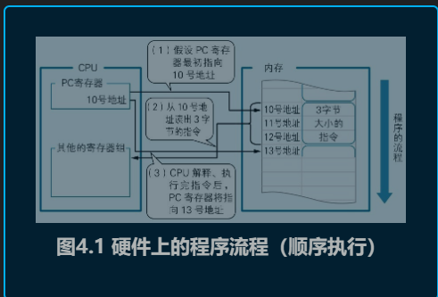
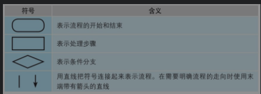
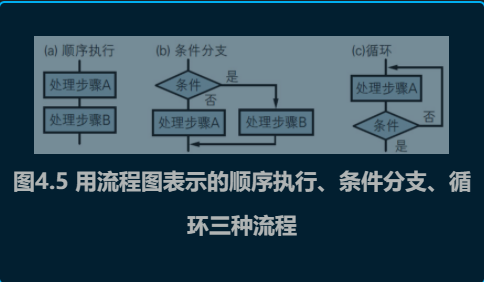

# 计算机是怎么跑起来的
## 目录
- [计算机的三大原则](#计算机的三大原则)
    - [计算机的三个根本性基础](#计算机的三个根本性基础)
    - [输入运算输出是硬件的基础](#输入运算输出是硬件的基础)
    - [软件是指令和数据的集合](#软件是指令和数据的集合)
    - [对计算机来说什么都是数字](#计算机的三个根本性基础)
    - [只要理解了三大原则，即使遇到在难懂的新技术也能轻松应对](#只要理解了三大原则，即使遇到在难懂的新技术也能轻松应对)
    - [软件是指令和数据的集合](#软件是指令和数据的集合)
- [程序向河水一样流动](#程序向河水一样流动)
    - [程序的路程分三种](#程序的路程分三种)
    - [用流程图表示程序的流程](#用流程图表示程序的流程)
    - [画流程图来思考算法](#画流程图来思考算法)
    - [特殊的程序流程-中断处理](#特殊的程序流程-中断处理)
    - [特殊的程序流程-事件驱动](#特殊的程序流程-事件驱动)
    - [画流程图来思考算法](#画流程图来思考算法)
- [与算法成为好朋友的七个要点](#与算法成为好朋友的七个要点)
    - [算法是程序的熟语](#算法是程序的熟语)
    - [要点一：算法中解决问题的步骤是明确且有限的](#要点一：算法中解决问题的步骤是明确且有限的)
    - [要点二：计算机不靠直觉而是机械的解决问题](#要点二：计算机不靠直觉而是机械的解决问题)
    - [要点三：了解并应用典型算法](#要点三：了解并应用典型算法)
    - [要点四：利用计算机的处理速度](#要点四：利用计算机的处理速度)
    - [要点五：使用编程技巧提升程序的执行速度](#要点五：使用编程技巧提升程序的执行速度)
    - [要点六：找出数字间的规律](#要点六：找出数字间的规律)
    - [要点七：先在纸上考虑算法](#要点七：先在纸上考虑算法)
- [与数据结构成为好朋友的七个要点](#与数据结构成为好朋友的七个要点)
    - [要点一:了解变量与内存的关系](#要点一:了解变量与内存的关系)
    - [要点二：了解最为数据结构基础的数组](#要点二：了解最为数据结构基础的数组)
    - [要点三：了解数组的应用-作为典型算法的数据结构](#要点三：了解数组的应用-作为典型算法的数据结构)
    - [要点四:了解并掌握典型数据结构的类型和概念](#要点四:了解并掌握典型数据结构的类型和概念)
    - [要点五：了解栈和队列的实现方式](#要点五：了解栈和队列的实现方式)
    - [要点六：了解结构体的组成](#要点六：了解结构体的组成-作为典型算法的数据结构)
    - [要点七：了解结构体的组成](#要点七：了解链表和二叉树的实现方法)

## 大纲
## 计算机的三大原则
### 计算机的三个根本性基础

1．计算机是执行输入、运算、输出的机器

2．程序是指令和数据的集合

3．计算机的处理方式有时与人们的思维习惯不同

### 输入运算输出是硬件的基础

首先从硬件的基础开始介绍。

    从硬件上来看，可以说计算机是执行输入、运算、输出三种操作的机器输入、运算、输出三者必须成套出现，缺一不可。
    
    这样说的原因有几点。
    
    首先，现在的计算机还没有发展到能通过自发的思考创造出信息的地步。因此不输入信息，计算机就不能工作。
    
    所以，输入是必不可少的。
    
    其次，计算机不可能不执行任何运算。如果只是使输入的信息绕过运算环节直接输出，那么这就是电线而不是计算机了。
    
    可以说不进行运算，计算机也就没有什么存在的意义。
    
    最后，输入的信息如果经过了运算，那么运算结果就必然要输出。
    
    如果不输出结果，那么这也不是计算机而只是堆积信息的垃圾箱了。因此，输出也必不可少。

### 软件是指令和数据的集合
下面介绍软件，即程序的基础。

    所谓程序，其实非常简单，只不过是指令和数据的集合。
    无论程序多么高深、多么复杂，其内容也都是指令和数据。
    所谓指令，就是控制计算机进行输入、运算、输出的命令。把向计算机发出的指令一条条列出来，就得到了程序。
    这里成套出现的输入、运算、输出，就是之前在硬件的基础一节中说明过的流程。
    向计算机发出的指令与计算机硬件上的行为一一对应是理所当然的。

程序中的数据分为两类，一类是作为指令执行对象的输入数据，一类是从指令的执行结果得到的输出数据。在编程时程序员会为数据赋予名字，称其为“变量”。看到变量和函数，诸位也许会联想到数学吧。正如数学中函数的表记方法那样，在很多编程语言中都使用着类似于下面的这种语法。

### 对计算机来说什么都是数字

计算机有计算机的处理方法，这是三大原则中的最后一点。

    计算机本身只不过是为我们处理特定工作的机器。
    如果计算机能自己干活的话，那么笔者一定会买几百台，让它们先替自己完成一整年的工作。
    但是，并没有这种会挣钱的计算机，计算机终究只是受人支配的工具。

### 只要理解了三大原则，即使遇到难懂的最新技术，也能轻松应对

    计算机是执行程序的机器。程序是指令和数据的集合。
    为了使互联网上相互连接的计算机能通过程序协同工作，微软公司采用了SOAP以及XML规范。
    SOAP是关于调用指令的规范，XML则是定义数据格式的规范。
    只要定义出了指令和数据的规范，装有符合规范的程序的计算机自然就可以相互协作了。
    所谓计算机的协同工作指的是，输入到一台计算机中的数据，可以通过互联网传送到与这台计算机相连的其他计算机上执行运算，运算所输出的结果再返回给这台计算机。
    像这样部署在其他计算机上能执行某种运算的程序就叫作XML Web服务。这回怎么样？应该变得容易理解了吧？
    如果又想到了其他的问题，比如“为什么不得不遵循SOAP和XML的规范呢？”或者“实际看了看SOAP和XML的规范，才发现也很复杂。
    ”那么就可以把答案归结为“因为那些都是适合计算机的处理方式”。

## 程序向河水一样流动
### 程序的路程分三种
计算机的硬件系统由**CPU、I/O和内存**三部分构成。
**内存中存储着程序，也就是指令和数据**。
CPU配合着由时钟发生器发出的滴答滴答的时钟信号，从内存中读出指令，然后再依次对其进行解释和执行。

**CPU中有各种各样的各司其职的寄存器**。
其中有一个被称为PC （Program Counter，程序计数器）的寄存器**，负责存储内存地址，该地址指向下一条即将执行的指令**。
**每解释执行完一条指令，PC寄存器的值就会自动被更新为下一条指令的地址。PC寄存器的值在大多数情况下只会增加。**
下面假设PC寄存器正指向内存中一个从10号地址开始的3字节指令。
CPU解释执行完这条指令后，PC寄存器中的值就变成10+3 = 13了。
也就是说，程序基本上是从内存中的低地址（编号较小的地址）开始，向着高地址（编号较大的地址）流下去的。我们把程序的这种流动称为“顺序执行”（如图4.1所示）。

程序的流程总共有三种。除了顺序执行以外，还有“**条件分支**”和“**循环**”。
因为只有这三种，记忆起来还是很轻松的吧。
正如上文所述，顺序执行是按照指令记录在内存中的先后顺序依次执行的一种流程。
而循环则是在程序的特定范围内反复执行若干次的一种流程。
条件分支是根据若干个条件的成立与否，在程序的流程中产生若干个分支的一种流程。
**无论规模多么大多么复杂的程序，都是通过把以上三种流程组合起来实现的。**

### 用流程图表示程序的流程
最低限度所需要的流程图符号

用流程图表示的顺序执行、条件分支、循环三种流程

### 画流程图来思考算法
所谓算法就是角色既定问题的步骤，想让计算机解决问题，就要把问题的解法转换成程序的流程。

思考算法时的要点是要分两步走，先从整体上考虑程序的粗略流程，再考虑程序各个部分细节的流程

### 特殊的程序流程-中断处理
中断处理是指计算机使程序的流程突然跳转到程序中的特定地方，这样的地方被称为中断处理例程（Routine）或是中断处理程序（Handler），而这种跳转是通过CPU所具备的硬件功能实现的。

人们通常把中断处理比作是接听电话。假设诸位都正坐在书桌前处理文件，这时突然来电话了，诸位就不得不停下手头的工作去接电话，接完电话再回到之前的工作。
像这样由于外部的原因使正常的流程中断，中断后再返回到之前流程的过程就是中断处理流程。

在第2章微型计算机的电路图中已经展示过，在Z80 CPU中有[插图]和[插图]两个引脚，它们可以接收从I/O设备发出的中断请求信号[插图]。
以硬件形式连接到CPU上的I/O模块会发出中断请求信号，CPU根据该信号执行相应的中断处理程序。在诸位使用的个人计算机上，中断请求信号是由连接到周边设备上的I/O模块发出的。
例如每当用户按下键盘上的按键，键盘上的I/O模块就会把中断请求信号发送给CPU。CPU通过这种方式就可以知道有按键被按下，于是就会从I/O设备读入数据（如图4.14所示）。
CPU并不会时刻监控键盘是否有按键被按下。

中断处理以从硬件发出的请求为条件，使程序的流程产生分支，因此可以说它是一种特殊的条件分支。
可是，**在诸位编写的程序中并不需要编写有关中断处理的代码**。**因为处理中断请求的程序，或是内置于被烧录在计算机ROM中的BIOS系统**（BasicInput Output System，基本输入输出系统）中，
或是内置于Windows等操作系统中。诸位只需要先记住以下两点即可：计算机具有硬件上处理中断的能力；中断一词的英文是Interrupt。

### 特殊的程序流程-事件驱动
