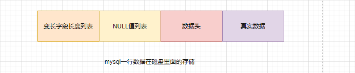
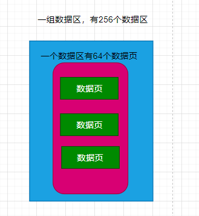
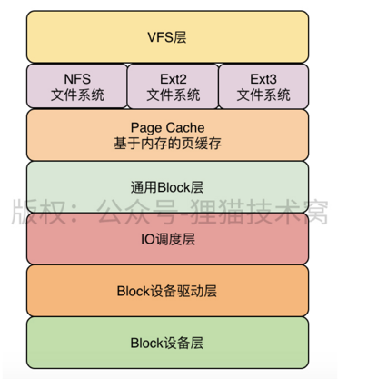
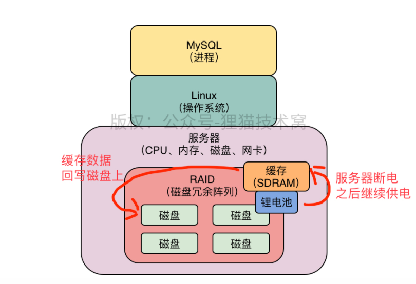
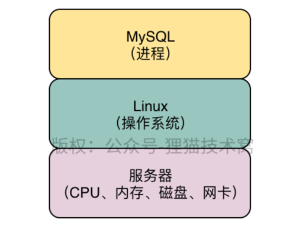
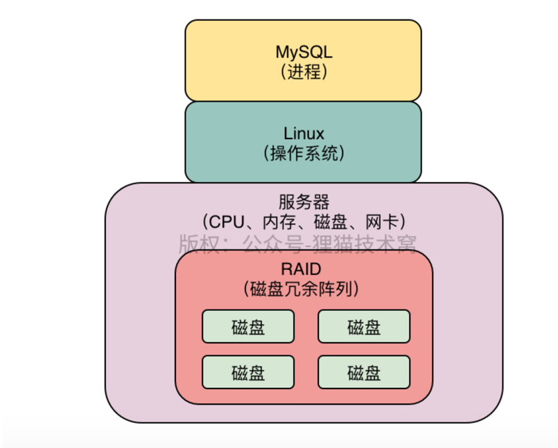
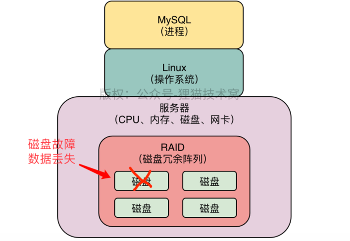
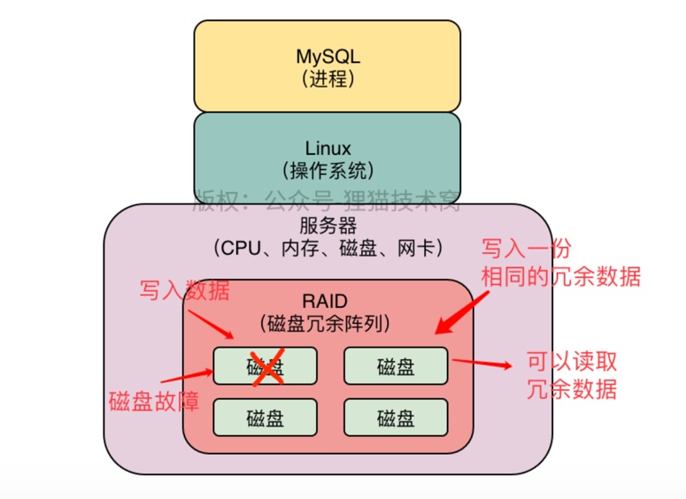

# mysql
## 目录

- [mysql基础架构](#mysql基础架构)
    - [mysql架构设计](#mysql架构设计)
    - [InnoDB存储引擎的架构设计](#InnoDB存储引擎的架构设计)
      - [buffer pool](#buffer pool)
    - [mysql数据模型](#mysql数据模型)
      - [VARCHAR这种变长字段，在磁盘上到底是如何存储的](#VARCHAR这种变长字段，在磁盘上到底是如何存储的)
      - [一行数据中的多个NULL字段值在磁盘上怎么存储？](#一行数据中的多个NULL字段值在磁盘上怎么存储？)
      - [磁盘文件中40个bit位的数据头以及真实数据是如何存储的？](#磁盘文件中40个bit位的数据头以及真实数据是如何存储的？)
      - [行溢出](#行溢出)        
      - [表空间](#表空间)

- [生产实践](#生产实践)
    - [真实生产环境下的数据库机器配置如何规划？](#真实生产环境下的数据库机器配置如何规划？)
    - [互联网公司的生产环境数据库是如何进行性能测试的？](#互联网公司的生产环境数据库是如何进行性能测试的？？)
    - [如何对生产环境中的数据库进行360度无死角压测？](#如何对生产环境中的数据库进行360度无死角压测？)
    - [如何为生产环境中的数据库部署监控系统？](#如何为生产环境中的数据库部署监控系统？)
    - [如何通过多个Buffer Pool来优化数据库的并发性能？](#如何通过多个Buffer Pool来优化数据库的并发性能？)
    - [如何通过chunk来支持数据库运行期间的Buffer Pool动态调整？](#如何通过chunk来支持数据库运行期间的Buffer Pool动态调整？)
    - [在生产环境中，如何基于机器配置来合理设置Buffer Pool？](#在生产环境中，如何基于机器配置来合理设置Buffer Pool)
    - [Linux操作系统的存储系统软件层原理剖析以及IO调度优化原理](#Linux操作系统的存储系统软件层原理剖析以及IO调度优化原理)
    - [数据库服务器使用的RAID存储架构初步介绍](#数据库服务器使用的RAID存储架构初步介绍)
    - [数据库服务器上的RAID存储架构的电池充放电原理](#数据库服务器上的RAID存储架构的电池充放电原理)

# 目录

## mysql基础架构

### mysql架构设计

一个不变的原则：网络连接必须让线程处理
mysql架构的整体设计原理

### InnoDB存储引擎的架构设计

实际上，执行器是非常核心的一个组件，负责跟存储引擎配合完成一个sql语句在磁盘与内存层面的全部数据更新操作。

拆分成两个阶段：

  上图的1，2，3，4是执行更新语句的时候干的事，
  5，6是从你提交事务开始的，属于提交事务阶段

    redo log 是一种偏向物理性值的重做日志，本身属于InnoDB存储引擎特有的一个东西。
    
    redo log 主要记录下你对数据做了哪些修改，这个此时还在内存缓存区
    
    bin log 叫做归档日志，它里面记录的时偏向逻辑性的日志，类似  对users 表中的id =10的一行数据，进行了更新操作，操作以后的值是什么   
    
    bin log 日志不是InnoDB 存储引擎特意的日志文件，是属于 mysql server 自己的日志文件

提交事务时，redo log日志的刷盘策略：

      这个策略通过innodb_flush_log_at_trx_commit 来配置
      0：提交事务的时候，不会把redo log buffer 里的数据刷入磁盘文件，此时你可能提交事务了，结果mysql宕机了，此时内存中的数据全部丢失。
      1：提交事务的时候，就必须把redo log 从内存中刷入到磁盘文件里去，只要事务提交成功，那么redo log 就必然在磁盘里。
      2：提交事务的时候，把redo日志写入磁盘文件对应的os cache缓存里去，而不是直接进入磁盘文件，可能1s之后才会把os cache里的数据写入到磁盘文件

对于数据库这种严格的系统而言，一般建议redo 日志刷盘策略设置为1，保证事务提交之后，数据绝对不能丢失

提交事务时，bin log日志的刷盘策略：
    
      这个策略通过sync_binlog参数来控制binlog的刷盘策略，它的默认值是0
      0:提交事务的时候，新进入 os cache 内存缓存，后刷回到磁盘（bin log会丢失）
      1:提交事务的时候，强制把binlog直接写入磁盘文件里去（bin log不会丢失）

#### buffer pool

数据库buffer pool 里面会包含很很多个缓存页，同时每个缓存页还有一个数据描述，也可以叫做数据控制

初始化buffer pool 
 
    数据库只要已启动，就会按照你设置的buffer pool 的大小稍微再加大一点去找操作系统申请一块内存区域，作为buffer pool的内存区域
    
    然后当内存区域申请完毕之后，数据库就会按照默认的缓存页的16kb的大小以及对应800个字节左右的描述数据的大小，在buffer pool 中划分出来一个个缓存页和一个个对应的数据描述
    
    只不过这个时候，buffer pool中一个个缓存页的都是空的，里面什么都没有，要等数据库运行起来，我们对数据进行增删改查的操作的时候，才会把数据对应的磁盘文件读取出来，放入buffer pool 的缓存页

哪些缓存页是空闲的？ free链表

从磁盘上的数据页放入到buffer pool的缓存页，必然涉及到一个问题，那就是哪些缓存页是空闲的？

    所以数据库会为buffer pool 设计一个**free链表**，它是一个双向链表的数据结构，这个free链表里，每个节点就是一个空闲的
    缓存页的描述数据块的地址，也就是说，只要你的一个缓存页是空闲的，那么它的描述数据块地址就会被放入free链表中。

磁盘上的数据页是如何读到缓存页中？

     其实有了free链表之后，这个问题就很简单了，首先需要重free链表中获取描述数据块，然后就可以获取这个描述数据块对应的空闲缓存页
     写缓存页，添加描述信息

那怎么知道一个数据是否加载到缓存页？

    数据库会维护一个**哈希表数据结构**，他会用表空间+数据页号作为key，然后缓存的地址作为value
    
    也就是说每次你读取一个数据页缓存之后，都会在这个哈希表中写入一个key-value，下次在使用数据页只需要从哈希表中读取数据即可 

哪些缓存页是脏页

    内存中更新的脏页数据，都是要被刷回磁盘文件的。
    但是不肯呢个所有的缓存页都刷回磁盘，因为有的缓存页可能是因为查询的时候，而被读到buffer pool 里面去的，可能根本没有修改过
    
    所以数据库这里引入了另外一个跟free链表类似的**flush 链表**，**这个flush链表的本质也是通过缓存页的描述数据块的两个指针，让被修改过的缓存页描述数据块组成一个双向链表**

引入LRU算法来判断哪些缓存页是不常用的（缓存命中率）

    怎么判断哪些缓存页不是经常使用，哪些缓存页是脏页？
    引入LRU链表
    
    LRU：least recently used 最近最少使用的意思
    
    工作原理：
    
    假如我们从磁盘加载一个数据页到缓存页的时候，就会把这个缓存页描述数据放到LRU的头部，
    那么只要有数据缓存页的时候，他就会在LRU链表里，而且最近被在加载的缓存页，都会放到
    LRU的头部去。
    
    然后假定某个缓存页的描述数据块本来是放在LRU尾部，后续你只要查询或者修改了这个缓存页的数据，也要把这个缓存页挪动到HttpServletRequest
    尾部，也就是说最近被访问过的缓存页，一定在LRU的头部。

LRU算法带来的问题

    预读带来的巨大问题

    预读会导致，一直没被访问的数据放在LRU链表的头部，在空闲缓存页全部使用完时，会将链表尾部的数据刷入磁盘，清空缓存页。但是有可能这个数据时经常被使用的

哪些情况会触发Mysql的预读机制

    1.innodb_read_ahead_threshold他的默认值是56，意思是就是如果顺序的访问一个区里的多个数据页，访问的数据页的数量可能超过这个阈值
    此时就会触发预读机制，把下一个相邻区中所有额数据页都加载到缓存中去。
    
    2.如果Buffer Pool里缓存了12个联系的数据页，而且这些数据都是比较频繁被访问的，此时就会出发预读机制，把这个区里的其他数据页都加载到缓存里区。
    这个机制是通过参数innodb_random_read_ahead来控制的，默认时OFF，也就是这个规则是关闭的

 另外一种可能导致频繁访问的缓存页被淘汰的场景体验一下

那就是**全表扫描**
    
      类似  SELECT * FROM USERS 他一下子吧这个表里的所有数据页，都加载到Buffer Pool里去

Mysql基于冷热数据分离方案优化LRU算法

    真正的LRU链表，会被拆分成两个部分,一个部分是热数据，一个部分是冷数据，这个冷数据比例是由
    
    innodb_old_blocks_pct参数来控制的，它默认的是37，也就是说冷数据的占比37%。
    
    实际上这个时候，第一次加载时，缓存页会被放到冷数据链表的头部。

冷数据区域的缓存页何时被加载到热数据区域

    innodb_old_blocks_time 默认设置为1000，也就是1000毫秒

    也就是数据加载到冷数据区域，过了1s后，你再访问这个缓存页，他就会被放到热数据区域的链表头部

LRU链表的热数据区域是如何进行优化的？

    经常被访问的数据时热数据，不经常被访问的数据是冷数据，所以在设计缓存的时候，经常会考虑 **热数据的缓存预加载**
    也就是说，每天统计出来哪些商品被访问次数最多，然后晚上的时候，系统启动一个定时作业，把热门商品的数据，预加载到redis里。
    那么第二页是不是对热门访问的商品自然就优先走redis
    
     LRU链表的热数据区域的访问规则被优化了一下，即你只要在热数据区域的后3/4部分缓存页被访问了，才会给你移动到链表头部

    如果你是热数据区域的前面的1/4的缓存页被访问，他是不会移动到链表头部的。
    
    这样可以尽可能减少链表中的节点移动了。

定时LRU尾部的部分缓存页刷入磁盘

    第一个时机：有一个后台线程，他会运行一个定时任务，这个定时任务每个一段时间，就会把LRU链表的冷数据区域的尾部一些缓存页刷入到磁盘里去，清空几个缓存页，把他们加入到free链表中。

    只要缓存页被刷盘，那么这个缓存页必然会加搭配free链表中，从flush链表中一处，从LRU链表中移除。

    因为LRU链表中的热数据可能是被频繁修改的，难道他们永远都不刷入到磁盘了吗？

    第二个时机，这个后台线程同时也会在Mysql不怎么繁忙的时候，找个时间把flush链表中的缓存页刷入磁盘，这样被你修改过的数据迟早都会刷入磁盘。

### mysql物理存储

#### VARCHAR这种变长字段，在磁盘上到底是如何存储的

**引⼊变长字段的长度列表，解决⼀⾏数据的读取问题：**

    将数据的长度转成16进制表示，放在数据存储的前面

**多个变长字段是如何存储的？**

    此时在磁盘中存储的，必须在他开头的变长字段长度列表中存储⼏个变长字段的长度，⼀定要注意⼀点，他这⾥是逆
    序存储的！

0x05 null值列表 数据头 hello a a 0x02 null值列表 数据头 hi a a

**mysql的一行行数据紧凑存储有什么好处？**

    多行紧凑的原因有： 序列化反序列时的开销小；不易有内存碎片；定位数据时比较快速

#### 一行数据中的多个NULL字段值在磁盘上怎么存储

**为什么一行数据的NULL值不能直接存储？**

    肯定不是按照字符串的方式存储，会浪费空间。

**NULL值是以二进制Bit来存储的？**

    bit值是1 说明是NULL，如果是0 说明不是NULL

**磁盘上的⼀⾏数据到底如何读取出来的？**

    我们结合上⾯的磁盘上的数据存储格式来思考⼀下，⼀⾏数据到底是如何读取出来的呢？
    再看上⾯的磁盘数据存储格式：
    0x09 0x04 00000101 头信息 column1=value1 column2=value2 ... columnN=valueN

    ⾸先他必然要把变长字段长度列表和NULL值列表读取出来，通过综合分析⼀下，就知道有⼏个变长字段，哪⼏个变长
    字段是NULL，因为NULL值列表⾥谁是NULL谁不是NULL都⼀清⼆楚。
    此时就可以从变长字段长度列表中解析出来不为NULL的变长字段的值长度，然后也知道哪⼏个字段是NULL的，此时
    根据这些信息，就可以从实际的列值存储区域⾥，把你每个字段的值读取出来了。
    如果是变长字段的值，就按照他的值长度来读取，如果是NULL，就知道他是个NULL，没有值存储，如果是定长字
    段，就按照定长长度来读取，这样就可以完美的把你⼀⾏数据的值都读取出来了！

#### 磁盘文件中40个bit位的数据头以及真实数据是如何存储的

    每一行数据在磁盘上存储的时候，每一行数据都会有变长字段长度列表，逆序存放这行数据里的变长字段的长度，  
    然后会有NULL值列表，对于允许NULL值得字段都会有一个bit位标识那个字段是否为NULL，也是逆序排序得

每一行数据存储得时候，还得有一个bit位得数据头，这个数据头是用来描述这行数据的。
  
    第一位bit和第二位bit都是预留位，是没有任何含义的。
    接下来的bit位是delete_mask：他标识这行数据是否被删除了
    下一个bit位是min_rec_mask：在B+树里每一层的非页字节点里最小值都有这个标记
    接下来是4个bit位是n_owned：记录了一个记录数
    接下来13个bit位是heap_no，他代表是当前这行数据在数据堆里的位置
    然后是3个bit位record_type：也就是这行数据的类型
       0:代表普通类型
       1：代表是B+树非叶子节点
       2：代表是最小值的数据 
       3：代表最大值的数据
    最后16位bit是next_record:这个是他下一条数据的指针
#### 一行数据实际在磁盘上的存储

变长字段列表 NULL值列表  数据头  真实数据

在实际存储一行数据的时候，会在他真实数据部分，添加一些隐藏字段

    DB_ROW_ID 字段：这是一个行的唯一标识，是数据库内部的一个标识，不是你的主键ID字段，入股我们没有指定主键和
    unique key 唯一索引的时候，他的内部就会自动加一个DB_ROW_ID

    DB_TRX_ID字段，这个跟事务相关，他是说这是哪个事务更新的数据，这是事务ID。

    DB_ROLL_PTR，这是回滚指针，用来进行事务回滚的

#### 行溢出

行溢出：就是一行的数据存储太多的内容，一个数据页都放不下，此时只能溢出这个数据页，把数据溢出存放到其他数据页里去，那些数据页就叫做溢出页。

#### 表空间

    表空间：我们平时创建的那些表，其实就是都有一个表空间的概念，在磁盘上对会对应'表明.ibd'，这样的一个磁盘数据文件。’
    
    ‘一个表空间磁盘文件里，其实会有很多很多的数据页，为了便于管理，表空间又引入了**数据区（extent）**
    一个数据区对应64个连续的数据页，每个数据页的大小是16kb，所以一个数据区就是1mb，然后256个数据区被划分为一组。
    
    当我们需要执行CRUD操作的时候，说白，就是从磁盘上表空间的数据文件里，去加载一些数据页出来到buffer pool的缓存页里区使用

### 生产实践

#### 真实生产环境下的数据库机器配置如何规划

普通应用的机器选择？

    就经验而言，普通的系统 4核8G ，每秒抗几百的请求没问题，
    数据库通常是在8核16G以上正常的是16核32G

高并发场景数据库应该选择什么样的机器？

    磁盘，io，网络压力会比较大，最好采用ssd固态硬盘

#### 互联网公司的生产环境数据库是如何进行性能测试的？

请求测试指标：QPS、TPS

    QPS：Query Per Second，每秒可以处理多少个请求，也就是说这个数据库每秒可以处理多少个sql
    
    TPS：Transaction Per Second 。其实就是每秒可处理的事物

IO相关压测性指标

    IOPS：这个是机器随机IO并发处理能力
    这个指标很关键，你在内存中更新的脏数据，最后都会由后台IO在不确定时间，刷回到磁盘里去。这个是随机IO的过程，
    如果说IOPS指标太低了，那么会导致脏数据刷回磁盘的效率不高。

    吞吐量：这个指机器的磁盘存储每秒可以读写多少个字节的数据
    这个指标也很关键，因为大家通过学习都知道，我们在平时执行各种sql的时候，提交事物的时候，其实都会有大量会写redo log日志之类的，这些日志都会直接写磁盘

    latency：这个指标说的往磁盘里写入一条数据的延迟。
    这个指标同样很重要，因为我们执行sql语句和提交事物的时候，都需要顺序写redo log 次哦盘文件，所以此时
    你写一条日志到磁盘文件里去，到底延迟是1ms还是100us，这就是对你的数据库sql语句执行性能是有影响的

其它指标

    CPU负载：PU负载是⼀个很重要的性能指标，因为假设你数据库压测到了每秒处理3000请求了，可能其他的性能指标
    都还正常，但是此时CPU负载特别⾼，那么也说明你的数据库不能继续往下压测更⾼的QPS了，否则CPU是吃不消的。
    
    网络负载：这个主要是要看看你的机器带宽情况下，在压测到⼀定的QPS和TPS的时候，每秒钟机器的⽹卡会输⼊多少
    MB数据，会输出多少MB数据，因为有可能你的⽹络带宽最多每秒传输100MB的数据，那么可能你的QPS到1000的时候，⽹
    卡就打满了，已经每秒传输100MB的数据了，此时即使其他指标都还算正常，但是你也不能继续压测下去了

    内存负载：：这个就是看看在压测到⼀定情况下的时候，你的机器内存耗费了多少，如果说机器内存耗费过⾼了，说明也
    不能继续压测下去了
      
#### 如何对生产环境中的数据库进行360度无死角压测？（https://apppukyptrl1086.pc.xiaoe-tech.com/detail/i_5e383c5357307_MjhluwMb/1?from=p_5e0c2a35dbbc9_MNDGDYba&type=6）

在linux 安装sysbench

    curl -s https://packagecloud.io/install/repositories/akopytov/sysbench/script.rpm.sh | sudo bash
    sudo yum -y install sysbench
    sysbench --version
    如果上⾯可以看到sysbench的版本号，就说明安装成功了

    QPS：Query Per Second，每秒可以处理多少个请求，也就是说这个数据库每秒可以处理多少个sql
    
    TPS：Transaction Per Second 。其实就是每秒可处理的事物

如何为生产环境中的数据库部署监控系统

    Prometheus：其实就是一个监控数据采集和存储系统，它可以利用采用缉拿空数据采集组件从你指定的Mysql数据库中采集他需要的监控数据
    然后他自己由一个时序数据库，他会把采集道德监控数据放到自己的时序数据库中，本质就是存储在磁盘文件里。
    
    Grafana：就是一个可视化的监控数据展示系统，他可以Prometheus采集到的大量mysql监控数据展示成各种精美报告，可以让我们直接看到mysql的监控情况。
    
#### 如何通过多个Buffer Pool来优化数据库的并发性能

多线程并发访问一个Buffer Pool的时候必然会加锁，然后很多线程可能要串行着排队，一个个的依次执行操作。

一般来说，Mysql默认的规则是，如果你给Buffer Pool分配的内存大小小于1GB，那么最多就会给你一个Buffer Pool

但是如果你的机器内存就很大，那么此时你是可以同时设置多个Buffer Pool

      innodb_buffer_pool_size = 8589934592
      innodb_buffer_pool_instance = 4

我们给Buffer Pool 设置了8GB的总内存，然后设置了4个Buffer Pool，也就是说每个Buffer Pool的大小是2GB

所以在生产实践中设置多个Buffer Pool 来优化高并发访问的性能，是mysql一个很重要的优化技巧。

#### 如何通过chunk来支持数据库运行期间的Buffer Pool动态调整

实际上Buffer Pool是由很多个chuck组成的，他的大小是innodb_buffer_pool_chunk_size 来控制的默认值是128M

    所以实际上我们可以做一个假设，比如现在我们给Buffer Pool 设置一个总大小是8GB，然后4个Buffer Pool ，那么每个Buffer Pool 就是2GB
     此时每个Buffer Pool 是由一系列的128M chuck组成的，也就是说每个Buffer Pool 会有16个chuck，然后每个Buffer Pool里的每个chuck里就是一系列
    数据描述和缓存页，每个Buffer Pool里的多个chuck共享一套 free flush lru 链表 

#### 在生产环境中，如何基于机器配置来合理设置Buffer Pool

Buffer Pool 的大小一般设置为机器大小的50-60%

确定了Buffer pool 的总大小之后，就得考虑设置多少个buffer pool以及chuck 

一般来说： buffer pool总大小 =  （chuck大小 * buffer pool数量）的倍数

#### Linux操作系统的存储系统软件层原理剖析以及IO调度优化原理

Linux的存储系统分为VFS层、⽂件系统层、Page Cache缓存层、通⽤Block层、IO调度层、Block设备驱动
层、Block设备层，

当mysql发起随机读写或者一次顺序写redo log日志文件的顺序读写的时候，实际上会把磁盘IO请求交给linux操作系统的VFS层

VFS层：根据你是对哪个目录中的文件执执行磁盘IO操作，把IO请求交给具体的文件系统。

    举个例⼦，在linux中，有的⽬录⽐如/xx1/xx2⾥的⽂件其实是由NFS⽂件系统管理的，有的⽬录⽐如/xx3/xx4⾥的⽂件
    其实是由Ext3⽂件系统管理的，那么这个时候VFS层需要根据你是对哪个⽬录下的⽂件发起的读写IO请求，把请求转
    交给对应的⽂件系统，如下图所⽰

    接着⽂件系统会先在Page Cache这个基于内存的缓存⾥找你要的数据在不在⾥⾯，如果有就基于内存缓存来执⾏读
    写，如果没有就继续往下⼀层⾛，此时这个请求会交给通⽤Block层，在这⼀层会把你对⽂件的IO请求转换为Block IO
    请求，如下图所⽰

    接着IO请求转换为Block IO请求之后，会把这个Block IO请求交给IO调度层，在这⼀层⾥默认是⽤CFQ公平调度算法的
    也就是说，可能假设此时你数据库发起了多个SQL语句同时在执⾏IO操作。
    有⼀个SQL语句可能⾮常简单，⽐如update xxx set xx1=xx2 where id=1，他其实可能就只要更新磁盘上的⼀个block
    ⾥的数据就可以了
    但是有的SQL语句，⽐如说select * from xx where xx1 like "%xx%"可能需要IO读取磁盘上的⼤量数据。
    那么此时如果基于公平调度算法，就会导致他先执⾏第⼆个SQL语句的读取⼤量数据的IO操作，耗时很久，然后第⼀
    个仅仅更新少量数据的SQL语句的IO操作，就⼀直在等待他，得不到执⾏的机会。
    所以在这⾥，其实⼀般建议MySQL的⽣产环境，需要调整为deadline IO调度算法，他的核⼼思想就是，任何⼀个IO操
    作都不能⼀直不停的等待，在指定时间范围内，都必须让他去执⾏。
    所以基于deadline算法，上⾯第⼀个SQL语句的更新少量数据的IO操作可能在等待⼀会⼉之后，就会得到执⾏的机会，
    这也是⼀个⽣产环境的IO调度优化经验。
    我们看下图，此时IO请求被转交给了IO调度层

    最后IO完成调度之后，就会决定哪个IO请求先执⾏，哪个IO请求后执⾏，此时可以执⾏的IO请求就会交给Block设备驱
    动层，然后最后经过驱动把IO请求发送给真正的存储硬件，也就是Block设备层，如下图所⽰。

    然后硬件设备完成了IO读写操作之后，要不然是写，要不然是读，最后就把响应经过上⾯的层级反向依次返回，最终
    MySQL可以得到本次IO读写操作的结果

#### 数据库服务器使用的RAID存储架构初步介绍

    所以MySQL数据库软件都是安装在一台linux服务器上的，然后启动MySQL的进程，就是启动了一个MySQL数据库
    
    MySQL运行过程中，他需要使用CPU、内存、磁盘和网卡这些硬件，但是不能直接使用，都是通过调用操作系统提供的接口，依托于操作系统来使用和运行的，然后linux操作系统负责操作底层的硬件。
    

    
    数据库部署在机器上的时候，存储都是搭建的RAID存储架构
    
    RAID就是一个磁盘冗余阵列
    
    RAID这个技术，大致理解为用来管理机器里的多块磁盘的一种磁盘阵列技术！
    
    有了他以后，你在往磁盘里读写数据的时候，他会告诉你应该在哪块磁盘上读写数据，

    有了RAID这种多磁盘阵列技术之后，我们是不是就可以在一台服务器里加多块磁盘，扩大我们的磁盘存储空间了？
    
    当我们往磁盘里写数据的时候，通过RAID技术可以帮助我们选择一块磁盘写入，在读取数据的时候，我们也知道从哪块磁盘去读取。

除此之外，RAID技术很重要的一个作用，就是他还可以**实现数据冗余机制**

    所谓的数据冗余机制，就是如果你现在写入了一批数据在RAID中的一块磁盘上，然后这块磁盘现在坏了，无法读取了，那么岂不是你就丢失了一波数据？如下图所示
    
    

所以其实有的RAID磁盘冗余阵列技术里，是可以把你写入的同样一份数据，在两块磁盘上都写入的.
这样可以让两块磁盘上的数据一样，作为冗余备份，然后当你一块磁盘坏掉的时候，可以从另外一块磁盘读取冗余数据出来，这一切都是RAID技术自动帮你管理的，不需要你操心，
如下图。

所以RAID技术实际上就是管理多块磁盘的一种磁盘阵列技术，他有软件层面的东西，也有硬件层买的东西，比如有RAID卡这种硬件设备。

具体来说，RAID还可以分成不同的技术方案，比如RAID 0、RAID 1、RAID 0+1、RAID2，等等，一直到RAID 10，很多种不同的多磁盘管理技术方案

#### 数据库服务器上的RAID存储架构的电池充放电原理

RAID緩存模式設置為write back，意思是先寫緩存再寫磁盤整列

鋰電池會性能减弱，所以需要对锂电池的配置订定时充放电。

充电的过程中 RAID缓存级别会从write back 变成write through，这个时候IO直接些磁盘。性能会下降，导致数据库抖动出现性能抖动。