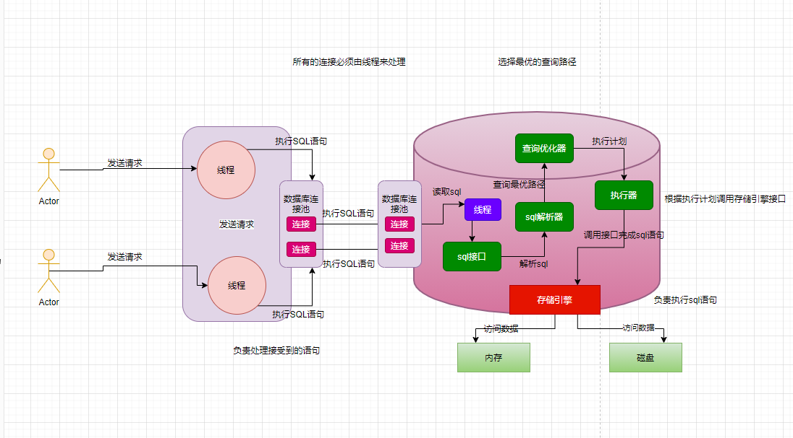
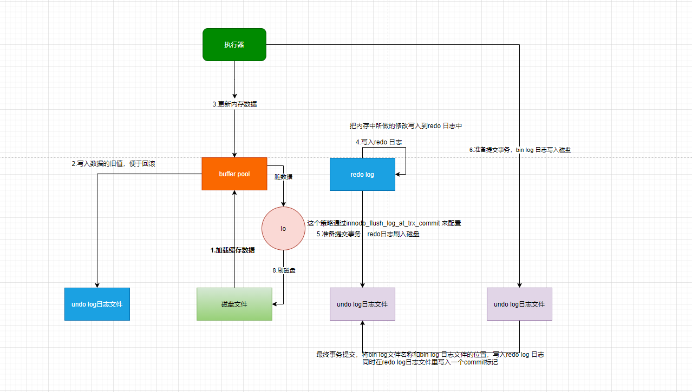
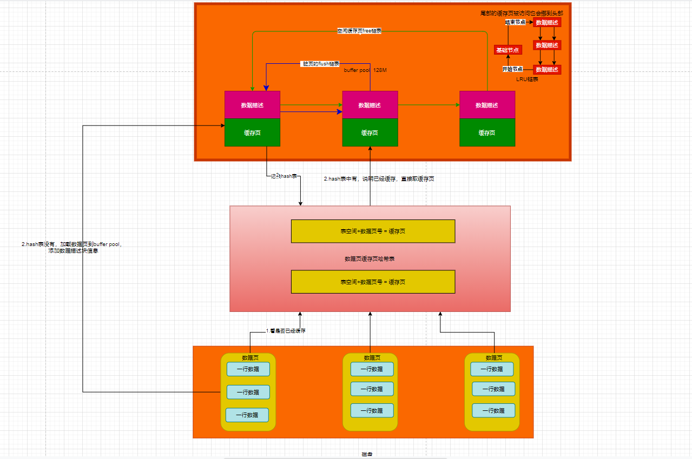
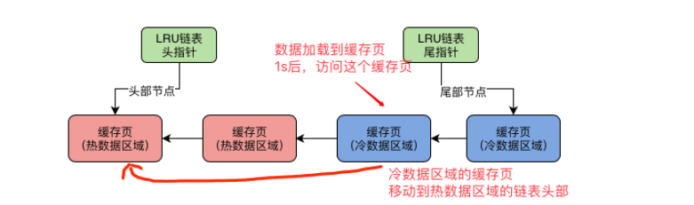

# mysql
## 目录

- [mysql基础架构](#mysql基础架构)
    - [mysql架构设计](#mysql架构设计)
    - [InnoDB存储引擎的架构设计](#InnoDB存储引擎的架构设计)
      - [buffer pool](#buffer pool)
- [生产实践](#生产实践)
    - [真实生产环境下的数据库机器配置如何规划？](#真实生产环境下的数据库机器配置如何规划？)
    - [互联网公司的生产环境数据库是如何进行性能测试的？](#互联网公司的生产环境数据库是如何进行性能测试的？？)
    - [如何对生产环境中的数据库进行360度无死角压测？](#如何对生产环境中的数据库进行360度无死角压测？)
    - [如何为生产环境中的数据库部署监控系统？](#如何为生产环境中的数据库部署监控系统？)
    - [共享应用程序](#共享应用程序)
    - [持久化数据库](#持久化数据库)
    - [使用绑定安装](#使用绑定安装)
    - [多容器应用](#多容器应用？)
    - [使用DockerCompose](#使用DockerCompose)
    - [图像构建最佳实践](#图像构建最佳实践)
    - [接下来做什么](#接下来做什么)
- [开始吧](#开始吧)
    - [编写Dockerfile的最佳实践](#编写Dockerfile的最佳实践)
    - [实例应用程序](#实例应用程序？)
    - [更新应用程序](#更新应用程序)
    - [共享应用程序](#共享应用程序)
    - [持久化数据库](#持久化数据库)
    - [使用绑定安装](#使用绑定安装)
    - [多容器应用](#多容器应用？)
    - [使用DockerCompose](#使用DockerCompose)
    - [图像构建最佳实践](#图像构建最佳实践)
    - [接下来做什么](#接下来做什么)
- [特定语言指南](#特定语言指南)
- [使用Docker开发](#使用Docker开发)
- [设置CI/CD](#设置CI/CD)
- [将应用部署到云](#将应用部署到云)
- [在生产环境运行应用](#在生产环境运行应用)
- [教育资源](#教育资源)
- [docker开源](#docker开源)

# 目录

## mysql基础架构

### mysql架构设计

一个不变的原则：网络连接必须让线程处理
mysql架构的整体设计原理

### InnoDB存储引擎的架构设计

实际上，执行器是非常核心的一个组件，负责跟存储引擎配合完成一个sql语句在磁盘与内存层面的全部数据更新操作。

拆分成两个阶段：

  上图的1，2，3，4是执行更新语句的时候干的事，
  5，6是从你提交事务开始的，属于提交事务阶段

redo log 是一种偏向物理性值的重做日志，本身属于InnoDB存储引擎特有的一个东西。

redo log 主要记录下你对数据做了哪些修改，这个此时还在内存缓存区

bin log 叫做归档日志，它里面记录的时偏向逻辑性的日志，类似  对users 表中的id =10的一行数据，进行了更新操作，操作以后的值是什么   

bin log 日志不是InnoDB 存储引擎特意的日志文件，是属于 mysql server 自己的日志文件

提交事务时，redo log日志的刷盘策略：

      这个策略通过innodb_flush_log_at_trx_commit 来配置
      0：提交事务的时候，不会把redo log buffer 里的数据刷入磁盘文件，此时你可能提交事务了，结果mysql宕机了，此时内存中的数据全部丢失。
      1：提交事务的时候，就必须把redo log 从内存中刷入到磁盘文件里去，只要事务提交成功，那么redo log 就必然在磁盘里。
      2：提交事务的时候，把redo日志写入磁盘文件对应的os cache缓存里去，而不是直接进入磁盘文件，可能1s之后才会把os cache里的数据写入到磁盘文件

对于数据库这种严格的系统而言，一般建议redo 日志刷盘策略设置为1，保证事务提交之后，数据绝对不能丢失

提交事务时，bin log日志的刷盘策略：
    
      这个策略通过sync_binlog参数来控制binlog的刷盘策略，它的默认值是0
      0:提交事务的时候，新进入 os cache 内存缓存，后刷回到磁盘（bin log会丢失）
      1:提交事务的时候，强制把binlog直接写入磁盘文件里去（bin log不会丢失）

#### buffer pool

数据库buffer pool 里面会包含很很多个缓存页，同时每个缓存页还有一个数据描述，也可以叫做数据控制

##### 初始化buffer pool 
 
    数据库只要已启动，就会按照你设置的buffer pool 的大小稍微再加大一点去找操作系统申请一块内存区域，作为buffer pool的内存区域
    
    然后当内存区域申请完毕之后，数据库就会按照默认的缓存页的16kb的大小以及对应800个字节左右的描述数据的大小，在buffer pool 中划分出来一个个缓存页和一个个对应的数据描述
    
    只不过这个时候，buffer pool中一个个缓存页的都是空的，里面什么都没有，要等数据库运行起来，我们对数据进行增删改查的操作的时候，才会把数据对应的磁盘文件读取出来，放入buffer pool 的缓存页
##### 哪些缓存页是空闲的？ free链表

从磁盘上的数据页放入到buffer pool的缓存页，必然涉及到一个问题，那就是哪些缓存页是空闲的？

    所以数据库会为buffer pool 设计一个**free链表**，它是一个双向链表的数据结构，这个free链表里，每个节点就是一个空闲的
    缓存页的描述数据块的地址，也就是说，只要你的一个缓存页是空闲的，那么它的描述数据块地址就会被放入free链表中。

##### 磁盘上的数据页是如何读到缓存页中？

   其实有了free链表之后，这个问题就很简单了，首先需要重free链表中获取描述数据块，然后就可以获取这个描述数据块对应的空闲缓存页
   写缓存页，添加描述信息

##### 那怎么知道一个数据是否加载到缓存页？

数据库会维护一个**哈希表数据结构**，他会用表空间+数据页号作为key，然后缓存的地址作为value

也就是说每次你读取一个数据页缓存之后，都会在这个哈希表中写入一个key-value，下次在使用数据页只需要从哈希表中读取数据即可 

##### 哪些缓存页是脏页

内存中更新的脏页数据，都是要被刷回磁盘文件的。
但是不肯呢个所有的缓存页都刷回磁盘，因为有的缓存页可能是因为查询的时候，而被读到buffer pool 里面去的，可能根本没有修改过

所以数据库这里引入了另外一个跟free链表类似的**flush 链表**，**这个flush链表的本质也是通过缓存页的描述数据块的两个指针，让被修改过的缓存页描述数据块组成一个双向链表**

##### 引入LRU算法来判断哪些缓存页是不常用的（缓存命中率）
怎么判断哪些缓存页不是经常使用，哪些缓存页是脏页？
引入LRU链表

LRU：least recently used 最近最少使用的意思

工作原理：

假如我们从磁盘加载一个数据页到缓存页的时候，就会把这个缓存页描述数据放到LRU的头部，
那么只要有数据缓存页的时候，他就会在LRU链表里，而且最近被在加载的缓存页，都会放到
LRU的头部去。

然后假定某个缓存页的描述数据块本来是放在LRU尾部，后续你只要查询或者修改了这个缓存页的数据，也要把这个缓存页挪动到HttpServletRequest
尾部，也就是说最近被访问过的缓存页，一定在LRU的头部。

##### LRU算法带来的问题

预读带来的巨大问题

    预读会导致，一直没被访问的数据放在LRU链表的头部，在空闲缓存页全部使用完时，会将链表尾部的数据刷入磁盘，清空缓存页。但是有可能这个数据时经常被使用的

哪些情况会触发Mysql的预读机制

    1.innodb_read_ahead_threshold他的默认值是56，意思是就是如果顺序的访问一个区里的多个数据页，访问的数据页的数量可能超过这个阈值
    此时就会触发预读机制，把下一个相邻区中所有额数据页都加载到缓存中去。
    
    2.如果Buffer Pool里缓存了12个联系的数据页，而且这些数据都是比较频繁被访问的，此时就会出发预读机制，把这个区里的其他数据页都加载到缓存里区。
    这个机制是通过参数innodb_random_read_ahead来控制的，默认时OFF，也就是这个规则是关闭的

 另外一种可能导致频繁访问的缓存页被淘汰的场景体验一下

那就是**全表扫描**
    
      类似  SELECT * FROM USERS 他一下子吧这个表里的所有数据页，都加载到Buffer Pool里去

Mysql基于冷热数据分离方案优化LRU算法

    真正的LRU链表，会被拆分成两个部分,一个部分是热数据，一个部分是冷数据，这个冷数据比例是由
    
    innodb_old_blocks_pct参数来控制的，它默认的是37，也就是说冷数据的占比37%。
    
    实际上这个时候，第一次加载时，缓存页会被放到冷数据链表的头部。

冷数据区域的缓存页何时被加载到热数据区域

    innodb_old_blocks_time 默认设置为1000，也就是1000毫秒

    也就是数据加载到冷数据区域，过了1s后，你再访问这个缓存页，他就会被放到热数据区域的链表头部

### 生产实践

#### 真实生产环境下的数据库机器配置如何规划

普通应用的机器选择？

    就经验而言，普通的系统 4核8G ，每秒抗几百的请求没问题，
    数据库通常是在8核16G以上正常的是16核32G

高并发场景数据库应该选择什么样的机器？

    磁盘，io，网络压力会比较大，最好采用ssd固态硬盘

#### 互联网公司的生产环境数据库是如何进行性能测试的？

请求测试指标：QPS、TPS

    QPS：Query Per Second，每秒可以处理多少个请求，也就是说这个数据库每秒可以处理多少个sql
    
    TPS：Transaction Per Second 。其实就是每秒可处理的事物

IO相关压测性指标

    IOPS：这个是机器随机IO并发处理能力
    这个指标很关键，你在内存中更新的脏数据，最后都会由后台IO在不确定时间，刷回到磁盘里去。这个是随机IO的过程，
    如果说IOPS指标太低了，那么会导致脏数据刷回磁盘的效率不高。

    吞吐量：这个指机器的磁盘存储每秒可以读写多少个字节的数据
    这个指标也很关键，因为大家通过学习都知道，我们在平时执行各种sql的时候，提交事物的时候，其实都会有大量会写redo log日志之类的，这些日志都会直接写磁盘

    latency：这个指标说的往磁盘里写入一条数据的延迟。
    这个指标同样很重要，因为我们执行sql语句和提交事物的时候，都需要顺序写redo log 次哦盘文件，所以此时
    你写一条日志到磁盘文件里去，到底延迟是1ms还是100us，这就是对你的数据库sql语句执行性能是有影响的

其它指标

    CPU负载：PU负载是⼀个很重要的性能指标，因为假设你数据库压测到了每秒处理3000请求了，可能其他的性能指标
    都还正常，但是此时CPU负载特别⾼，那么也说明你的数据库不能继续往下压测更⾼的QPS了，否则CPU是吃不消的。
    
    网络负载：这个主要是要看看你的机器带宽情况下，在压测到⼀定的QPS和TPS的时候，每秒钟机器的⽹卡会输⼊多少
    MB数据，会输出多少MB数据，因为有可能你的⽹络带宽最多每秒传输100MB的数据，那么可能你的QPS到1000的时候，⽹
    卡就打满了，已经每秒传输100MB的数据了，此时即使其他指标都还算正常，但是你也不能继续压测下去了

    内存负载：：这个就是看看在压测到⼀定情况下的时候，你的机器内存耗费了多少，如果说机器内存耗费过⾼了，说明也
    不能继续压测下去了
      
#### 如何对生产环境中的数据库进行360度无死角压测？（https://apppukyptrl1086.pc.xiaoe-tech.com/detail/i_5e383c5357307_MjhluwMb/1?from=p_5e0c2a35dbbc9_MNDGDYba&type=6）

非常好的数据库压测工具 sysbench

##### 在linux 安装sysbench

    curl -s https://packagecloud.io/install/repositories/akopytov/sysbench/script.rpm.sh | sudo bash
    sudo yum -y install sysbench
    sysbench --version
    如果上⾯可以看到sysbench的版本号，就说明安装成功了

    QPS：Query Per Second，每秒可以处理多少个请求，也就是说这个数据库每秒可以处理多少个sql
    
    TPS：Transaction Per Second 。其实就是每秒可处理的事物

#### 如何为生产环境中的数据库部署监控系统

    Prometheus：其实就是一个监控数据采集和存储系统，它可以利用采用缉拿空数据采集组件从你指定的Mysql数据库中采集他需要的监控数据
    然后他自己由一个时序数据库，他会把采集道德监控数据放到自己的时序数据库中，本质就是存储在磁盘文件里。
    
    Grafana：就是一个可视化的监控数据展示系统，他可以Prometheus采集到的大量mysql监控数据展示成各种精美报告，可以让我们直接看到mysql的监控情况。
    

