# mysql

## 目录

- [mysql基础架构](#mysql基础架构)
    - [mysql架构设计](#mysql架构设计)
    - [InnoDB存储引擎的架构设计](#InnoDB存储引擎的架构设计)
        - [buffer pool](#buffer pool)
        - [redo log](#redo log)
        - [undo log](#undo log)
    - [事务](#事务)
        - [多事务并发更新或者查询的数据问题](#多事务并发更新或者查询的数据问题)
            - [脏写](#脏写)
            - [脏读](#脏读)
            - [不可重复读](#不可重复读)
            - [幻读](#幻读)
        - [SQl对事务的四种隔离级别](#SQL标准中对事务的4个隔离级别)
            - [read uncommitted](#读未提交)
            - [read committed](#读已提交)
            - [repeatable](#可重复读)
            - [serializable](#串行化)
        - [透彻剖析Mysql的MVCC事务隔离机制](#透彻剖析Mysql的MVCC事务隔离机制)
            - [undo log版本链](#undo log版本链)
            - [ReadView机制](#ReadView机制)
            - [Read Committed隔离级别是如何基于ReadView机制实现的？](#Read Committed隔离级别是如何基于ReadView机制实现的？)
            - [MySQL最牛的RR隔离级别，是如何基于ReadView机制实现的？](#MySQL最牛的RR隔离级别，是如何基于ReadView机制实现的？)
        - [多个事务更新同一行数据时，是如何加锁避免脏写的？](#多个事务更新同一行数据时，是如何加锁避免脏写的？)
            - [共享锁](#共享锁)
            - [独占锁](#独占锁)
        - [索引](#索引)
            - [磁盘上数据页的存储结构](#磁盘上数据页的存储结构)
            - [页分裂的过程](#页分裂的过程)
            - [主键索引](#主键索引)
            - [B+树实现索引的物理结构](#B+树实现索引的物理结构) 
            - [聚簇索引](#聚簇索引)
            - [针对主键之外的其他字段建立索引的原理](#针对主键之外的其他字段建立索引的原理)
    - [mysql数据模型](#mysql数据模型)
        - [VARCHAR这种变长字段，在磁盘上到底是如何存储的](#VARCHAR这种变长字段，在磁盘上到底是如何存储的)
        - [一行数据中的多个NULL字段值在磁盘上怎么存储？](#一行数据中的多个NULL字段值在磁盘上怎么存储？)
        - [磁盘文件中40个bit位的数据头以及真实数据是如何存储的？](#磁盘文件中40个bit位的数据头以及真实数据是如何存储的？)
        - [行溢出](#行溢出)
        - [表空间](#表空间)

- [生产实践](#生产实践)
    - [真实生产环境下的数据库机器配置如何规划？](#真实生产环境下的数据库机器配置如何规划？)
    - [互联网公司的生产环境数据库是如何进行性能测试的？](#互联网公司的生产环境数据库是如何进行性能测试的？？)
    - [如何对生产环境中的数据库进行360度无死角压测？](#如何对生产环境中的数据库进行360度无死角压测？)
    - [如何为生产环境中的数据库部署监控系统？](#如何为生产环境中的数据库部署监控系统？)
    - [如何通过多个Buffer Pool来优化数据库的并发性能？](#如何通过多个Buffer Pool来优化数据库的并发性能？)
    - [如何通过chunk来支持数据库运行期间的Buffer Pool动态调整？](#如何通过chunk来支持数据库运行期间的Buffer Pool动态调整？)
    - [在生产环境中，如何基于机器配置来合理设置Buffer Pool？](#在生产环境中，如何基于机器配置来合理设置Buffer Pool)
    - [Linux操作系统的存储系统软件层原理剖析以及IO调度优化原理](#Linux操作系统的存储系统软件层原理剖析以及IO调度优化原理)
    - [数据库服务器使用的RAID存储架构初步介绍](#数据库服务器使用的RAID存储架构初步介绍)
    - [数据库服务器上的RAID存储架构的电池充放电原理](#数据库服务器上的RAID存储架构的电池充放电原理)
    - [数据库无法连接故障的定位，Too many connections](#数据库无法连接故障的定位Toomanyconnections)
    - [线上数据库不确定性的性能抖动优化](#线上数据库不确定性的性能抖动优化)

# 目录

## mysql基础架构

### mysql架构设计

一个不变的原则：网络连接必须让线程处理 mysql架构的整体设计原理

### InnoDB存储引擎的架构设计

实际上，执行器是非常核心的一个组件，负责跟存储引擎配合完成一个sql语句在磁盘与内存层面的全部数据更新操作。

拆分成两个阶段：

上图的1，2，3，4是执行更新语句的时候干的事， 5，6是从你提交事务开始的，属于提交事务阶段

    redo log 是一种偏向物理性值的重做日志，本身属于InnoDB存储引擎特有的一个东西。
    
    redo log 主要记录下你对数据做了哪些修改，这个此时还在内存缓存区
    
    bin log 叫做归档日志，它里面记录的时偏向逻辑性的日志，类似  对users 表中的id =10的一行数据，进行了更新操作，操作以后的值是什么   
    
    bin log 日志不是InnoDB 存储引擎特意的日志文件，是属于 mysql server 自己的日志文件

提交事务时，redo log日志的刷盘策略：

      这个策略通过innodb_flush_log_at_trx_commit 来配置
      0：提交事务的时候，不会把redo log buffer 里的数据刷入磁盘文件，此时你可能提交事务了，结果mysql宕机了，此时内存中的数据全部丢失。
      1：提交事务的时候，就必须把redo log 从内存中刷入到磁盘文件里去，只要事务提交成功，那么redo log 就必然在磁盘里。
      2：提交事务的时候，把redo日志写入磁盘文件对应的os cache缓存里去，而不是直接进入磁盘文件，可能1s之后才会把os cache里的数据写入到磁盘文件

对于数据库这种严格的系统而言，一般建议redo 日志刷盘策略设置为1，保证事务提交之后，数据绝对不能丢失

提交事务时，bin log日志的刷盘策略：

      这个策略通过sync_binlog参数来控制binlog的刷盘策略，它的默认值是0
      0:提交事务的时候，新进入 os cache 内存缓存，后刷回到磁盘（bin log会丢失）
      1:提交事务的时候，强制把binlog直接写入磁盘文件里去（bin log不会丢失）

#### buffer pool

数据库buffer pool 里面会包含很很多个缓存页，同时每个缓存页还有一个数据描述，也可以叫做数据控制

初始化buffer pool

    数据库只要已启动，就会按照你设置的buffer pool 的大小稍微再加大一点去找操作系统申请一块内存区域，作为buffer pool的内存区域
    
    然后当内存区域申请完毕之后，数据库就会按照默认的缓存页的16kb的大小以及对应800个字节左右的描述数据的大小，在buffer pool 中划分出来一个个缓存页和一个个对应的数据描述
    
    只不过这个时候，buffer pool中一个个缓存页的都是空的，里面什么都没有，要等数据库运行起来，我们对数据进行增删改查的操作的时候，才会把数据对应的磁盘文件读取出来，放入buffer pool 的缓存页

哪些缓存页是空闲的？ free链表

从磁盘上的数据页放入到buffer pool的缓存页，必然涉及到一个问题，那就是哪些缓存页是空闲的？

    所以数据库会为buffer pool 设计一个**free链表**，它是一个双向链表的数据结构，这个free链表里，每个节点就是一个空闲的
    缓存页的描述数据块的地址，也就是说，只要你的一个缓存页是空闲的，那么它的描述数据块地址就会被放入free链表中。

磁盘上的数据页是如何读到缓存页中？

     其实有了free链表之后，这个问题就很简单了，首先需要重free链表中获取描述数据块，然后就可以获取这个描述数据块对应的空闲缓存页
     写缓存页，添加描述信息

那怎么知道一个数据是否加载到缓存页？

    数据库会维护一个**哈希表数据结构**，他会用表空间+数据页号作为key，然后缓存的地址作为value
    
    也就是说每次你读取一个数据页缓存之后，都会在这个哈希表中写入一个key-value，下次在使用数据页只需要从哈希表中读取数据即可 

哪些缓存页是脏页

    内存中更新的脏页数据，都是要被刷回磁盘文件的。
    但是不肯呢个所有的缓存页都刷回磁盘，因为有的缓存页可能是因为查询的时候，而被读到buffer pool 里面去的，可能根本没有修改过
    
    所以数据库这里引入了另外一个跟free链表类似的**flush 链表**，**这个flush链表的本质也是通过缓存页的描述数据块的两个指针，让被修改过的缓存页描述数据块组成一个双向链表**

引入LRU算法来判断哪些缓存页是不常用的（缓存命中率）

    怎么判断哪些缓存页不是经常使用，哪些缓存页是脏页？
    引入LRU链表
    
    LRU：least recently used 最近最少使用的意思
    
    工作原理：
    
    假如我们从磁盘加载一个数据页到缓存页的时候，就会把这个缓存页描述数据放到LRU的头部，
    那么只要有数据缓存页的时候，他就会在LRU链表里，而且最近被在加载的缓存页，都会放到
    LRU的头部去。
    
    然后假定某个缓存页的描述数据块本来是放在LRU尾部，后续你只要查询或者修改了这个缓存页的数据，也要把这个缓存页挪动到HttpServletRequest
    尾部，也就是说最近被访问过的缓存页，一定在LRU的头部。

LRU算法带来的问题

    预读带来的巨大问题

    预读会导致，一直没被访问的数据放在LRU链表的头部，在空闲缓存页全部使用完时，会将链表尾部的数据刷入磁盘，清空缓存页。但是有可能这个数据时经常被使用的

哪些情况会触发Mysql的预读机制

    1.innodb_read_ahead_threshold他的默认值是56，意思是就是如果顺序的访问一个区里的多个数据页，访问的数据页的数量可能超过这个阈值
    此时就会触发预读机制，把下一个相邻区中所有额数据页都加载到缓存中去。
    
    2.如果Buffer Pool里缓存了12个联系的数据页，而且这些数据都是比较频繁被访问的，此时就会出发预读机制，把这个区里的其他数据页都加载到缓存里区。
    这个机制是通过参数innodb_random_read_ahead来控制的，默认时OFF，也就是这个规则是关闭的

另外一种可能导致频繁访问的缓存页被淘汰的场景体验一下

那就是**全表扫描**

      类似  SELECT * FROM USERS 他一下子吧这个表里的所有数据页，都加载到Buffer Pool里去

Mysql基于冷热数据分离方案优化LRU算法

    真正的LRU链表，会被拆分成两个部分,一个部分是热数据，一个部分是冷数据，这个冷数据比例是由
    
    innodb_old_blocks_pct参数来控制的，它默认的是37，也就是说冷数据的占比37%。
    
    实际上这个时候，第一次加载时，缓存页会被放到冷数据链表的头部。

冷数据区域的缓存页何时被加载到热数据区域

    innodb_old_blocks_time 默认设置为1000，也就是1000毫秒

    也就是数据加载到冷数据区域，过了1s后，你再访问这个缓存页，他就会被放到热数据区域的链表头部

LRU链表的热数据区域是如何进行优化的？

    经常被访问的数据时热数据，不经常被访问的数据是冷数据，所以在设计缓存的时候，经常会考虑 **热数据的缓存预加载**
    也就是说，每天统计出来哪些商品被访问次数最多，然后晚上的时候，系统启动一个定时作业，把热门商品的数据，预加载到redis里。
    那么第二页是不是对热门访问的商品自然就优先走redis
    
     LRU链表的热数据区域的访问规则被优化了一下，即你只要在热数据区域的后3/4部分缓存页被访问了，才会给你移动到链表头部

    如果你是热数据区域的前面的1/4的缓存页被访问，他是不会移动到链表头部的。
    
    这样可以尽可能减少链表中的节点移动了。

定时LRU尾部的部分缓存页刷入磁盘

    第一个时机：有一个后台线程，他会运行一个定时任务，这个定时任务每个一段时间，就会把LRU链表的冷数据区域的尾部一些缓存页刷入到磁盘里去，清空几个缓存页，把他们加入到free链表中。

    只要缓存页被刷盘，那么这个缓存页必然会加搭配free链表中，从flush链表中一处，从LRU链表中移除。

    因为LRU链表中的热数据可能是被频繁修改的，难道他们永远都不刷入到磁盘了吗？

    第二个时机，这个后台线程同时也会在Mysql不怎么繁忙的时候，找个时间把flush链表中的缓存页刷入磁盘，这样被你修改过的数据迟早都会刷入磁盘。

#### redo log

redo log:在事务提交成功之后，保存一条日志记录，防止机器宕机导致数据丢失。顺序写，性能高。

redo log长什么样？

    redo log里面记录的就是：**表空间号+数据页号+偏移量+修改了几个字节的值+具体的值**
    
    修改了几个字节的值，redo log就划分了不同的类型，MLOG_1BYTE:就是修改了一个字节的值，以此类推
    但是如果你修改了一大串的值，类型就是MLOG_WRITE_STRING,就是代表你一下子在那个数据页的某个偏移量位置插入或者修改了一大串的值
    
    日志类型(就是类似MLOG_1BYTE)，表空间号，数据页号，数据页中的偏移量。具体修改的数据

redo log写磁盘的过程

    其实mysql内有另外一个数据结构，叫做 redo log block
    一个 redo log block是512字节，这个redo log block字节分为三个部分
    一个是12字节的header块头，一个是496字节的body块体，一个是4字节trailer块尾
    在这里面，12个字节的header投又分为4个部分：
        1.包括4个字节的block no，就是块唯一编码
        2.2个字节的data length，就是block里写入了多个字节数据；
        3.2个字节的first record group ，这个是说每个事务都会有多个redo log ，一个是redo log group，另一组redo log。那么在这个block里的第一组redo log的偏移量，就是这两个字节存储的；
        4.4个字节的checkpoint on

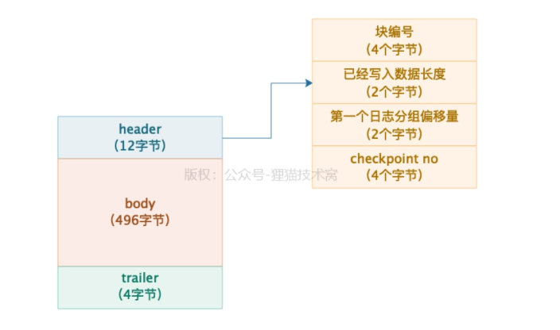

redo log block 与磁盘文件的关系

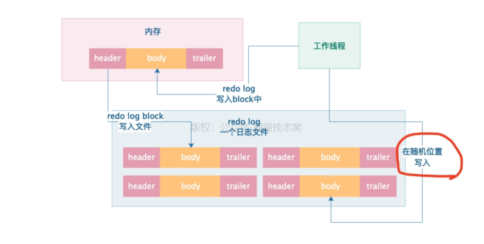

平时我们执行完增删改之后，要写入磁盘的redo log，其实应该是先进入到redo log block这个数据结构里，然后再进入磁盘文件

redo log buffer 类似申请出一块连续的空间，然后里面划分出N多个空的redo log block

通过设置mysql的innodb_log_buffer_size可以指定这个redo log buffer的大小，默认也就是16MB

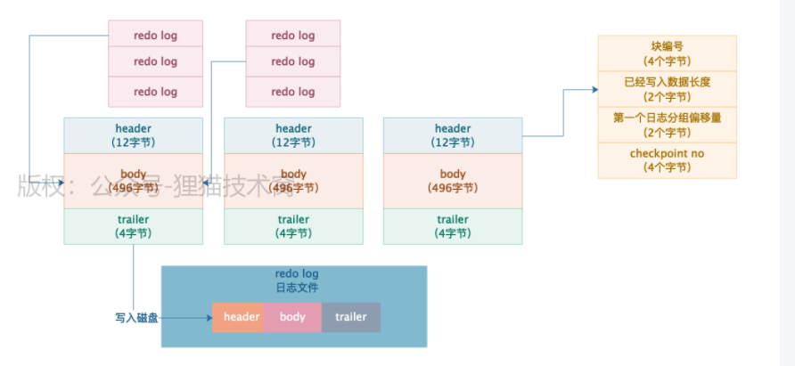

redo log buffer中的缓冲日志，到底是什么时候写入磁盘的？

    （1）如果写入redo log buffer的日志已经占据了redo log buffer总容量的一半了，也就是超过了8MB的redo log在
    缓冲里了，此时就会把他们刷入到磁盘文件里去
    （2）一个事务提交的时候，必须把他的那些redo log所在的redo log block都刷入到磁盘文件里去，只有这样，当事
    务提交之后，他修改的数据绝对不会丢失，因为redo log里有重做日志，随时可以恢复事务做的修改
    （PS：当然，之前最早最早的时候，我们讲过，这个redo log哪怕事务提交的时候写入磁盘文件，也是先进入os cache的，进入os的
    文件缓冲区里，所以是否提交事务就强行把redo log刷入物理磁盘文件中，这个需要设置对应的参数，我们之前都讲过的 ，大家回过
    头去看看 ）
    （3）后台线程定时刷新，有一个后台线程每隔1秒就会把redo log buffer里的redo log block刷到磁盘文件里去
    （4）MySQL关闭的时候，redo log block都会刷入到磁盘里去

redo log占用磁盘越来越大怎么办？

实际上默认情况下，redo log都会写入到一个目录中文件按里，这个目录可以通过

    show variables like 'datadir'

可以通过修改

    innodb_log_group_home_dir

参数来设置redo log这个目录

指定每个redo log文件的大小，默认是48M

    innodb_log_file_size

指定日志文件的数量

    innodb_log_file_in_group

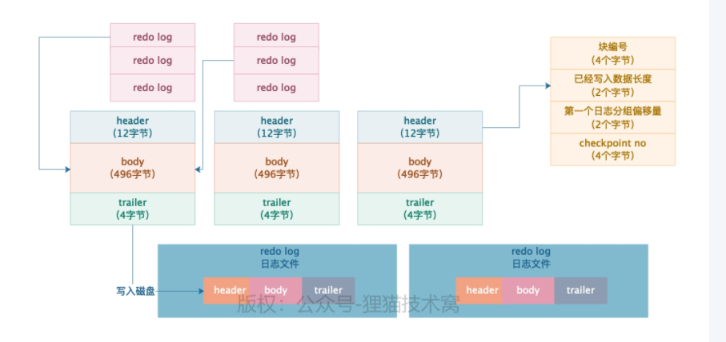

#### undo log

INSERT 语句的undo log 类型是TRX_UNDO_INSERT_REC ，这个undo log里包含了一下的东西：

        1.这条日志的开始位置
        2.主键的各列长度和值
        3.表idx
        4.undo log 日志编号
        5.undo log 日志类型
        6.这条日志的结束位置

现在事务要是回滚，直接从undo log 日志中拿出这个id，找到对应的数据删掉

### 事务

#### 多事务并发更新或者查询的数据问题

多个事务要是对缓存页里的同一条数据同时进行更新或者查询，此时会产生哪些问题？

      实际上会设计到脏读，脏写，不可重复读，幻读

##### 脏写

    事务B修改了事务A修改过的值，此时事务A还没提交，所以事务A随时会回滚，导致事务B修改过的值也没了

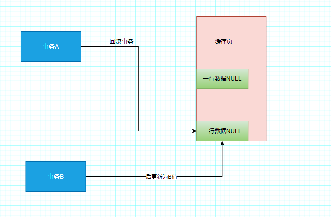

##### 脏读

    事务B查询了事务A修改过的数据，但是此时事务A还没有提交，所以事务A随时回滚，导致事务B再次查询就读不到事务A修改的数据了

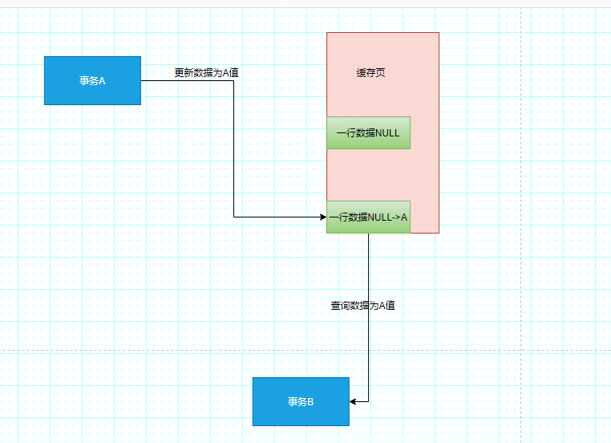

其實一句话总结：

    无论是脏写还是脏读，都是因为一个事务去更新或者查询了另外一个还没有提交的事务更新过的数据
        
    因为另外一个事务还没提交，所以他随时可能反悔回滚，那么必然导致你更新的数据没了，或者你之前查询到的数据就没了，这种就是脏读和脏写。

##### 不可重复读

       针对已经提交的事务修改的值，被你的事务给读到了，你的事务多次查询，多次读到的是别人已经提交事务
       修改过的值，导致每次查询的值不一样

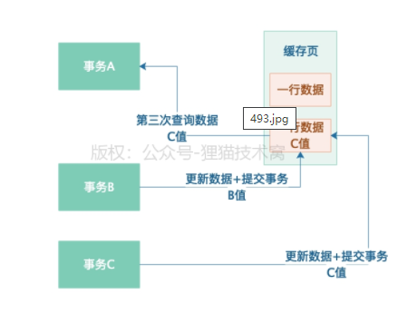

##### 幻读

#### SQL标准中对事务的4个隔离级别

SQL标准中滚定了4种事务隔离级别，并不是Mysql的事务隔离级别，mysql的事务隔离级别有点差别。

在SQL标准中，规定的4种事务隔离级别，就是说多个事务并发运行的同时，互相是如何隔离的，从而避免事务并发问题

这四种级别包括：

##### read uncommitted 读未提交：是不允许脏写的

    也就是说，不可能两个事务在没有提交的情况下去更新同一行数据的值，
    但是这种隔离级别下，可能发生脏读，不可重复度，幻读。

##### read committed  RC 读已提交：不可能发生脏写和脏读

    也就是说人家事务没有提交修改的值，你是绝对读不到的
    这种隔离级别下不会发生脏读和脏写，但是可以发生不可重复读和幻读

##### repeatable read RR 可重复读：不可能发生脏读脏写，不可重复读

    你的事务多次查询一个数据的值，哪怕别的事务修改这个值还提交了，没有，你不会读到人家事务提交事务修改过的值
    你的事务一旦开始，多次查询一个值，会一直读到同一个值。

##### serializable 串行化

     这种隔离级别，根本不允许你多个事务并发执行，只能串起来执行

#### spring对事务的支持

在@Transaction(isolation =isolation.DEFAULT),默认是default，表示数据库是什么就是什么 isolation.READ_UNCOMMITTED isolation.READ_COMMITTED
isolation.REPEATABLE_READ isolation.SERIALIZABLE

#### 透彻剖析Mysql的MVCC事务隔离机制

##### undo log版本链

    我们每条数据其实都有两个隐藏字段，一个是trx_id,一个是roll_pointer ，這個trx_id就是最近一次更新过这条数据的事务id，roll_pointer
    就是指向你了你更新这个事务之前生成的undo log。
    所以不管多个事务并发执行时如何执行的，起码先搞清楚一点，就是多个事务串行执行的时候，每个人修改了一行数据，都会更新隐藏字段
    trx_id和roll_pointer，同时之前多个数据快照对应的undo log，会通过roll_pointer指针串联起来，形成一个很重要的版本链

##### ReadView机制(https://apppukyptrl1086.pc.xiaoe-tech.com/detail/i_5e86040203a20_GmWrGMJe/1?from=p_5e0c2a35dbbc9_MNDGDYba&type=6)

在执行事务的时候，就会生成一个ReadView，里面比较重要的东西有四个

    1.一个是m_ids，这个就是说此时有哪些事务在mysql里执行还没有提交的
    2.一个是min_trx_id，就是m_ids里最小的值；
    3.一个是max_trx_id,这是说mysql下一个要生成的事务id，就是最大的事务id
    4.一个是create_trx_id，就是你这个事务的id

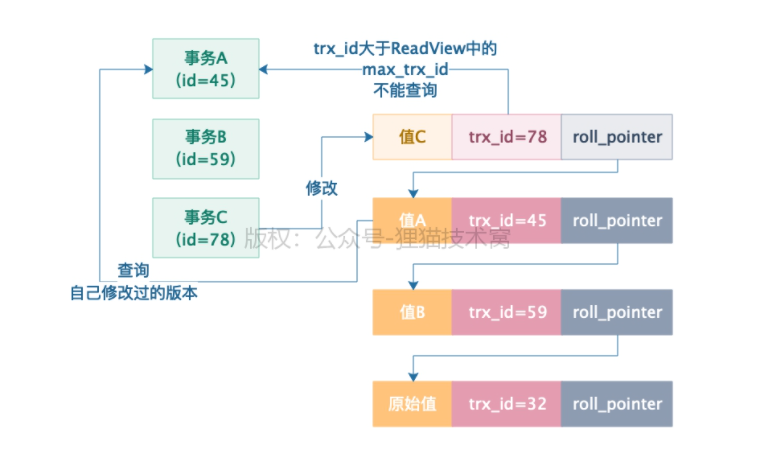

    通过undo log多版本链条，加上你开启事务时候生产的一个ReadView，然后再有一个查询的时候，根据ReadView进
    行判断的机制，你就知道你应该读取哪个版本的数据。
    而且他可以保证你只能读到你事务开启前，别的提交事务更新的值，还有就是你自己事务更新的值。假如说是你事务
    开启之前，就有别的事务正在运行，然后你事务开启之后 ，别的事务更新了值，你是绝对读不到的！或者是你事务开
    启之后，比你晚开启的事务更新了值，你也是读不到的！

##### Read Committed隔离级别是如何基于ReadView机制实现的？

    每次查询都生成新的ReadView，那么如果 在你这次查询之前，有事务修改了数据还提交了，你这次查询生成的ReadView里，那个m_ids列表当然不包含这个已
    经提交的事务了，既然不包含已经提交的事务了，那么当然可以读到人家修改过的值了。
    这就是基于ReadView实现RC隔离级别的原理，实际上，基于undo log多版本链条以及
    ReadView机制实现的多事务并发执行的RC隔离级别、RR隔离级别，就是数据库的MVCC多版本并发控制机制。

##### MySQL最牛的RR隔离级别，是如何基于ReadView机制实现的？

默认的ReadView 就是这个机制

    默认情况下，有人在更新数据的时候，你去读取这一行数据,直接默认就是开启mvcc机制的。
    也就是说，此时一行数据的读和写两个操作默认是不会加锁互斥的，因为mysql的mvcc机制就是为了解决这个问题，避免频繁加锁互斥。
    此时你读取数据，完全可以根据你的ReadView，去在undo log版本链条里找一个你能读取的版本，完全不用顾虑别人在不在更新。
    就算你真的等他更新完毕了还提交了，基于mvcc机制，你也读取不到他更新的值啊！因为ReadView机制是不允许的，所以你默认情况下的读
    ，完全不需要加锁，不需要care其他食物的更新加锁问题，直接介于mvcc机制读某个快照就可以了
    
    如果要再执行查询的时候想要加锁，mysql支持一种共享锁 就是 s锁，这种共享锁的语法
    select * from table lock in mode
    共享锁和独占锁互斥，独占锁之间互斥，共享锁与共享锁不互斥
        
    查询的时候还能加互斥锁，也就是 X 锁（Exclude独占锁），这种独占锁的语法
    select * from table for update
   
    当有一个事务加了独占锁之后，其他事务再更新这行数据，都是要加独占锁的，但是只能生成独占锁在后面等待。

    一旦你查询的时候加了独占锁，此时在你的事务提交之前，任何人都不能更新数据，只能你在本事务里更新数据，等你提交了别人在更新数据

#### 多个事务更新同一行数据时，是如何加锁避免脏写的？

多个事务同时更新一行数据，此时都会加锁（X 锁，也就是Exclude独占锁），然后都会等待排队，必须一个事务执行完毕了，提交了，释放了锁，才能唤醒别的事务继续执行。

加锁

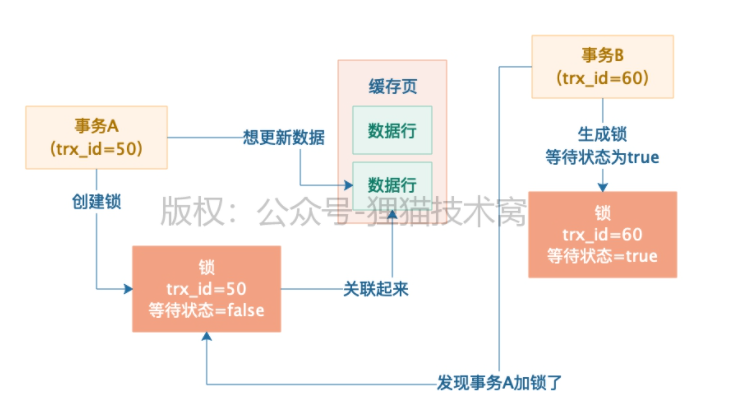

释放锁-加锁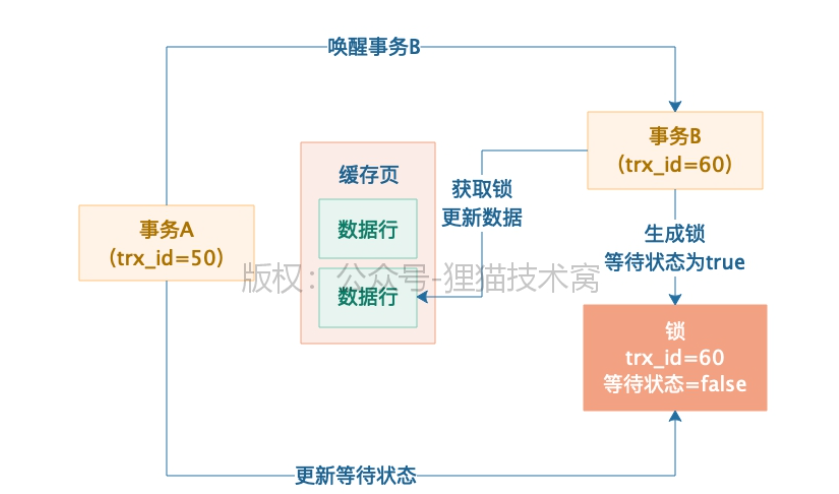

##### 共享锁

    如果要再执行查询的时候想要加锁，mysql支持一种共享锁 就是 s锁，这种共享锁的语法
    select * from table lock in mode
    共享锁和独占锁互斥，独占锁之间互斥，共享锁与共享锁不互斥

    默认情况下，有人在更新数据的时候，你去读取这一行数据,直接默认就是开启mvcc机制的。
    也就是说，此时一行数据的读和写两个操作默认是不会加锁互斥的，因为mysql的mvcc机制就是为了解决这个问题，避免频繁加锁互斥。
    
    如果要再执行查询的时候想要加锁，mysql支持一种共享锁 就是 s锁，这种共享锁的语法
    select * from table lock in mode
    共享锁和独占锁互斥，独占锁之间互斥，共享锁与共享锁不互斥
        
    查询的时候还能加互斥锁，也就是 X 锁（Exclude独占锁），这种独占锁的语法
    select * from table for update
   
    当有一个事务加了独占锁之后，其他事务再更新这行数据，都是要加独占锁的，但是只能生成独占锁在后面等待。

    一旦你查询的时候加了独占锁，此时在你的事务提交之前，任何人都不能更新数据，只能你在本事务里更新数据，等你提交了别人在更新数据

##### 独占锁

    当有一个事务加了独占锁之后，其他事务再更新这行数据，都是要加独占锁的，但是只能生成独占锁在后面等待。

    查询的时候还能加互斥锁，也就是 X 锁（Exclude独占锁），这种独占锁的语法
    
    select * from table for update

    一旦你查询的时候加了独占锁，此时在你的事务提交之前，任何人都不能更新数据，只能你在本事务里更新数据，等你提交了别人在更新数据

#### 在表级别加锁

多个事务并发更新数据的时候，都要在行级别加独占锁，独占锁是互斥的，所以不可能发生脏写问题，一个事务提交了才会释放自己的独占锁，唤醒下一个事务的执行。
如果你此时去读取别的事务在更新的数据，有两种可能：
    1.第一种可能就是基于MVCC机制进行事务隔离，读取快照版本，这个是比较常见的；
    2.第二种可能是查询的同时基于特殊语法去加独占锁或者共享锁。

一般而言，不太建议在数据卷粒度去通过行锁实现复杂的业务锁机制，而更加建议通过redis，zookeeper来用分布式锁来实现复杂业务下的锁机制

比较正常的情况而言，其实还是多个事务并发运行更新一行数据，默认加独占锁互斥，同时其他事物基于mvcc机制进行快照版本读实现事务隔离
、表锁其实是InnoDB存储引擎的概念

#### 索引

##### 磁盘上数据页的存储结构

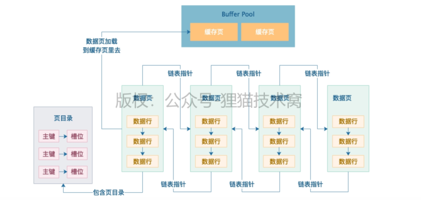

    大量的数据页按照顺序一页一页的存放的，然后相邻的两个数据页会采用采用双向列表的格式互相引用
    
    然后一个数据页内部会存储一行行的数据，也就是我们平时在表里插入的一行行数据就会存储在数据页里
    
    然后数据页里的每一行数据都会按照主键大小进行排序村粗，同时每一行数据都有一个指针指向下一行数据
    
    的位置，组成一个单向链表。

    然后每个数据页都会有一个页目录，里面根据数据行的主键存放一个目录，同时数据行是被分割存储在不同槽位里去的

在没有索引的情况下查找数据
    
    第一个数据页遍历所有数据页查找，将数据页加载到缓存页中
    如果是主键查找，在数据页的页目录里,根据主键值直接定位到数据行
    如果非主键查找，再=单向遍历查找那条数据，如果没有那条数据，再加载下一个数据页到缓存页里来
    以此类推，循环往复， 其实就是一个全表扫描

#### 页分裂的过程

    假如我们不停的再表里插入数据，接着数据越来越多，此时就要在搞一个数据页了
    但是此时就会遇到一个问题，索引运作的一个核心基础就是要求你后一个数据页的主键值大于前面一个数据页的主键值
    但是如果你的主键是自增的，还可以保证这一点，因为你新插入的后一个数据页的主键值一定都大于前一个数据页的主键值。
    但是如果你的主键不是自增的，所以可能会出现你的后一个数据页的主键值里，有点小于前一个数据页的主键值。
    所以此时就会出现一个过程叫做也分裂
    就是万一你的主键值都是你自己设置的，那么在增加一个新的数据页的时候，实际上会把前一个数据页主键值较大，挪到新的数据页里来
    然后把你新插入的主键值较小的数据挪动到上一个数据页里去。保证了新数据页里的主键值一定都比上一个数据页里的主键值大。
    
#### 主键索引

    我们先拿最基础的主键索引来分析，把索引原理和查询原理搞清楚
    
    mysql针对主键设计了一个索引，针对主键的索引实际上就是主键目录这个目录呢
    把每个数据页的页号，还有数据页里最小主键的值放在一起，组成一个索引目录
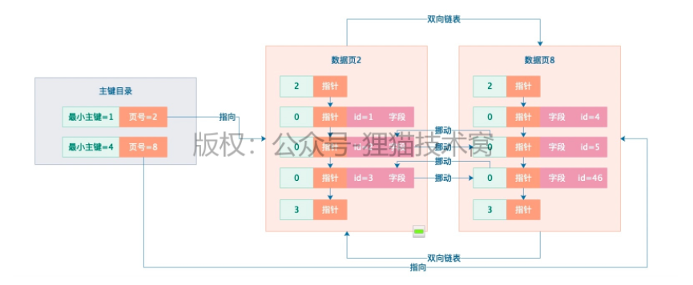

    通过主键查找时，通过二分查找，对比之后，确定id到底在那个数据页，
    通过页目录直接定位到数据行

#### B+树实现索引的物理结构

    很多索引数据不可能一直放在索引页里，会进行分裂
    
    在更高索引层级里，保存每个索引页里最小的主键值，如果最顶层的索引页里存放下层索引页的也好太多了怎么办？
    继续分裂，加一层索引页，这就形成了B+树，
    这是索引最真实的物理存储结构，采用跟数据页一样的页结构来存储，一个索引就是由很多个数据页组成的一颗B+树

#### 聚簇索引

更新数据时，自动维护的聚簇索引

    当我们要查找谋和主键id 的值时，通过二分查找很容易找到对应的索引页，通过索引页就能快读定位到数据页
    实际上索引页和数据页之间是有指针连接起来的
    另外呢,对于同一层级的索引页互相之间都是基于指针组成双向链表的
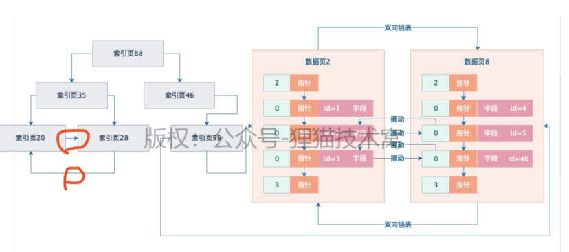

    加入把索引页和数据页综合起来看,他们连接在一起,看起来就如同一颗完整的大B+树一样
    
    在B+树里最底层的一层就是数据页,数据页也就是B+树里的叶子节点了
    
    也就是说,上图所有的索引页+数据页组成的B+树就是**聚簇索引**
    
    这个聚簇索引默认时按照主键来组织的,所以你在增删改的时候,一方面会更新数据页,另一方面其实会给你自动维护
    B+树结构的聚簇索引,给新增和更新索引页,这个聚簇索引是默认给你建立的.

#### 针对主键之外的其他字段建立索引的原理

    根据主键搜索数据的原理其实很清晰了,其实就是从聚簇索引的根节点进行二分查找,一路找到对应的数据页里,
    基于页目录直接定位到主键对应的数据就可以了

主键之外的其他字段建立索引的原理
    
    其实原理是一样的,简单来说,你插入数据的时候,一方面会把完整的数据插入到聚簇索引的叶子节点的数据页里面去,
    同时维护好聚簇索引,另一方面会为其他字段建立索引,重新建立一颗B+树.
    
    比如你基于name建立一个索引,那么此时你插入数据的时候,就会重新搞一个B+树(这是独立与聚簇索引的另一个索引的B+树),
    B+树的叶子节点也是数据页,但是这个数据页里仅仅存放主键字段和name字段.

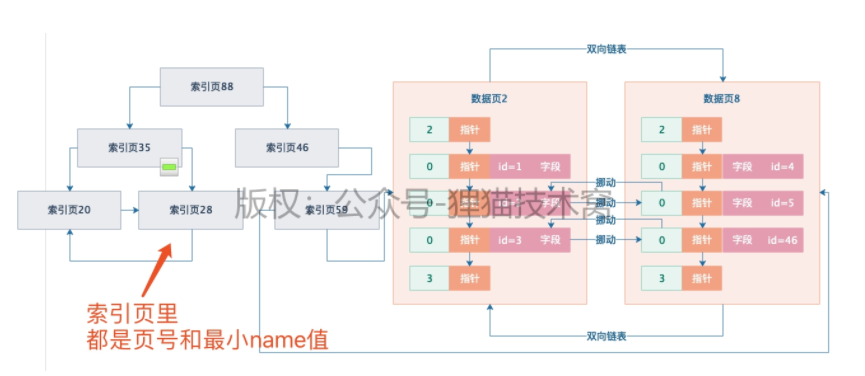

    搜索的时候过程和主键字段一模一样,不就是从name字段的索引B+树里根节点开始一层一层往下找,一直找到
    叶子节点的数据页里,定位到name字段对应的主键值.
    此时还需要进行回表操作,这个回表就是根据主键值,再到聚簇索引里面从根节点开始,一路找到叶子接待你的数据页,
    定位到主键对应的完整数据行.
    一般吧普通字段的索引称为二级索引,一级索引就是聚簇索引

多个字段联合起来,建立联合索引,比如:age+name

    联合索引的运行原理也是一样的,只不过是建立了一颗独立的B+树,叶子节点里面存放了id+name+age的数据,
    然后默认按照name排序,name一样就按照age排序
    查询的时候和普通索引一样的原理

这就是InnoDB存储引擎的索引的完整实现原理了.
    

### mysql物理存储

#### VARCHAR这种变长字段，在磁盘上到底是如何存储的

**引⼊变长字段的长度列表，解决⼀⾏数据的读取问题：**

    将数据的长度转成16进制表示，放在数据存储的前面

**多个变长字段是如何存储的？**

    此时在磁盘中存储的，必须在他开头的变长字段长度列表中存储⼏个变长字段的长度，⼀定要注意⼀点，他这⾥是逆
    序存储的！

0x05 null值列表 数据头 hello a a 0x02 null值列表 数据头 hi a a

**mysql的一行行数据紧凑存储有什么好处？**

    多行紧凑的原因有： 序列化反序列时的开销小；不易有内存碎片；定位数据时比较快速

#### 一行数据中的多个NULL字段值在磁盘上怎么存储

**为什么一行数据的NULL值不能直接存储？**

    肯定不是按照字符串的方式存储，会浪费空间。

**NULL值是以二进制Bit来存储的？**

    bit值是1 说明是NULL，如果是0 说明不是NULL

**磁盘上的⼀⾏数据到底如何读取出来的？**

    我们结合上⾯的磁盘上的数据存储格式来思考⼀下，⼀⾏数据到底是如何读取出来的呢？
    再看上⾯的磁盘数据存储格式：
    0x09 0x04 00000101 头信息 column1=value1 column2=value2 ... columnN=valueN

    ⾸先他必然要把变长字段长度列表和NULL值列表读取出来，通过综合分析⼀下，就知道有⼏个变长字段，哪⼏个变长
    字段是NULL，因为NULL值列表⾥谁是NULL谁不是NULL都⼀清⼆楚。
    此时就可以从变长字段长度列表中解析出来不为NULL的变长字段的值长度，然后也知道哪⼏个字段是NULL的，此时
    根据这些信息，就可以从实际的列值存储区域⾥，把你每个字段的值读取出来了。
    如果是变长字段的值，就按照他的值长度来读取，如果是NULL，就知道他是个NULL，没有值存储，如果是定长字
    段，就按照定长长度来读取，这样就可以完美的把你⼀⾏数据的值都读取出来了！

#### 磁盘文件中40个bit位的数据头以及真实数据是如何存储的

    每一行数据在磁盘上存储的时候，每一行数据都会有变长字段长度列表，逆序存放这行数据里的变长字段的长度，  
    然后会有NULL值列表，对于允许NULL值得字段都会有一个bit位标识那个字段是否为NULL，也是逆序排序得

每一行数据存储得时候，还得有一个bit位得数据头，这个数据头是用来描述这行数据的。

    第一位bit和第二位bit都是预留位，是没有任何含义的。
    接下来的bit位是delete_mask：他标识这行数据是否被删除了
    下一个bit位是min_rec_mask：在B+树里每一层的非页字节点里最小值都有这个标记
    接下来是4个bit位是n_owned：记录了一个记录数
    接下来13个bit位是heap_no，他代表是当前这行数据在数据堆里的位置
    然后是3个bit位record_type：也就是这行数据的类型
       0:代表普通类型
       1：代表是B+树非叶子节点
       2：代表是最小值的数据 
       3：代表最大值的数据
    最后16位bit是next_record:这个是他下一条数据的指针

#### 一行数据实际在磁盘上的存储

变长字段列表 NULL值列表 数据头 真实数据

在实际存储一行数据的时候，会在他真实数据部分，添加一些隐藏字段

    DB_ROW_ID 字段：这是一个行的唯一标识，是数据库内部的一个标识，不是你的主键ID字段，入股我们没有指定主键和
    unique key 唯一索引的时候，他的内部就会自动加一个DB_ROW_ID

    DB_TRX_ID字段，这个跟事务相关，他是说这是哪个事务更新的数据，这是事务ID。

    DB_ROLL_PTR，这是回滚指针，用来进行事务回滚的

#### 行溢出

行溢出：就是一行的数据存储太多的内容，一个数据页都放不下，此时只能溢出这个数据页，把数据溢出存放到其他数据页里去，那些数据页就叫做溢出页。

#### 表空间

    表空间：我们平时创建的那些表，其实就是都有一个表空间的概念，在磁盘上对会对应'表明.ibd'，这样的一个磁盘数据文件。’
    
    ‘一个表空间磁盘文件里，其实会有很多很多的数据页，为了便于管理，表空间又引入了**数据区（extent）**
    一个数据区对应64个连续的数据页，每个数据页的大小是16kb，所以一个数据区就是1mb，然后256个数据区被划分为一组。
    
    当我们需要执行CRUD操作的时候，说白，就是从磁盘上表空间的数据文件里，去加载一些数据页出来到buffer pool的缓存页里区使用

### 生产实践

#### 真实生产环境下的数据库机器配置如何规划

普通应用的机器选择？

    就经验而言，普通的系统 4核8G ，每秒抗几百的请求没问题，
    数据库通常是在8核16G以上正常的是16核32G

高并发场景数据库应该选择什么样的机器？

    磁盘，io，网络压力会比较大，最好采用ssd固态硬盘

#### 互联网公司的生产环境数据库是如何进行性能测试的？

请求测试指标：QPS、TPS

    QPS：Query Per Second，每秒可以处理多少个请求，也就是说这个数据库每秒可以处理多少个sql
    
    TPS：Transaction Per Second 。其实就是每秒可处理的事物

IO相关压测性指标

    IOPS：这个是机器随机IO并发处理能力
    这个指标很关键，你在内存中更新的脏数据，最后都会由后台IO在不确定时间，刷回到磁盘里去。这个是随机IO的过程，
    如果说IOPS指标太低了，那么会导致脏数据刷回磁盘的效率不高。

    吞吐量：这个指机器的磁盘存储每秒可以读写多少个字节的数据
    这个指标也很关键，因为大家通过学习都知道，我们在平时执行各种sql的时候，提交事物的时候，其实都会有大量会写redo log日志之类的，这些日志都会直接写磁盘

    latency：这个指标说的往磁盘里写入一条数据的延迟。
    这个指标同样很重要，因为我们执行sql语句和提交事物的时候，都需要顺序写redo log 次哦盘文件，所以此时
    你写一条日志到磁盘文件里去，到底延迟是1ms还是100us，这就是对你的数据库sql语句执行性能是有影响的

其它指标

    CPU负载：PU负载是⼀个很重要的性能指标，因为假设你数据库压测到了每秒处理3000请求了，可能其他的性能指标
    都还正常，但是此时CPU负载特别⾼，那么也说明你的数据库不能继续往下压测更⾼的QPS了，否则CPU是吃不消的。
    
    网络负载：这个主要是要看看你的机器带宽情况下，在压测到⼀定的QPS和TPS的时候，每秒钟机器的⽹卡会输⼊多少
    MB数据，会输出多少MB数据，因为有可能你的⽹络带宽最多每秒传输100MB的数据，那么可能你的QPS到1000的时候，⽹
    卡就打满了，已经每秒传输100MB的数据了，此时即使其他指标都还算正常，但是你也不能继续压测下去了

    内存负载：：这个就是看看在压测到⼀定情况下的时候，你的机器内存耗费了多少，如果说机器内存耗费过⾼了，说明也
    不能继续压测下去了

#### 如何对生产环境中的数据库进行360度无死角压测？（https://apppukyptrl1086.pc.xiaoe-tech.com/detail/i_5e383c5357307_MjhluwMb/1?from=p_5e0c2a35dbbc9_MNDGDYba&type=6）

在linux 安装sysbench

    curl -s https://packagecloud.io/install/repositories/akopytov/sysbench/script.rpm.sh | sudo bash
    sudo yum -y install sysbench
    sysbench --version
    如果上⾯可以看到sysbench的版本号，就说明安装成功了

    QPS：Query Per Second，每秒可以处理多少个请求，也就是说这个数据库每秒可以处理多少个sql
    
    TPS：Transaction Per Second 。其实就是每秒可处理的事物

如何为生产环境中的数据库部署监控系统

    Prometheus：其实就是一个监控数据采集和存储系统，它可以利用采用缉拿空数据采集组件从你指定的Mysql数据库中采集他需要的监控数据
    然后他自己由一个时序数据库，他会把采集道德监控数据放到自己的时序数据库中，本质就是存储在磁盘文件里。
    
    Grafana：就是一个可视化的监控数据展示系统，他可以Prometheus采集到的大量mysql监控数据展示成各种精美报告，可以让我们直接看到mysql的监控情况。

#### 如何通过多个Buffer Pool来优化数据库的并发性能

多线程并发访问一个Buffer Pool的时候必然会加锁，然后很多线程可能要串行着排队，一个个的依次执行操作。

一般来说，Mysql默认的规则是，如果你给Buffer Pool分配的内存大小小于1GB，那么最多就会给你一个Buffer Pool

但是如果你的机器内存就很大，那么此时你是可以同时设置多个Buffer Pool

      innodb_buffer_pool_size = 8589934592
      innodb_buffer_pool_instance = 4

我们给Buffer Pool 设置了8GB的总内存，然后设置了4个Buffer Pool，也就是说每个Buffer Pool的大小是2GB

所以在生产实践中设置多个Buffer Pool 来优化高并发访问的性能，是mysql一个很重要的优化技巧。

#### 如何通过chunk来支持数据库运行期间的Buffer Pool动态调整

实际上Buffer Pool是由很多个chuck组成的，他的大小是innodb_buffer_pool_chunk_size 来控制的默认值是128M

    所以实际上我们可以做一个假设，比如现在我们给Buffer Pool 设置一个总大小是8GB，然后4个Buffer Pool ，那么每个Buffer Pool 就是2GB
     此时每个Buffer Pool 是由一系列的128M chuck组成的，也就是说每个Buffer Pool 会有16个chuck，然后每个Buffer Pool里的每个chuck里就是一系列
    数据描述和缓存页，每个Buffer Pool里的多个chuck共享一套 free flush lru 链表 

#### 在生产环境中，如何基于机器配置来合理设置Buffer Pool

Buffer Pool 的大小一般设置为机器大小的50-60%

确定了Buffer pool 的总大小之后，就得考虑设置多少个buffer pool以及chuck

一般来说： buffer pool总大小 = （chuck大小 * buffer pool数量）的倍数

#### Linux操作系统的存储系统软件层原理剖析以及IO调度优化原理

Linux的存储系统分为VFS层、⽂件系统层、Page Cache缓存层、通⽤Block层、IO调度层、Block设备驱动 层、Block设备层，

当mysql发起随机读写或者一次顺序写redo log日志文件的顺序读写的时候，实际上会把磁盘IO请求交给linux操作系统的VFS层

VFS层：根据你是对哪个目录中的文件执执行磁盘IO操作，把IO请求交给具体的文件系统。

    举个例⼦，在linux中，有的⽬录⽐如/xx1/xx2⾥的⽂件其实是由NFS⽂件系统管理的，有的⽬录⽐如/xx3/xx4⾥的⽂件
    其实是由Ext3⽂件系统管理的，那么这个时候VFS层需要根据你是对哪个⽬录下的⽂件发起的读写IO请求，把请求转
    交给对应的⽂件系统，如下图所⽰

    接着⽂件系统会先在Page Cache这个基于内存的缓存⾥找你要的数据在不在⾥⾯，如果有就基于内存缓存来执⾏读
    写，如果没有就继续往下⼀层⾛，此时这个请求会交给通⽤Block层，在这⼀层会把你对⽂件的IO请求转换为Block IO
    请求，如下图所⽰

    接着IO请求转换为Block IO请求之后，会把这个Block IO请求交给IO调度层，在这⼀层⾥默认是⽤CFQ公平调度算法的
    也就是说，可能假设此时你数据库发起了多个SQL语句同时在执⾏IO操作。
    有⼀个SQL语句可能⾮常简单，⽐如update xxx set xx1=xx2 where id=1，他其实可能就只要更新磁盘上的⼀个block
    ⾥的数据就可以了
    但是有的SQL语句，⽐如说select * from xx where xx1 like "%xx%"可能需要IO读取磁盘上的⼤量数据。
    那么此时如果基于公平调度算法，就会导致他先执⾏第⼆个SQL语句的读取⼤量数据的IO操作，耗时很久，然后第⼀
    个仅仅更新少量数据的SQL语句的IO操作，就⼀直在等待他，得不到执⾏的机会。
    所以在这⾥，其实⼀般建议MySQL的⽣产环境，需要调整为deadline IO调度算法，他的核⼼思想就是，任何⼀个IO操
    作都不能⼀直不停的等待，在指定时间范围内，都必须让他去执⾏。
    所以基于deadline算法，上⾯第⼀个SQL语句的更新少量数据的IO操作可能在等待⼀会⼉之后，就会得到执⾏的机会，
    这也是⼀个⽣产环境的IO调度优化经验。
    我们看下图，此时IO请求被转交给了IO调度层

    最后IO完成调度之后，就会决定哪个IO请求先执⾏，哪个IO请求后执⾏，此时可以执⾏的IO请求就会交给Block设备驱
    动层，然后最后经过驱动把IO请求发送给真正的存储硬件，也就是Block设备层，如下图所⽰。

    然后硬件设备完成了IO读写操作之后，要不然是写，要不然是读，最后就把响应经过上⾯的层级反向依次返回，最终
    MySQL可以得到本次IO读写操作的结果

#### 数据库服务器使用的RAID存储架构初步介绍

    所以MySQL数据库软件都是安装在一台linux服务器上的，然后启动MySQL的进程，就是启动了一个MySQL数据库
    
    MySQL运行过程中，他需要使用CPU、内存、磁盘和网卡这些硬件，但是不能直接使用，都是通过调用操作系统提供的接口，依托于操作系统来使用和运行的，然后linux操作系统负责操作底层的硬件。

    数据库部署在机器上的时候，存储都是搭建的RAID存储架构
    
    RAID就是一个磁盘冗余阵列
    
    RAID这个技术，大致理解为用来管理机器里的多块磁盘的一种磁盘阵列技术！
    
    有了他以后，你在往磁盘里读写数据的时候，他会告诉你应该在哪块磁盘上读写数据，

    有了RAID这种多磁盘阵列技术之后，我们是不是就可以在一台服务器里加多块磁盘，扩大我们的磁盘存储空间了？
    
    当我们往磁盘里写数据的时候，通过RAID技术可以帮助我们选择一块磁盘写入，在读取数据的时候，我们也知道从哪块磁盘去读取。

除此之外，RAID技术很重要的一个作用，就是他还可以**实现数据冗余机制**

    所谓的数据冗余机制，就是如果你现在写入了一批数据在RAID中的一块磁盘上，然后这块磁盘现在坏了，无法读取了，那么岂不是你就丢失了一波数据？如下图所示
    
    

所以其实有的RAID磁盘冗余阵列技术里，是可以把你写入的同样一份数据，在两块磁盘上都写入的.
这样可以让两块磁盘上的数据一样，作为冗余备份，然后当你一块磁盘坏掉的时候，可以从另外一块磁盘读取冗余数据出来，这一切都是RAID技术自动帮你管理的，不需要你操心， 如下图。

所以RAID技术实际上就是管理多块磁盘的一种磁盘阵列技术，他有软件层面的东西，也有硬件层买的东西，比如有RAID卡这种硬件设备。

具体来说，RAID还可以分成不同的技术方案，比如RAID 0、RAID 1、RAID 0+1、RAID2，等等，一直到RAID 10，很多种不同的多磁盘管理技术方案

#### 数据库服务器上的RAID存储架构的电池充放电原理

RAID緩存模式設置為write back，意思是先寫緩存再寫磁盤整列

鋰電池會性能减弱，所以需要对锂电池的配置订定时充放电。

充电的过程中 RAID缓存级别会从write back 变成write through，这个时候IO直接些磁盘。性能会下降，导致数据库抖动出现性能抖动。

#### RAID锂电池充放电导致的MySQL数据库性能抖动的优化

RAID 0：同时些很多快磁盘，读写并发能力强，容易丢失数据 RAID 1：两块磁盘为镜像关系，所写的数据在另一块磁盘上都有，形成数据冗余，防止数据丢失，分摊读写的压力。

RAID 10 = RAID 0 + RAID 1：写的时候使用RAID 0 的思路，备份使用RAID 1 的思路。

对于RAID 锂电池充放电问题导致的存储性能抖动，一般有三种解决方案：

    1.给RAID卡把锂电池换成电容，电容是不用频繁充放电的，不会导致充放电的性能抖动，还有就是电容可以支持透明充放电，就是自动检查电量，自动进行充电，不会说在充放电的时候让写IO直接走磁盘，但是更换电容很麻烦，而且电容比较容易老化，这个其实一般不常用

    2.手动充放电，这个比较常用，包括一些大家知道的顶尖互联网大厂的数据库服务器的RAID就是用了这个方案避免性能抖动，就是关闭RAID自动充放电，然后写一个脚本，脚本每隔一段时间自动在晚上凌晨的业务低峰时期，脚本手动触发充放电，这样可以避免业务高峰期的时候RAID自动充放电引起性能抖动

    3.充放电的时候不要关闭write back，就是设置一下，锂电池充放电的时候不要把缓存级别从write back修改为write through，这个也是可以做到的，可以和第二个策略配合起来使用

#### 数据库无法连接故障的定位TooManyConnections

TooManyConnections 说明数据库连接池已经满了，你的业务系统不能与他建立更多的连接了。

检查mysql的配置文件 my.conf，里面有个关键的参数max_connections就是mysql建立的最大连接数。

查看mysql实际最大连接数

    show variables like 'max_connections'

mysql无法设置max_connections期望值，只能强行限制为214？为什么？

        简单来说，就是因为底层linux操作系统把进程可以打开的文件句柄数限制为1024了导致mysql最大连接数时214
        为什么linux的最大文件句柄限制为1024的时候，MySQL的最大连接数是214呢？ 
        原因其实是mysql内部源码写死的，它在源码中就是有一个公式，算下来如此罢了

如何解决经典的Too Many Connections故障，背后的原理是什么？

        ulimit -HSn 65535
        然后就可以用如下命令检查最大文件句柄数是否被修改了
        cat /etc/security/limits.conf
        cat /etc/rc.local
        如果都修改好了之后，可以在mysql的my.cnf里确保max_connections参数也调整好了，然后就可以重启服务器，重启mysql，
        这样的话，linux的最大文件句柄就会生效了，mysql最大连接数也会生效了

#### 线上数据库不确定性的性能抖动优化

sql语句性能会出现不正常的莫名其妙的抖动，平时可能即使毫秒，现在居然要几秒钟，根本原因有两种：

1.第一个可能buffer pool缓存页都满了，此时你的sql查询了很多数据，一下把很多缓存页flush到磁盘上去，刷磁盘太慢了，就会导致你的查询语句执行的很慢。

2.第二种可能是你执行更新语句的时候，redo log在磁盘上的所有文件都写满了，此时需要回到第一个redo log文件覆盖写，覆盖写可能就涉及到第一个redo log文件里有很多
redo log日志对应的更新操作改动了缓存页，那写缓存页还没有flush到磁盘，此时就必须把哪些缓存页的flush到磁盘，才能执行后续的更新语句，那么这一等待
必然会导致更新执行很慢

如何尽可能的优化Mysql的一些参数，减少这种缓存页flush到磁盘带来的性能抖动的问题？

    1.对于不是数据库的机器一定要采用ssd的磁盘，
    2.innodb_io_capacity 这个参数是告诉数据库采用多大的io速率把缓存页flush到磁盘里去的
        可以使用fio工具测试磁盘最大随机io速率之后，就知道他每秒可以执行多少次随机io
    3.innodb_flush_neighbors,意思是在flush缓存页到磁盘德时候，可能会把缓存页临近的其他缓存页也刷到磁盘
    但是这样有时候会导致flush缓存也太多了，实际上如果你使用的是SSD固态硬盘，并没必要让他同时刷进临近的缓存页，
    可以把innodb_flush_neighbors设置为0，禁止刷进缓存页
