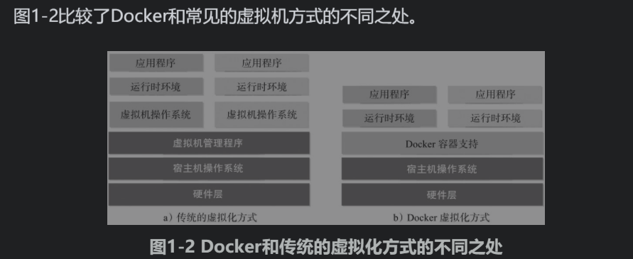

# docker
## 目录

- [基础入门](#基础入门)
    - [初识docker与容器](#初识docker与容器)
    - [核心概念与安装配置](#核心概念与安装配置)
    - [使用docker镜像](#使用docker镜像)
    - [操作docker容器](#操作docker容器)
    - [访问docker仓库](#访问docker仓库)
    - [docker数据管理](#docker数据管理)
    - [端口映射与容器互联](#端口映射与容器互联)
    - [使用dockerFile创建镜像](#使用dockerFile创建镜像)
- [实战案例](#实战案例)
    - [操作系统](#操作系统)
    - [为镜像添加ssh服务](#为镜像添加ssh服务)
    - [web服务与应用](#web服务与应用)
    - [数据库运用](#数据库运用)
    - [分布式处理与大数据平台](#分布式处理与大数据平台)
    - [编程开发](#编程开发)
    - [容器与云服务](#容器与云服务)
    - [容器实战思考](#容器实战思考)
- [进阶技能](#进阶技能)
    - [核心实现技术](#核心实现技术)
    - [配置私有仓库](#配置私有仓库)
    - [安全防护与配置](#安全防护与配置)
    - [高级网络功能](#高级网络功能)
    - [libnetwork插件化网络功能](#libnetwork插件化网络功能)
    - [安全防护与配置](#安全防护与配置)
- [开源项目](#开源项目)
    - [Etcd——高可用的键值数据库](#Etcd——高可用的键值数据库)
    - [Docker三剑客之Machine](#Docker三剑客之Machine)
    - [Docker三剑客之Compose](#Docker三剑客之Compose)
    - [Docker三剑客之Swarm](#Docker三剑客之Swarm)
    - [Mesos——优秀的集群资源调度平台](#Mesos——优秀的集群资源调度平台)
    - [Kubernetes——生产级容器集群平台](#Kubernetes——生产级容器集群平台)
    - [其他相关项目](#其他相关项目)
## 大纲
## 基础入门
### 初识docker与容器

#### 什么是docker
Docker是基于Go语言实现的开源容器项目。可以将Docker容器理解为一种轻量级的沙盒（sandbox）。每个容器内运行着一个应用，不同的容器相互隔离，容器之间也可以通过网络互相通信。
容器的创建和停止十分快速，几乎跟创建和终止原生应用一致； 另外，容器自身对系统资源的额外需求也十分有限，远远低于传统虚拟机。很多时候，甚至直接把容器当作应用本身也没有任何问题。

#### 为什么要使用Docker
**Docker容器虚拟化的好处**

**问题**：传统的部署，需要安装各个应用，并进行配置（安装mysql tomcat  nginx redis等并配置）工作繁琐而且无趣，
      并且一旦需要服务器迁移（从阿里云迁移到腾讯云）；又需要对每个应用进行安装和调试，极大的降低了工作效率
**原因**：究其根源，是这些应用直接运行在底层操作系统上，无法保证同一份应用在不同的环境中行为一致。

**docker解决方案**：**通过容器来打包应用、解耦应用和运行平台**。这意味着迁移的时候，**只需要在新的服务器上启动需要的容器**就可以了，无论新旧服务器是否是同一类型的平台。

**Docker在开发和运维中的优势**

- 1.更快速的交付和部署。
- 2.更高效的资源利用。
- 3.更轻松的迁移和扩展。
- 4.更简单的更新管理。

**Docker与虚拟机比较**

作为一种轻量级的虚拟化方式，Docker在运行应用上跟传统的虚拟机方式相比具有如下显著优势：

- Docker容器很快，启动和停止可以在秒级实现，这相比传统的虚拟机方式（数分钟）要快得多；
- Docker容器对系统资源需求很少，一台主机上可以同时运行数千个Docker容器（在IBM服务器上已经实现了同时运行10K量级的容器实例）；
- Docker通过类似Git设计理念的操作来方便用户获取、分发和更新应用镜像，存储复用，增量更新；
- Docker通过Dockerfile支持灵活的自动化创建和部署机制，以提高工作效率，并标准化流程。

#### Docker与虚拟化

虚拟化（virtualization）技术是一个通用的概念，在不同领域有不同的理解。在计算领域，一般指的是计算虚拟化（computing virtualization），或通常说的服务器虚拟化。

虚拟化的核心是对资源的抽象，目标往往是为了在同一个主机上同时运行多个系统或应用，从而提高系统资源的利用率，并且带来降低成本、方便管理和容错容灾等好处。

虚拟化：硬件的虚拟化和软件的虚拟化

软件虚拟化：应用虚拟化和平台虚拟化

平台虚拟化：【完全虚拟化:虚拟机模拟完整底层硬件环境和特权指令的执行过程，客户的操作系统无须进行修改。（例：VMware Workstation、VirtualBox）】

平台虚拟化：【硬件辅助虚拟化：利用硬件（主要是CPU）辅助支持（目前x86体系结构上可用的硬件辅助虚拟化技术包括Intel-VT和AMD-V）处理敏感指令来实现完全虚拟化的功能，客户操作系统无须修改。】

平台虚拟化：【部分虚拟化：只针对部分硬件资源进行虚拟化，客户操作系统需要进行修改。现在有些虚拟化技术的早期版本仅支持部分虚拟化；】

平台虚拟化：【超虚拟化：部分硬件接口以软件的形式提供给客户机操作系统，客户操作系统需要进行修改】

平台虚拟化：【操作系统级虚拟化。内核通过创建多个虚拟的操作系统实例（内核和库）来隔离不同的进程。容器相关技术即在这个范畴】

**Docker以及其他容器技术都属于操作系统虚拟化这个范畴**，操作系统虚拟化最大的特点就是不需要额外的supervisor支持。

传统方式是在硬件层面实现虚拟化，需要有额外的虚拟机管理应用和虚拟机操作系统层。Docker容器是在操作系统层面上实现虚拟化，直接复用本地主机的操作系统，因此更加轻量级。