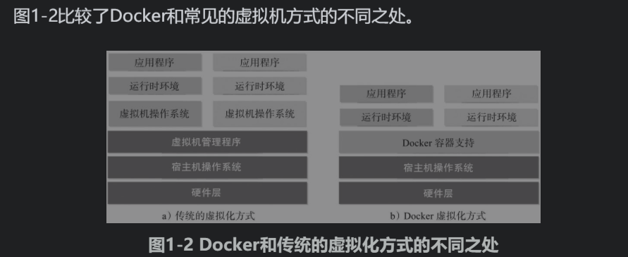
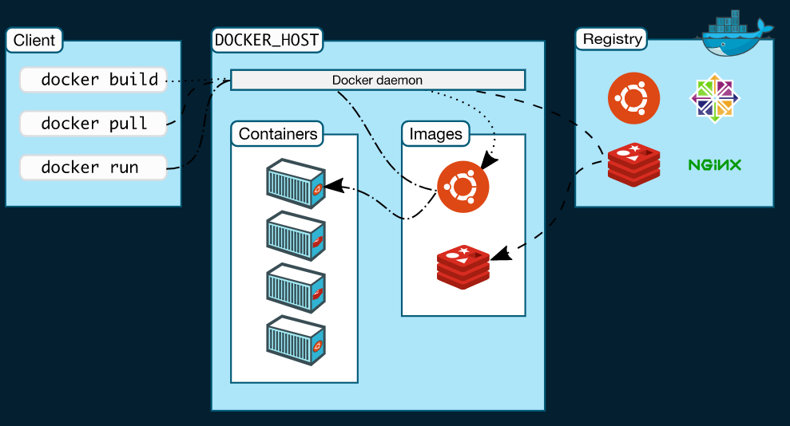
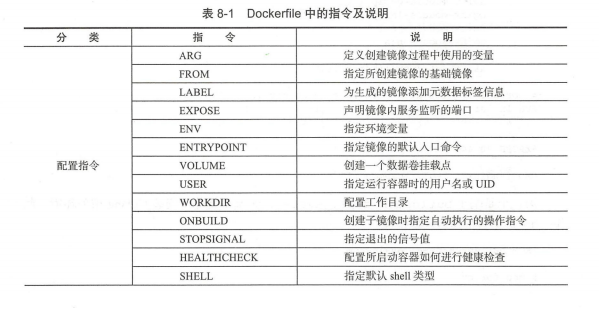
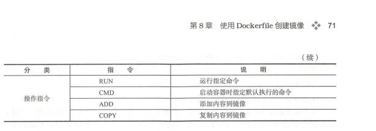

# docker
## 目录

- [Docker概述](#Docker概述)
    - [Docker平台](#Docker平台)
    - [我可以将Docker用于什么](#我可以将Docker用于什么？)
    - [docker架构](#docker架构)
- [获取Docker](#获取Docker)
- [开始吧](#开始吧)
    - [编写Dockerfile的最佳实践](#编写Dockerfile的最佳实践)
    - [实例应用程序](#实例应用程序？)
    - [更新应用程序](#更新应用程序)
    - [共享应用程序](#共享应用程序)
    - [持久化数据库](#持久化数据库)
    - [使用绑定安装](#使用绑定安装)
    - [多容器应用](#多容器应用？)
    - [使用DockerCompose](#使用DockerCompose)
    - [图像构建最佳实践](#图像构建最佳实践)
    - [接下来做什么](#接下来做什么)
- [特定语言指南](#特定语言指南)
- [使用Docker开发](#使用Docker开发)
- [设置CI/CD](#设置CI/CD)
- [将应用部署到云](#将应用部署到云)
- [在生产环境运行应用](#在生产环境运行应用)
- [教育资源](#教育资源)
- [docker开源](#docker开源)

## 大纲
## 基础入门
### Docker概述
Docker是基于Go语言实现的开源容器项目。
Docker是一个用于开发，交付和运行应用程序的开放平台。
Docker使您能够将应用程序与基础架构分开，从而可以快速交付软件。
助Docker，您可以以与管理应用程序相同的方式来管理基础架构。通过利用Docker的快速交付，测试和部署代码的方法，您可以显着减少编写代码和在生产环境中运行代码之间的延迟。

#### Docker平台
Docker提供了在松散隔离的环境（称为容器）中打包和运行应用程序的功能。隔离和安全性使您可以在给定主机上同时运行多个容器。容器是轻量级的，包含运行该应用程序所需的所有内容，因此您无需依赖主机上当前安装的内容。您可以在工作时轻松共享容器，并确保与您共享的每个人都能以相同的方式获得相同的容器。

Docker提供了工具和平台来管理容器的生命周期：

- 使用容器开发应用程序及其支持组件。
- 容器成为分发和测试您的应用程序的单元。
- 准备就绪后，可以将应用程序作为容器或协调服务部署到生产环境中。无论您的生产环境是本地数据中心，云提供商还是两者的混合，其工作原理都相同。

#### 我可以将Docker用于什么？
快速，一致地交付您的应用程序

Docker通过允许开发人员使用提供您的应用程序和服务的本地容器在标准化环境中工作，从而简化了开发生命周期。容器非常适合进行持续集成和持续交付（CI / CD）工作流。

考虑以下示例方案：

- 您的开发人员在本地编写代码，并使用Docker容器与同事共享他们的工作。
- 他们使用Docker将其应用程序推送到测试环境中，并执行自动和手动测试。
- 当开发人员发现错误时，他们可以在开发环境中对其进行修复，然后将其重新部署到测试环境中以进行测试和验证。
- 测试完成后，将修补程序推送给生产环境就像将更新的映像推送到生产环境一样简单。
- 响应式部署和扩展

Docker的基于容器的平台允许高度可移植的工作负载。Docker容器可以在开发人员的本地笔记本电脑上，数据中心内的物理或虚拟机上，云提供商上或混合环境中运行。

Docker的可移植性和轻量级的特性还使您可以轻松地动态管理工作负载，并根据业务需求指示实时扩展或拆除应用程序和服务。

在相同的硬件上运行更多的工作负载

Docker轻巧快速。它为基于虚拟机管理程序的虚拟机提供了一种可行的，具有成本效益的替代方案，因此您可以利用更多的计算能力来实现业务目标。Docker非常适合高密度环境以及中小型部署，而您需要用更少的资源做更多的事情。

 **Docker与虚拟化**

虚拟化（virtualization）技术是一个通用的概念，在不同领域有不同的理解。在计算领域，一般指的是计算虚拟化（computing virtualization），或通常说的服务器虚拟化。

虚拟化的核心是对资源的抽象，目标往往是为了在同一个主机上同时运行多个系统或应用，从而提高系统资源的利用率，并且带来降低成本、方便管理和容错容灾等好处。

虚拟化：硬件的虚拟化和软件的虚拟化

软件虚拟化：应用虚拟化和平台虚拟化

平台虚拟化：【完全虚拟化:虚拟机模拟完整底层硬件环境和特权指令的执行过程，客户的操作系统无须进行修改。（例：VMware Workstation、VirtualBox）】

平台虚拟化：【硬件辅助虚拟化：利用硬件（主要是CPU）辅助支持（目前x86体系结构上可用的硬件辅助虚拟化技术包括Intel-VT和AMD-V）处理敏感指令来实现完全虚拟化的功能，客户操作系统无须修改。】

平台虚拟化：【部分虚拟化：只针对部分硬件资源进行虚拟化，客户操作系统需要进行修改。现在有些虚拟化技术的早期版本仅支持部分虚拟化；】

平台虚拟化：【超虚拟化：部分硬件接口以软件的形式提供给客户机操作系统，客户操作系统需要进行修改】

平台虚拟化：【操作系统级虚拟化。内核通过创建多个虚拟的操作系统实例（内核和库）来隔离不同的进程。容器相关技术即在这个范畴】

**Docker以及其他容器技术都属于操作系统虚拟化这个范畴**，操作系统虚拟化最大的特点就是不需要额外的supervisor支持。

传统方式是在硬件层面实现虚拟化，需要有额外的虚拟机管理应用和虚拟机操作系统层。Docker容器是在操作系统层面上实现虚拟化，直接复用本地主机的操作系统，因此更加轻量级。

#### docker架构
Docker使用客户端-服务器架构。Docker客户端与Docker守护进程进行对话，该守护进程完成了构建，运行和分发Docker容器的繁重工作。

Docker客户端和守护程序可以 在同一系统上运行，或者您可以将Docker客户端连接到远程Docker守护程序。

Docker客户端和守护程序在UNIX套接字或网络接口上使用REST API进行通信。

另一个Docker客户端是Docker Compose，它使您可以处理由一组容器组成的应用程序。

以访问Docker官网的Get Docker（https://www.docker.com/get-docker）页面，查看获取Docker的方式，以及Docker支持的平台类型

##### Docker守护程序

Docker守护程序（dockerd）侦听Docker API请求并管理Docker对象，例如图像，容器，网络和卷。守护程序还可以与其他守护程序通信以管理Docker服务。

##### Docker客户端

Docker客户端（docker）是许多Docker用户与Docker交互的主要方式。当您使用诸如之类的命令时docker run，客户端会将这些命令发送到dockerd，以执行这些命令。该docker命令使用Docker API。Docker客户端可以与多个守护程序通信。

##### Docker注册表

Docker注册表存储Docker镜像。Docker Hub是任何人都可以使用的公共注册表，并且默认情况下，Docker已配置为在Docker Hub上查找镜像。您甚至可以运行自己的私人注册表。

使用docker pull或docker run命令时，将从配置的注册表中提取所需的图像。使用该docker push命令时，会将映像推送到已配置的注册表。

##### Docker对象

使用Docker时，您正在创建和使用镜像，容器，网络，卷，插件和其他对象。

###### 镜像

**一个镜像是用于创建一个码头工人容器指令的只读模板**。通常，一个镜像基于另一个镜像，并进行一些其他自定义。例如，您可以基于该ubuntu 镜像构建镜像，但安装Apache Web服务器和您的应用程序，以及运行该应用程序所需的配置详细信息。

您可以创建自己的镜像，也可以仅使用其他人创建并在注册表中发布的镜像。**要构建自己的镜像，您可以 使用简单的语法创建一个Dockerfile**，以定义创建镜像并运行它所需的步骤。Dockerfile中的每条指令都会在镜像中创建一个层。

当您更改Dockerfile并重建镜像时，仅重建那些已更改的层。与其他虚拟化技术相比，这是使镜像如此轻巧，小型和快速的部分原因。

###### 容器

**容器是镜像的可运行实例**。**您可以使用Docker API或CLI创建，启动，停止，移动或删除容器**。您可以将容器连接到一个或多个网络，将存储连接到它，甚至根据其当前状态创建一个新镜像。

默认情况下，容器与其他容器及其主机之间的隔离程度相对较高。您可以控制容器的网络，存储或其他底层子系统与其他容器或与主机的隔离程度。

容器由其镜像在创建或启动时为其提供的任何配置选项定义。删除容器后，未存储在持久性存储中的状态更改将消失。

示例docker run命令
以下命令运行一个ubuntu容器，以交互方式附加到本地命令行会话，然后运行/bin/bash。

$ docker run -i -t ubuntu /bin/bash
当您运行此命令时，会发生以下情况（假设您使用的是默认注册表配置）：

如果您在ubuntu本地没有该映像，则Docker会将其从已配置的注册表中拉出，就像您已docker pull ubuntu手动运行一样。

Docker会创建一个新容器，就像您已docker container create 手动运行命令一样。

Docker将一个读写文件系统分配给容器，作为其最后一层。这允许运行中的容器在其本地文件系统中创建或修改文件和目录。

Docker创建了一个网络接口，将容器连接到默认网络，因为您没有指定任何网络选项。这包括为容器分配IP地址。默认情况下，容器可以使用主机的网络连接连接到外部网络。

Docker启动容器并执行/bin/bash。因为容器是交互式运行的，并且已附加到您的终端（由于-i和-t 标志），所以您可以在输出记录到终端时使用键盘提供输入。

当您键入exit以终止/bin/bash命令时，该容器将停止但不会被删除。您可以重新启动或删除它。
### 底层技术

Docker用Go编程语言编写，并利用Linux内核的多种功能来交付其功能。Docker使用一种称为的技术namespaces来提供称为容器的隔离工作区。运行容器时，Docker会为该容器创建一组 名称空间。

这些名称空间提供了一层隔离。容器的每个方面都在单独的名称空间中运行，并且对其的访问仅限于该名称空间。

### 获取Docker(https://docs.docker.com/engine/)

#### 在CentOS上安装Docker Engine (https://docs.docker.com/engine/install/centos/#prerequisites)

**系统要求**：CentOS 7或8
centos-extras库必须启用。默认情况下，此存储库是启用的
overlay2建议使用存储驱动程序

##### 卸载旧版本
较旧的Docker版本称为docker或docker-engine。如果已安装这些程序，请卸载它们以及相关的依赖项。

    sudo yum remove docker \
                  docker-client \
                  docker-client-latest \
                  docker-common \
                  docker-latest \
                  docker-latest-logrotate \
                  docker-logrotate \
                  docker-engine

如果yum报告未安装这些软件包，则可以。

的内容（/var/lib/docker/包括图像，容器，卷和网络）被保留。Docker Engine软件包现在称为docker-ce。

##### 安装方法

您可以根据需要以不同的方式安装Docker Engine：

- 大多数用户会 设置Docker的存储库并从中进行安装，以简化安装和升级任务。这是**推荐的方法**。

- 一些用户下载并手动安装RPM软件包， 并完全手动管理升级。这在诸如在无法访问互联网的空白系统上安装Docker的情况下很有用。

- 在测试和开发环境中，一些用户选择使用自动 便利脚本来安装Docker。

**使用存储库安装**

在新主机上首次安装Docker Engine之前，需要设置Docker存储库。之后，您可以从存储库安装和更新Docker。

**设置存储库**

安装**yum-utils**软件包（提供**yum-config-manager** 实用程序）并设置稳定的存储库

    sudo yum install -y yum-utils
    sudo yum-config-manager \
    --add-repo \
    https://download.docker.com/linux/centos/docker-ce.repo

可选：启用每晚或测试存储库。

这些存储库包含在docker.repo上面的文件中，但默认情况下处于禁用状态。您可以在稳定存储库旁边启用它们。以下命令启用每晚存储库。

    sudo yum-config-manager --enable docker-ce-nightly

要启用测试通道，请运行以下命令：

    sudo yum-config-manager --enable docker-ce-test
您可以通过运行带有标志的命令来禁用每晚或测试存储库 。要重新启用它，请使用该标志。以下命令禁用夜间存储库。yum-config-manager--disable--enable

    sudo yum-config-manager --disable docker-ce-nightly
了解每晚和测试频道。

#####  安装Docker引擎

二选一：

1.安装最新版本的Docker Engine和容器，或转到下一步以安装特定版本：

    sudo yum install docker-ce docker-ce-cli containerd.io

Docker已安装但尚未启动。docker创建该组，但没有用户添加到该组。

2.要安装特定版本的Docker Engine，请在存储库中列出可用版本，然后选择并安装：

一种。列出并排序您存储库中可用的版本。本示例按版本号（从高到低）对结果进行排序，并被截断：

    yum list docker-ce --showduplicates | sort -r

返回的列表取决于启用的存储库，并且特定于您的CentOS版本（.el7此示例中的后缀表示）。

b。通过其完全合格的软件包名称安装特定版本，该软件包名称是软件包名称（docker-ce）加上版本字符串（第二列），从第一个冒号（:）到第一个连字符，以连字符（-）分隔。例如，docker-ce-18.09.1。

sudo yum install docker-ce-<VERSION_STRING> docker-ce-cli-<VERSION_STRING> containerd.io
Docker已安装但尚未启动。docker创建该组，但没有用户添加到该组。

3.启动Docker。

    sudo systemctl start docker

4.通过运行hello-world 映像来验证是否正确安装了Docker Engine 。

    sudo docker run hello-world

##### 升级Docker引擎

从软件包安装

1.转到https://download.docker.com/linux/centos/ 并选择您的CentOS版本。然后浏览x86_64/stable/Packages/ 并下载.rpm要安装的Docker版本的文件。

    注意：要安装夜间或测试（预发布）软件包，stable请将上述URL中的单词更改为nightly或test。 了解每晚和测试频道。

2.安装Docker Engine，将下面的路径更改为您下载Docker软件包的路径。

    sudo yum install /path/to/package.rpm

Docker已安装但尚未启动。docker创建该组，但没有用户添加到该组。

3.启动Docker。

    sudo systemctl start docker
4.通过运行hello-world 映像来验证是否正确安装了Docker Engine 。

    sudo docker run hello-world

此命令下载测试图像并在容器中运行它。容器运行时，它会打印参考消息并退出。

Docker Engine已安装并正在运行。您需要使用sudo来运行Docker命令。继续执行Linux的安装后步骤，以允许非特权用户运行Docker命令以及其他可选配置步骤。

升级Docker引擎

要升级Docker Engine，请下载更新的软件包文件，并使用 代替重复 安装过程，并指向新文件。
    
    yum -y upgrade yum -y install

##### 卸载Docker

1.卸载Docker Engine，CLI和Containerd软件包：

    sudo yum remove docker-ce docker-ce-cli containerd.io

2,主机上的映像，容器，卷或自定义配置文件不会自动删除。要删除所有图像，容器和卷：

    sudo rm -rf /var/lib/docker
    sudo rm -rf /var/lib/containerd
您必须手动删除所有已编辑的配置文件。

Linux的安装后步骤(https://docs.docker.com/engine/install/linux-postinstall/)

##### 以非root用户管理Docker

Docker守护程序绑定到Unix套接字而不是TCP端口。**默认情况下，Unix套接字由用户拥有root，其他用户只能使用来访问它sudo**。Docker守护程序始终以root用户身份运行。

**如果您不想在docker命令前添加sudo，请创建一个Unix组docker，并将其添加用户。**Docker守护程序启动时，它会创建一个可由该docker组成员访问的Unix套接字。

注意事项：

要在没有root特权的情况下运行Docker，请参阅 以非root用户身份运行Docker守护程序（无根模式）（https://docs.docker.com/engine/security/rootless/）。

###### 要创建docker组并添加您的用户，请执行以下操作

1.创建docker组。

     sudo groupadd docker

2.将您的用户添加到该docker组。

    sudo usermod -aG docker $USER

3.注销并重新登录，以便重新评估您的组成员身份。

如果在虚拟机上进行测试，则可能需要重新启动虚拟机以使更改生效。

在台式机Linux环境（例如X Windows）上，完全注销会话，然后重新登录。

在Linux上，您还可以运行以下命令来激活对组的更改

       newgrp docker

4.确认您可以docker不带命令行运行命令sudo。

     docker run hello-world

###### 配置Docker以在启动时启动

当前大多数Linux发行版（RHEL，CentOS，Fedora，Debian，Ubuntu 16.04及更高版本）用于systemd管理系统引导时启动的服务。在Debian和Ubuntu上，默认情况下，将Docker服务配置为在引导时启动。要在启动时自动启动其他发行版的Docker和Containerd，请使用以下命令：

    sudo systemctl enable docker.service
    sudo systemctl enable containerd.service

若要禁用此行为，请disable改用。

    sudo systemctl disable docker.service
    sudo systemctl disable containerd.service

如果需要添加HTTP代理，为Docker运行时文件设置不同的目录或分区，或进行其他自定义，请参阅 自定义系统的Docker守护程序选项。

###### 配置默认的日志记录驱动程序

Docker提供了通过一系列日志记录驱动程序从主机上运行的所有容器收集和查看日志数据的**功能**。默认的日志记录驱动程序json-file将日志数据写入主机文件系统上的JSON格式的文件中。随着时间的流逝，这些日志文件的大小会扩大，从而可能会耗尽磁盘资源。

为了缓解此类问题，可以将**json-file**日志记录驱动程序配置为启用**日志循环**，使用 **备用日志记录驱动程序**， 例如 默认情况下执行日志循环的**“本地”日志记录驱动程序**，或者使用将日志记录发送到远程日志记录聚合器的日志记录驱动程序。

### 开始吧

    docker run -d -p 80:80 docker/getting-started
    -d -以分离模式运行容器（在后台）
    -p 80:80 -将主机的端口80映射到容器中的端口80
    docker/getting-started -要使用的图像
    可以组合单个字符标志来缩短完整命令
    docker run -dp 80:80 docker/getting-started

什么是容器？

什么是容器？简而言之，容器只是您计算机上的另一个进程，已与主机上的所有其他进程隔离。这种隔离利用了Linux上已有很长时间的内核名称空间和cgroups。

什么是容器镜像

什么是容器图片？🔗
运行容器时，它使用隔离的文件系统。此自定义文件系统由容器映像提供。由于该映像包含容器的文件系统，因此它必须包含运行应用程序所需的所有内容-所有依赖项，配置，脚本，二进制文件等。该映像还包含该容器的其他配置，例如环境变量，要运行的默认命令，和其他元数据。？

#### cli参考(https://docs.docker.com/engine/reference/run/)
- docker version(https://docs.docker.com/engine/reference/commandline/version/)
- docker run(https://docs.docker.com/engine/reference/commandline/run/)
- docker image(https://docs.docker.com/engine/reference/commandline/image/)
- docker container(https://docs.docker.com/engine/reference/commandline/container/)

#### 使用docker镜像

##### 获取镜像

      docker image	管理镜像
      docker image ls 列出镜像
      docker images	列出镜像

         
##### 删除镜像  

        docker rmi	删除一个或多个镜像
        docker rmi redis：lastest
        docker rmi [id]
        docker rmi -f 强制删除，通常不建议使用 -f
        正确的做法是先删除该镜像的所有容器，在删除镜像

##### 清理镜像

          docker image prune 清理镜像
              docker image   prune -a 删除所有无用的镜像，不光是临时镜像
              docker image   prune           -filter 之清理符合过滤器的镜像
              docker image   prune       -f ，-force：强制删除镜像，而不进行确认提示

 ##### 创建镜像   
创建镜像的犯法有三种：基于已有镜像的容器创建，基于本地模板导入，基于DockerFile创建
  
1.基于已有容器创建

    docker [container] commit

    命令格式为 docker [container] commit [OPTIONS] CONTAINER [REPOSITORY
    [:TAG ］］，主要选项包括：
    口－ a, --author＝”’ ：作者信息；
    口－ c, - -change ＝［］： 提交的时候执行 Dockerfile 令，包括 CMDIENTRYPOINTIE
    IEXPOSEILABELIONBUILDIUSERIVOLUMEIWORKDIR 等；
    口－m, --message ＝＂＂：提交消息
    口－ p, - -pause=true 提交时暂停容器运行

2.基于本地模板导入

用户也可以直接从 个操作系统模板文件导人 个镜像，
主要使用 docker [container] import 
命令 命令格式为 docker [image] import [OPTIONS] filelURLl -[REPOSITORY
[:TAG] ]

3.基于Dockerfile创建

基于 docker file 创建是最常见的方式 Dockerfile 个文本文件，利用给定的指
述基于某个父镜像创建新镜像的过程

##### 存入和载入镜像

Docker 镜像的 save load 子命令 用户可以使用 oc er [image ]
save 和docker [image ] load 命令来存出和载人镜像

存入镜像

    docker save -o redis.tar redis:latest 将 redis镜像保存为文件 redis.tar 

载入镜像

    docker load -i 

##### 上传镜像
  
      docker pull上传到镜像仓具，默认上传到Docker Hub 官方仓库

用户在 Docker Hub 网站注册后可以上传自制的镜像
例如，用户 user 上传本地的 test :latest 镜像，可以先添加新的标签 user/
test:latest 然后 docker [image ] push 令上传镜像

$ docker tag test:latest user/test : latest
$ docker push user/test:latest
The push refers to a repository [docker.io/user/test]

#### 使用docker容器
容器是 Docker 的另一个核心概念 简单来说，容器是镜像的一个运行实例。所不同的
是，镜像是静态的只读文件，而容器带有运行时需要的可写文件层，同时，容器中的应用进
程处于运行状态
如果认为虚拟机是模拟运行的一整套操作系统（包括内核 应用运行态环境和其他系统
环境）和跑在上面的应用 那么 Docker 容器就是独立运行的一个（或一组）应用，以及它们
必需的运行环境

##### 创建容器

      docker [container] create 命令创建一个容器
      
      docker create -it redis:latest
      使用 docker [container] create 命令新建的容器处于停止状态，可以使用 docker
      [container] start 命令来启动它

##### 启动容器

    使用 docker [container] start 来启动 个已经创建的容器

    docker start 

##### 新建并启动容器
      
    docker run  等价于 docker create + docker start

    docker run -it ubuntu:lB .04 /bin/bash
    当利用 docker [container] run 来创建并启动容器时， Docker 在后台运行的标准
    操作包括：
    口检查本地是否存在指定的镜像，不存在就从公有仓库下载；
    口利用镜像创建一个容器，并启动该容器；
    口分配 个文件系统给容器，并在只读的镜像层外面挂载一层可读写层
    口从宿主主机配置的网桥接口中桥接一个虚拟接口到容器中去；
    口从网桥的地址池配置一个 IP 地址给容器；
    口执行用户指定的应用程序；
    口执行完毕后容器被自动终止
  
守護進程運行
  docker run -d

##### 查看容器數據

    docker logs
              该命令支持的选项包括：
        口－ details 打印详细信息；
        口－ f, follo ：持续保持输出；
        口一 since string ：输出从某个时间开始的日志；
        口－ tail string 输出最近的若干日志；
        口－ t, timestamps 显示时间戳信息
        口－until string 输出某个时间之前的日

##### 停止容器
    暫停容器：docker pause 容器
    恢復容器：docker unpause 容器

##### 終止容器

    docker stop 

##### 進入容器

1.attach
attach 是docker自帶的命令
然而使用 attach 命令有时候并不方便 当多个窗口同时 attach 到同一个容器的时
候，所有窗口都会同步显示；当某个窗口因命令阻塞时，其他窗口也无法执行操作了

2.exec命令
docker1.3.0之後，docker提供了更加方便地工具exec命令，可以在容器中執行任何命令
该命令的基本格式为：

      docker [container] exec [-di -detach] [ detach-keys[;[]]] [-il--interactive]
      [ - -pii vileged］卜ti 町， tty] [ u I user (;USER]] CONTAINER COMMAND ［阻 . . . ]
      比较重要的参数有：
      重操作 Docker 窑器 •！• 47
      口－ d, --detach 在容器中后台执行命令；
      口－－ detach-keys ＝＂＂：指定将容器切回后台的按键；
      口－ e, - - env= ［）：指定环境变量列表
      口－ i, --interactive=true I false ：打开标准输入接受用户输入命令， 默认值为
      false;
      口－－ privileged=trueifalse 是否给执行命令以高权限，默认值为 false;
      口－ t, --tty=trueifalse 分配伪终端，默认值为 false;
      口－ u, --user ＝＂＂：执行命令的用户名或 ID
例如，进入到刚创建的容器中，并启动一个 bash:
docker exec -it 243c32535da7 /bin/bash
可以看到会打开一个新的 bash 终端，在不影响容器内其他应用的前提下，用户可以与
容器进行交五

通过指定 it 参数来保持标准输入打开，并 且分配 一个伪终端 通过 ec 命令对
容器执行操作是最为推荐的方式

##### 刪除容器

docker rm  容器
    
    口－ f, --force=false 是否强行终止并删除一个运行中的容器
    口－ 1, --link=false ：删除容器的连接 ，但保留容器；
    口－ v, --volumes=false ：删除容器挂载的数据卷

##### 導入和到處容器
導出

    docker [container) export [-ol - -output [=””) ) CONTAINER
    docker export - o test for run.tar ce5

導入

    docker import [-cl--change[=[]]] [-ml --message[=MESSAGE]] filelURLI-
    [REPOSITORY [:TAG]]

     docker import test_for_run.tar - test/ubuntu:vl.O

实际上，既可以使用 docker load 命令来导入镜像存储文件到本地镜像库，也可以使
docker [container] import 命令来导入一个容器快照到本地镜像库 这两者的区
别在于 容器快照文件将丢弃所有的历史记录和元数据信息（即仅保存容器当时的快照状态），
而镜像存储文件将保存完整记录，体积更大 此外，从容器快照文件导人时可以重新指定标
签等元数据信息

##### 查看容器
1.查看容器詳情

    docker container inspect
    ocker container inspect test
2.查看容器進程

docker top test

3.查看統計信息

    查看统计信息可以使用 docker [container] stats [OPTIONS] [CONTAINER ... ]
    子命令，会显示 CPU 、内存、存储、网络等使用情况的统计信息
    支持选项包括
    口－ a, -all ：输出所有容器统计信息，默认仅在运行中；
    口－ format string ：格式化输出信息；
    口－ no-stream ：不持续输出，默认会自动更新持续实时结果；
    口－ no-trunc ：不截断输出信息
    例如，查看当前运行中容器的系统资

##### 其他容器命令
1.複製文件
  docker cp

2.查看更變
  docker container diff

3.查看端口映射

docker container import

4.更換配置
docker container update

#### 訪問dockers倉庫

仓库（Repository ）是集中存放镜像的地方，又分公共仓库和私有仓库
有时候容易把仓库与注册服务器（ Regis盯）混淆 实际上 册服务器是存放仓库的具
体服务器， 个注册服务器上可以有多个仓库，而每个仓库下面可以有多个镜像 从这方面
来说，仓库可以被认为是一个具体的项目或目录 例如对于仓库地址 private-docker.
com/ubuntu 来说， private-docker.com 是注册服务器地址， ubuntu 是仓库名

登录

docker login 命令来输入用户名和密码

基本操作

docker search 来查找官方账户中的镜像

docker pull 来将它下载到本地

自动创建
要配置自动创建，包括如下的步骤：
1 ）创建并登录 Docker Hub ，以及目标网站如 Github;
）在目标网站中允许 Docker Hub 访问服务；
）在 Docker Hub 中配置一个“自动创建”类型的项目；
）选取一个目标网站中的项目（需要含 Dockerfile ）和分支；
5 ）指定 Dockerfile 的位置，并提交创建
之后，可以在 Docker Hub 的“自动创建”页面中跟踪每次创建的状态

第三方镜像市场

搭建本地的私有仓库

安装docker 之后可以通过官方的registry镜像来搭建一套本地私有仓库环境

docker run -d -p 5000:5000 registry:2

这将自动下载并启动一个registry的容器，创建本地的私有仓库服务

默认情况下，仓库会被创建在容器/var/lib/registry目录下
可以通过 -v 参数来将镜像文件存放在本地指定路径

$ docker run -d -p 5000 5000 -v /opt / data /registry:/var/lib/registry registry : 2
此时－， 在本地将启动一个私有仓库服务，监听端口为 5000

#### docker 数据管理
在生产环境中使用docker ，往往要对数据进行持久化，或者需要在多个容器之间进行数据共享，这就必然涉及数据管理操作

容器中的数据管理主要有两种方式：
1.数据卷：容器内数据直接映射到本地主机环境
2.数据卷容器：使用特定容器维护数据卷

##### 数据卷

数据卷 Data Volumes 个可供容器使用的特殊目录，它将主机操作系统目录直接
映射进容器，类似于 Linux 中的 mou 行为
数据卷可以提供很多有用的特性
口数据卷可以在容器之间共事和重用，容器间传递数据将变得高效与方便；
口对数据卷内数据的修改会立马生效，无论是容器内操作还是本地操作；
口对数据卷的更新不会影响镜像，解摘开应用和数据
  卷会一直存在 ，直到没有容器使用，可以安 地卸载它

###### 创建数据卷
docker 提供了 volume 子命令来管理数据卷

      docker volume create  -d loacl test
      此时可以查看/var/lib/docker/volumes路径下，会发现所 建的数据卷位置

##### 绑定数据卷
除了使用 vo lume 子命令来管理数据卷外，还可以在创建容器时将主 地的任意路径
挂载到容器内作为数据卷，这种形式创建的数据卷称为绑定数据卷

    在用 docker [container] ru口命令的时候，可以使用 mount 选项来使用数据卷
    mount 项支持三种类型的数据卷，包括
    D volume 普通数据卷，映射到主机／var/ lib /docke /vo lumes 径下；
    bind ：绑定数据卷，映射到主机指定路径下；
    D tmpfs ：临时数据卷，只存在于内存中
    下面使用 training/webapp 镜像创建 Web 容器，并创建 个数据卷挂载到容器
    的／ opt/webapp 目录：
    $ docker run d P -name web mount type=bind,source=/webapp,destination=/opt/
    webapp tra ng/webapp python app.py
    上述命令等同于使用旧的 标记可以在容器内创建一个数据卷：
    $ docker run - d - P --name web - v /webapp: /opt/webapp training/webapp python app.py
    这个功能在进行应用测试的时候十分方便，比如用户可以放置一些程序或数据到本地目
    录中实时进行更新，然后在容器 运行和使用
    另外，本地目录的路径必须是绝对路径，容器内路径可以为相对路径 如果目录不存
    在， Docke 会自动创建
    Docker 载数据卷的默认权限是读写（ rw ，用户也可以 ro 定为只读
    $ docker ru且－ -P --name web -v /webapp: /opt/webapp:ro training/webapp python app.py
    加了： ro 之后，容器内对所挂载数据卷内的数据就无法修改了
    如果直接挂载一个文件到容器，使用文件编辑工具，包括 vi 或者 sed - - in place
    的时候，可能会造成文件 in ode 的改 Docker 1.1.0 起，这会导致报错误信息 所以推
    方式是直接挂载文 所在的目录到容器内。

##### 数据卷容器

如果用户需要在多个容器之间共享一些持续更新的数据，最简单的方式时使用数据卷容器
    首先，创建一个数据卷容器 dbdata 并在其中创建一个数据卷挂载到／dbdata
    $ docker run it -v /dbdata ame dbdata ubuntu
    
    然后，可以在其他容器中使用－－ volumes-from 来挂载 dbdata 容器中的数据卷，例
    如创建 dbl db2 两个容器，并从 dbdata 容器挂载数据卷：
    $ docker run -it --volumes-from dbdata -name dbl ubuntu
    $ docker run -it --volumes-from dbdata －口ame db2 ubuntu
    如果删除了挂载的容器（包括 dbdata db 工和 db2 ），数据卷并不会被自动删除 如果
    删除一个数据卷，必须在删除最后一个还挂载着它的容器时显式使用 docker rm -v
    令来指定同时删除关联的容器
    使用数据卷容器可以让用户在容器之间自由地升级和移动数据卷，具体的操作将在下
    节进行讲解

##### 端口映射实现容器访问
1.从外部访问容器应用
在启动容器的时候，如果不指定对应参数，在容器外部是无法通过网络来访问容器内的
网络应用和服务的
当容器中运行 些网络应用，要让外部访问这些应用时，可以通过－ 或－ 参数来指
定端口映射 当使用－ （大写的）标记时， Docker 会随机映射一个 49000 49900 的端口
到内部容器开放的网络端口：

-p 小写的）则可以指定要映射的端口，并且，在一个指定端口上只可以绑定一个容器

2. 映射所有接口地址
   使用 HostPort:ContainerPort 格式本地的 5000 端口映射到容器的 5000 端口，
   可以执行如下命令：
   $ docker run -d -p 5000:5000 training/webapp python app.py
   此时 认会绑定本地所有 口上的所有地址 多次使用－ 记可以绑定多个端口 例如：
   $docker run -d -p 5000 : 5000 -p 3000:80 training/webapp python app.py
   映射到指定地址的指定端口
   可以使用 IP:HostPort:ContainerPort 格式指定映射使用一个特定地址，比如
   localhost 地址 127 .0.0. 1:
   $ docker run -d -p 127 0 0 1:5000:5000 training/webapp python app.py
4. 映射到指定地址的任意端口
   使用 IP: :ContainerPort 绑定 localhost 的任意端口到容器的 5000 端口，本地主机
   会自动分配一个端口：
   docker run d p 127 O O 1::5000 training/webapp python app.py
   还可以使用 udp 标记来指定 udp 端口：
   $docker run -d -p 127.0.0.1:5000 5000/udp training/webapp pytho app.py
5. 查看映射端口配置
   使用 docker port 查看当前映射的端口配置， 也可以查看到绑定的地址：
   e Rd nu nu CM o
   --- e m o r a 9 •
   L o S p04 rQJ nRd
   :
   qv1A d7 0· k· r·
   m.墨容器有自己的内部网络和 IP 地址，使用 docker [container) inspect 容器
- ID 可以获取容器的具体信息

#### 使用dockerFile创建镜像
Dockerfile 是一个文本格式的配 文件，用户可以使用 Dockerfile 来’快速创建自定义的镜像

##### 基本结构

DockerFile由一行行命令语句组成，并且支持以# 开头的注释行
一般而言DockerFile主体部分分为四个部分：基础镜像信息，维护者信息，镜像操作指令，容器启动时执行指令

##### 指令说明

Dockerfile 中指令的一般格式为 INSTRUCTION arguments ，包括“配置指令”（配置
镜像信息）和“操作指令”（

配置指令

1. ARG定义 建镜像过程中使用的变量。
   格式为 ARG <name>[=<default value ＞］ 
   
2.FROM
   指定所创建镜像的基础镜像
   格式为 FROM < image > [AS ame ＞］或 FROM < image >: <tag> [AS ＜口ame>]
   FROM < image >®< digest > [AS ＜丑 me ＞］
   任何 Dockerfile 中第 条指令必须为 ROM 并且，如果在同一个 Dockerfile 中创
   建多个镜像时，可以使用多个 FROM 指令（每个镜像一次）

3.LABEL
LABEL 指令可以为生成的镜像添加元数据标签信息 这些信息可 以用来辅助过滤出特
定镜像
格式为 LAB EL <key>=<value> <key> = <value> <key>=<va lue> ..
4. EXPOSE
   声明镜像内服务监听的端口
   格式为 EXPOSE <port> [<port>/<protocol> ...

   注意该指令只是起到声明作用，并不会自动完成端口映射
   如果要映射端口出来，在启动容器时可以使用 参数（Docker 主机会自动分配 个宿主
   机的临时端口）或－ HOST PORT:CONTAINER PORT 参数（具体指定所映射的本地端口）
   
5. ENV
指定环境变 ，在镜像生成过程中会被后续 RUN 令使用 ，在镜像启动的容器中也会存在
格式为 ENV <key> <value ＞或 ENV <key>=<value>

6 .ENTRYPOINT
指定镜像的默认人口命令，该入口命令会在启动容器时作为根命令执行，所有传人值作
为该命令的参数
支持两种格式
ENTRYPOINT [”executable”J’paraml”,”param2”]: ex巳c 调用执行；
ENTRYPOINT command param 1 param2: shell 中执行
此时， CMD 令指定值将作为根 令的参数
每个 Dockerfile 只能有一个 ENTRYPOINT ，当指定多个时，只有最后一个起效

7. VOLUME

创建 个数据卷挂载点
格式为 VOLUME [ 11/data11
运行容器时可以从本地主机或其他容器挂载数据卷，一般用来存放数据库和需要保持的
数据等

8. USER

指定运行容器时的用户名或 urn ，后续的 RUN 等指令 使用指定的用户身份

9. WORKDIR为后续的 RUN CMD ENTRYPO INT 指令配置工作目录
   格式为 WORKDIR path /to/workd ir
   
##### 创建镜像
docker build

#### 编程开发

14.2 Java
Java 是一种跨平台、面向对象、泛型编程的编译型语言，广泛应用于企业级
应用开发和移动应用开发领域，由 SUN 公司在 1995 年推出 Java 是基于类的面
向对象的高级语言，其设计理念是尽可能地减少部署依赖，致力于允许 Java 应用
的开发者“开发一次，到处运行” 这就意味着 Java 的二进制编码不需要再次编
译，即可运行在异构的口础上 Java 在大型互联网项目，特别是互联网金融和
电子商务项目中非常受欢迎 OpenJDK (Open Java Development Kit）是免费开源的
« ~~
Java· Java 平台，支持 Java SE( Standard Edition Java 开始， OpenJDK 就是官方的 Java SE 环境
使用官方镜像
在容器中运行 Java 代码最简单的方法就是将 Java 编译指令直接写人 Dockerfile ，然后使
用此 Dockerfile 构建并运行此镜像，即可启动程序。具体步骤如下
首先，从官方仓库获取某版本 Java 基础镜像：
$ docker pull java:7
然后，在本地新建一个空目录，在其中创建 Dockerfile 文件 Dockerfile 中，加入需
要执行的 Java 编译命令，例如：
FROM openjdk:7
COPY . /usr/src/javaapp
WORKDIR /usr/src/ javaapp
RUN javac HelloWorld . java
CMD ["java ”,”HelloWorld"]
如果我们希望使用最新的 Java 10 ，可以修改基础镜像为 FROM ope dk: 10 下面我
们继续使用此 Dockerfile 构建镜 ava-image:
$ docker build -t java-image
Successfully built 406d480c8fde
可以通过 docker images 指令查看生成的镜像：
$ docker mages
REPOSITORY TAG IMAGE ID CREATED VIRTUAL SIZE
java- image latest 406d480c8fde 56 seconds ago 587.7 MB
然后，运行此镜像即自动编译程序并执行：
$ docker run -it --rm --name java-container java-image
Hello, World
如果只需要容器中编译 Java 程序，而不需要运行， 则可以使用如下命
$ docker ru口－－ rm -v "$ (pwd )”:/usr/src/javaapp -w /usr/src/javaapp java:7 javac
HelloWorld. j ava
以上命令会将当前目录（“$ (pwd ）”）挂载为容器的工作目录，并执行 avac Hello
14 章编 程开 ·：· 147
World . j ava 令编译 Hell oWor ld.ja 码，然后生成的 He lloWor ld cla ss
文件至当前目录下：
$ ls -la
total 24
drwxr-xr-x 5 f axi staff 170 Feb 2 12:35
drwxr-xr-x 3 f axi staff 102 Feb 2 11 :52
” rw-r -r-- 1 faxi staff 114 Feb 2 12:01 Dockerfile
-rw-r--r-- 1 faxi staff 426 Feb 2 12:29 HelloWorld.class
-rw-r--r-- 1 faxi staff 182 Feb 2 11:59 HelloWorld.java
2. 关于 Spring Boot
   Spring Boot 是由 ivotal 团队开发的框架，其设计目的是用
   来简化新 Spring 应用的初始搭建以及开发过程 该框架使用了特
   定的方式进行配置，从而使开发人员不再需要定义样板化的配
   Spring Boot 致力于在蓬勃发展的快速应用开发领域成为领导者
   翠盟国
   Spring Boot 项目旨在简化创建产品级的 pring 应用和服务，通过它来选择不同的 Spring
   平台 可创建独立的 Java 应用和 Web 应用，同时提供了命令行工具来支持 spring scripts
   14-1 显示 pring Boot Spring 生态中的位置
   14-1 Spring 生态
   Spring Boot 特性包括：
   口创建独立 Spring 应用；
   口内嵌 Tomcat, Je即或 Undertow （无须部署 WAR 文件）；
   口提供 starter POM ，简化 Maven 配置；
   口尽可能地实现 Spring 项目配置自动化；
   口提供工业级特性 metr ，健康检查等；
   口不生成代码，不需 XML 配置
   148 音盼实战案例
   下面介绍如何使用 compose 来搭建 Spring Boot 应用，环境要求是 JDKl 或以上版本，
   Maven3.0 或以上版本
   第一步 建一个 pring Boot 应用
   首先，下载并解压 pring Boot 应用模板代码：
   git clone https : //github .com/ spring-guides/gs-spring-boot-docker.git ’
   ' cd gs-spring-boot-docker
   然后，编辑代码文件 rc main/java/h llo Application.java ，内容如下：
   package hello;
   mport org.springframework.boot.SpringApplication;
   import org.springframework.boot.autoconfigure.SpringBootApplication;
   import org.springframework.boot.bind.RelaxedPropertyResolver;
   import org.springframework.web.bind .annotation.RequestMapping;
   import org springframework .web.b ind.annotat on.RestController
   { o E
   n-
-
ate 4la ot
-- 
--ip
rp
p‘
eA
D&
14
@@SRU peb rsl go Bnc otl ora tos Als
P
@RequestMapping (”/ ”)
public String home() {
return ”Hello Docker World ”,
public static void main(String[] args) {
SpringApplication.run (Applicat on.class, args);
Spri gBootApplication RestController 注解表示 Java pplication
经准备好被 spring MVC 所调用，并提供 HTTP 服务 注解＠RequestMapping （＇『／＇『） 表示
context path ”的请求路由到方法 ome 中进行处理， main 方法中的 SpringApplication
run （）用来启动 Spring Boot 应用。
二步 ，容器化 Spring Boot 应用
首先，新建 src /main docker Dockerfile ，内容如下
FROM java:8
VOLUME / tmp
ADD gs-spring-boot-docker-0 .1. o .jar app. jar
RUN bash -c ’ touch /app.jar'
ENTRYPOINT [”j ava ”,”-Djava.security.egd=file:/dev/ /urandom”,” jar”,”/ app. jar"]
然后，使用 docker-maven-plug 建镜像， pom.xml 文件内容如下：
<properties >
<docker.image.prefix>registry.aliyuncs com/l nhuatest</docker.image.pref X>
</propert es> 口户」咱－－←」
14 章编程开发 •！• 149
<bui ld>
<plug ins>
<plugin>
<groupid>com.spotify</groupid>
<artifactid>docker-maven-plugin</artifactid>
<version>0.2 3</version>
<conf igurat Oil>
<imageName>${docker . image.prefix}/${project . artifactid}</imageName>
<dockerDirectory>src/main /docker</dockerDirectory>
<resources>
<resource>
<targetPath>/</targetPath>
<directory>${pro ject.build .directory}</d rectory
〈工 nclude>${pro ject build .finalName} .jar</include>
</resource>
</resources>
</configuration>
</plugin>
</plugins >
</build>
pom.xml 中指定了以下属性

镜像的名称，此处为 registry.aliyuncs.com/linhuatest/gs-spring-bootdocker 其中 registry.aliyuncs com 是阿里云镜像仓库的域名， linhuatest 是用
户的命名空间， gs-spring-boot-docker 是用户某个仓库的名称，此处没有镜像
tag ，默认为 latest;

Dockerfi 文件所在的目录，该目录可以理解为 Docker le context ，保存 Docker
依赖的资源；
口将何种资源拷贝到 Dockerfile 文件所在的目录，即 cont ext 中，此处用户只需要编
译出来的 jar 文件
最后，可以构建和推送镜像到任何一个镜像仓库，如下所
$ mvn package docker:bu ld ＃此处必须要有 docker 客户端连接到 docker daemon 方能构建
$ docker push springio/gs-spring-boot-docker
3. 相关资
   Java Spring Boot 的相关资源如下
   Java 官方镜像 https :/ registry.hub.docker.co java/
   Java 官方镜像标 https: //reg is .hub.docker.corn/_/java/tags/manage/
   Spring Boot 官网： http: //projects.spring.io/spring-boo t/