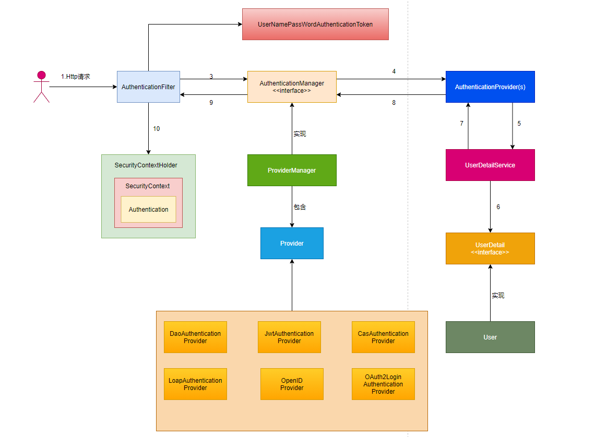
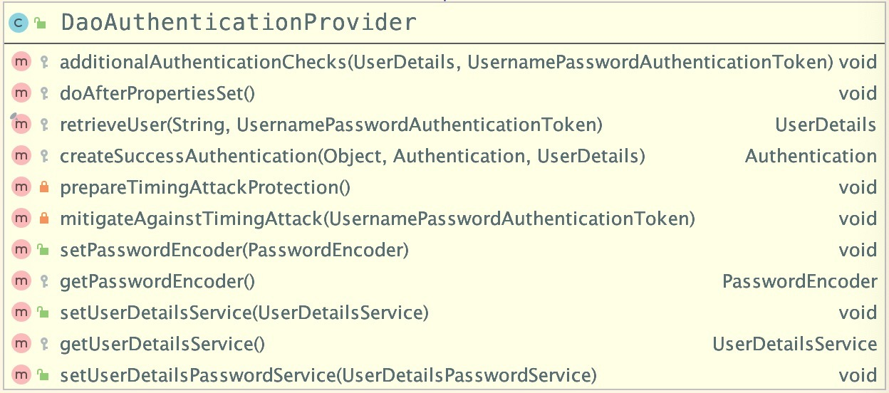
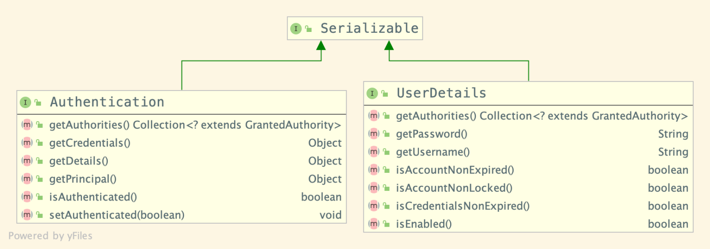
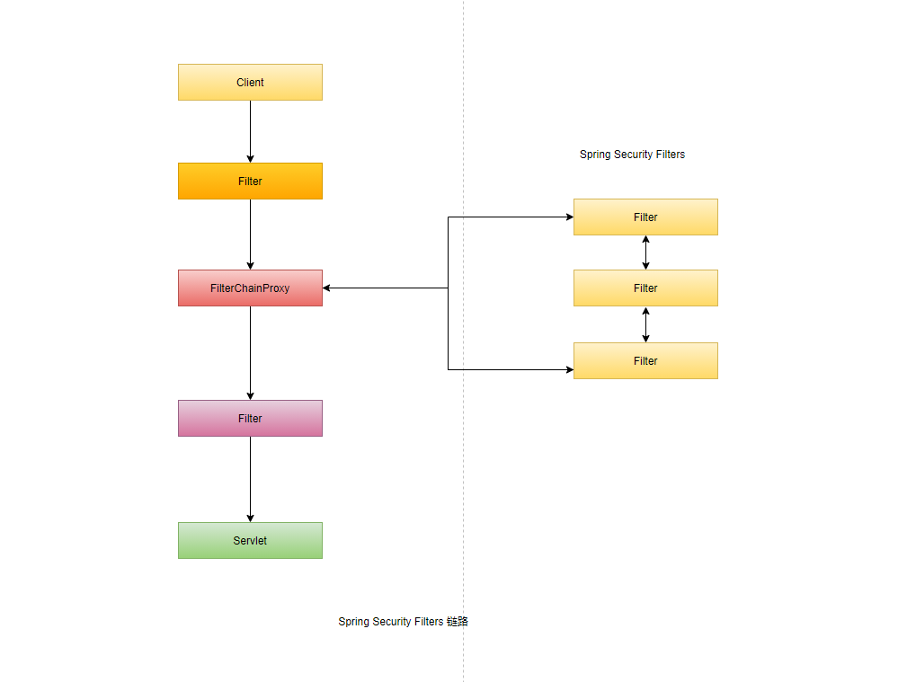

#Spring Security

##  目录
- [架构设计](#架构设计)
    - [核心组件](#核心组件)
    - [身份认证](#身份认证)
    - [核心服务](#核心服务)
- [Spring Security 与 Spring Boot整合 ](#SpringSecurity与SpringBoot整合)
  - [SpringSecurity中的过滤器链机制](#SpringSecurity中的过滤器链机制)

# 架构设计


spring security 整体架构



## 核心组件

核心组件 SecurityContextHolder,SecurityContext和Authentication

    最基本的对象是SecurityContextHolder，它是我们存储当前应用程序安全上下文的详细信息，其中包括当前应用程序的主题详细信息。如当前操作用户是谁，该用户是否已经被认证，他拥有哪些角色权限等。

    默认情况下，SecurityContextHolder 使用ThreadLocal来存储这些详细信息，这意味着SecurityContext始终可用于同一执行线程中的方法，即使这些SecurityContext未作为这些方法的参数显示传递。

获取当前用户信息

    因为身份信息与当前执行线程已绑定，所以可以使用一下代码块在应用程序中获取当前已验证的用户的用户名

```java
Object principal = SecurityContextHolder.getContext()
  .getAuthentication().getPrincipal();

if (principal instanceof UserDetails) {
  String username = ((UserDetails)principal).getUsername();
} else {
  String username = principal.toString();
}
```
    调用getContext()返回的是SecurityContext接口的一个实例，对应SecurityContext接口定义如下：

```java
public interface SecurityContext extends Serializable {
	Authentication getAuthentication();
	void setAuthentication(Authentication authentication);
}
```

Authentication

    在SecurityContext接口中定义了getAuthentication()和setAuthentication()两个抽象方法，当调用getAuthentication()方法后，会返回一个Authentication类型的对象
    这里的Authentication也是一个接口，它的定义如下：

```java
// org/springframework/security/core/Authentication.java
public interface Authentication extends Principal, Serializable {
  // 权限信息列表，默认是GrantedAuthority接口的一些实现类，通常是代表权限信息的一系列字符串。
	Collection<? extends GrantedAuthority> getAuthorities();
  // 密码信息，用户输入的密码字符串，在认证过后通常会被移除，用于保障安全。
	Object getCredentials();
	Object getDetails();
  // 最重要的身份信息，大部分情况下返回的是UserDetails接口的实现类，也是框架中的常用接口之一。
	Object getPrincipal();
	boolean isAuthenticated();
	void setAuthenticated(boolean isAuthenticated) throws IllegalArgumentException;
}
```
    以上的Authentication接口是spring-security-core.jar包下的接口，直接继承自Principal类，而Principal位于Java.security包中，
    由此可知Authentication是spring security中的核心接口。
    通过这个Authentication接口的实现类，我们可以得到用户拥有的权限信息列表，密码用户细节信息，用户身份信息，认证信息等

**小结**

    下面我们来总结一下，SecurityContextHolder，SecurityContext，Authoritarian这三个对象的关系

    SecurityContextHolder用来保存SecurityContext（安全上下文对象），通过调用SecurityContext对象中的方法，如getAuthentication()方法，
    我们可以方便的获取Authentication对象，利用该对象我们进一步获取已认证用户的详细信息

    SecurityContextHolder，SecurityContext 和 Authentication 的详细定义如下所示：


## 身份认证

spring security中的身份认证是什么？

    让我们考虑每一人都熟悉的标准身份验证的方案：
    
    1.系统会提示使用用户名和密码登录
    2.系统验证用户名和密码是否正确
    3.若验证通过则获取该用户的上下文信息(如权限列表)
    4.为用户建立安全上下文
    5.用户继续执行，可能执行某些操作，该操作可能收访问控制机制的保护，
    该访问控制机制根据当前安全上下文信息检查操作是否需要权限。
    
    前三项构成了身份验证的进行，因此我们将在spring security中查看这些内容。
    
    1.获取用户名和密码并将组合到UsernamePasswordAuthenticationToken的实例中(我们之前看到的Authentication接口的实例中).
    2.令牌将传递给AuthenticationManager的实例进行验证。
    3.AuthenticationManager在成功验证时，返回完全填充的Authentication
    4.SecurityContext对象时通过调用SecurityContextHolder.getContext().setAuthentication()创建的，传入返回身份验证的Authentication对象

spring security身份验证的流程示例：

AuthenticationManager 接口：

```java
public interface AuthenticationManager {
  // 对传入的authentication对象进行认证
	Authentication authenticate(Authentication authentication)
			throws AuthenticationException;
}
```

SampleAuthenticationManager 类：

```java
class SampleAuthenticationManager implements AuthenticationManager {
  static final List<GrantedAuthority> AUTHORITIES = new ArrayList<GrantedAuthority>();

  static {
    AUTHORITIES.add(new SimpleGrantedAuthority("ROLE_USER"));
  }

  public Authentication authenticate(Authentication auth) throws AuthenticationException {
    // 判断用户名和密码是否相等，仅当相等时才认证通过
    if (auth.getName().equals(auth.getCredentials())) {
      return new UsernamePasswordAuthenticationToken(auth.getName(),
          auth.getCredentials(), AUTHORITIES);
    }
    throw new BadCredentialsException("Bad Credentials");
   }
}
```

AuthenticationExample 类：
```java
public class AuthenticationExample {
  private static AuthenticationManager am = new SampleAuthenticationManager();

  public static void main(String[] args) throws Exception {
    BufferedReader in = new BufferedReader(new InputStreamReader(System.in));

    while(true) {
      System.out.println("Please enter your username:");
      String name = in.readLine();
      System.out.println("Please enter your password:");
      String password = in.readLine();
      try {
        // 使用用户输入的name和password创建request对象，这里的UsernamePasswordAuthenticationToken
        // 是前面提到的Authentication接口的实现类
        Authentication request = new UsernamePasswordAuthenticationToken(name, password);
        // 使用SampleAuthenticationManager实例，对request进行认证操作
        Authentication result = am.authenticate(request);
        // 若认证成功，则保存返回的认证信息，包括已认证用户的授权信息
        SecurityContextHolder.getContext().setAuthentication(result);
        break;
      } catch(AuthenticationException e) {
        System.out.println("Authentication failed: " + e.getMessage());
      }
    }
    System.out.println("Successfully authenticated. Security context contains: " +
      SecurityContextHolder.getContext().getAuthentication());
  }
}
```

## 核心服务

AuthenticationManager，ProviderManager 和 AuthenticationProvider

    AuthenticationManager(接口)是认证相关的核心接口，也是发起认证的出发点，因为在实际需求中，我们可能会允许用户
    使用用户名+密码登录，同时允许用户使用邮箱+密码，手机号+密码，甚至，可能用户使用指纹登录，所以要求认证系统中支持多种认证方式。

    Spring Security中AuthenticationManager接口默认实现是ProviderManager，但是它本身并不直接处理身份验证的请求，
    它会委托给已配置的AuthenticationProvider列表，每个列表一次被查询已查看它是否可以执行身份验证。每个Provider验证程序将抛出异常
    或返回一个Authentication对象。

    也就是说，Spring Security中的核心认证入口始终只只有一个：
        AuthenticationManager，不同的认证方式：用户名+密码（UsernamePasswordAuthenticationToken）,
    邮箱+密码，手机号+密码登录，则对应了三个AuthenticationProvider

    下面我们来看一下AuthenticationManager核心源码：

```java
// spring-security-core-5.2.0.RELEASE-sources.jar
// org/springframework/security/authentication/ProviderManager.java
public class ProviderManager implements AuthenticationManager, MessageSourceAware,
		InitializingBean {
	// 维护一个AuthenticationProvider列表
  private List<AuthenticationProvider> providers = Collections.emptyList();
      
	public Authentication authenticate(Authentication authentication)
			throws AuthenticationException {
		Class<? extends Authentication> toTest = authentication.getClass();
		AuthenticationException lastException = null;
		AuthenticationException parentException = null;
		Authentication result = null;
		Authentication parentResult = null;
		boolean debug = logger.isDebugEnabled();

    // 遍历providers列表，判断是否支持当前authentication对象的认证方式
		for (AuthenticationProvider provider : getProviders()) {
			if (!provider.supports(toTest)) {
				continue;
			}

			try {
        // 执行provider的认证方式并获取返回结果
				result = provider.authenticate(authentication);

				if (result != null) {
					copyDetails(authentication, result);
					break;
				}
			}
			catch (AccountStatusException | InternalAuthenticationServiceException e) {
				prepareException(e, authentication);
				throw e;
			} catch (AuthenticationException e) {
				lastException = e;
			}
		}

    // 若当前ProviderManager无法完成认证操作，且其包含父级认证器，则允许转交给父级认证器尝试进行认证
		if (result == null && parent != null) {
			try {
				result = parentResult = parent.authenticate(authentication);
			}
			catch (ProviderNotFoundException e) {
			}
			catch (AuthenticationException e) {
				lastException = parentException = e;
			}
		}

    
		if (result != null) {
			if (eraseCredentialsAfterAuthentication
					&& (result instanceof CredentialsContainer)) {
        // 完成认证，从authentication对象中移除私密数据
				((CredentialsContainer) result).eraseCredentials();
			}
      
      // 若父级AuthenticationManager认证成功，则派发AuthenticationSuccessEvent事件
			if (parentResult == null) {
				eventPublisher.publishAuthenticationSuccess(result);
			}
			return result;
		}
    
    // 未认证成功，抛出ProviderNotFoundException异常
		if (lastException == null) {
			lastException = new ProviderNotFoundException(messages.getMessage(
					"ProviderManager.providerNotFound",
					new Object[] { toTest.getName() },
					"No AuthenticationProvider found for {0}"));
		}
    
		if (parentException == null) {
			prepareException(lastException, authentication);
		}

		throw lastException;
	}
}
```
    在ProviderManager进行认证的过程中，会遍历providers列表，判断是否支持当前authentication对象的认证方式，若支持该认证方式时，
    就会调用所匹配provider(AuthenticationProvider)对象的authenticate方法进行认证操作。若认证失败则返回null，
    下一个AuthenticationProvider会继续尝试认证，如果所有的认证器都无法认证成功，则ProviderManager会抛出ProviderNotFoundException异常。

DaoAuthenticationProvider

    在Spring Security中比较常用的AuthenticationProvider是DaoAuthenticationProvider，这也是Spring Security最早支持的
    AuthenticationProvider之一。顾名思义，Dao是数据访问层的缩写，也暗示这个身份验证器的实现思路。

    DaoAuthenticationProvider类的内部结构如下：


    实际项目中最常见的认证方式是使用用户名和密码，用户在登录表单中提交用户名和密码，而对于已注册的用户，在数据库中已保存了正确的用户名和密码，
    认证便是负责比对同一个用户名，提交的密码和数据库所保存的密码是否相同便是了。

    对于Spring Security中，对于使用用户名和密码的进行认证的场景，用户在登录表单中提交的用户名和密码被封装成了UsernamePasswordAuthenticationToken，
    而根据用户名加载用户的任务则是交给了UserDetailsService，在DaoAuthenticationProvider中，对应的方法就是
    retrieveUser只有第一个参数起主要作用，返回一个UserDetails。

    retrieveUser方法的具体实现如下：

```java
// spring-security-core-5.2.0.RELEASE-sources.jar
// org/springframework/security/authentication/dao/DaoAuthenticationProvider.java
protected final UserDetails retrieveUser(String username,
			UsernamePasswordAuthenticationToken authentication)
			throws AuthenticationException {
		prepareTimingAttackProtection();
		try {
			UserDetails loadedUser = this.getUserDetailsService().loadUserByUsername(username);
			if (loadedUser == null) {
				throw new InternalAuthenticationServiceException(
						"UserDetailsService returned null, which is an interface contract violation");
			}
			return loadedUser;
		}
		catch (UsernameNotFoundException ex) {
			mitigateAgainstTimingAttack(authentication);
			throw ex;
		}
		catch (InternalAuthenticationServiceException ex) {
			throw ex;
		}
		catch (Exception ex) {
			throw new InternalAuthenticationServiceException(ex.getMessage(), ex);
		}
}
```
        
    在DaoAuthenticationProvider类的retrieveUser方法中，会以传入的username作为参数,
    调用UserDetailsService对象的loadUserByUsername方法加载用户。

UserDetails与UserDetailsService

UserDetails 接口

在DaoAuthenticationProvider类中retrieveUser的方法签名是这样的：

```java
protected final UserDetails retrieveUser(String username,
	UsernamePasswordAuthenticationToken authentication) 
  throws AuthenticationException {
}
```
    该方法返回UserDetails对象，这里的UserDetails也是一个接口，它的定义如下：

```java
public interface UserDetails extends Serializable {
	Collection<? extends GrantedAuthority> getAuthorities();
	String getPassword();
	String getUsername();
	boolean isAccountNonExpired();
	boolean isAccountNonLocked();
	boolean isCredentialsNonExpired();
	boolean isEnabled();
}
```

    顾名思义，UserDetails表示详细的用户信息，这个接口涵盖了一些必要的用户信息字段，具体的实现类对它进行了扩展。
    前面我们也介绍了一个Authentication接口，它与UserDetails接口的定义如下：




    虽然Authentication与UserDetails很类似，但是它们之间是有区别的。
    Authentication中的getAuthorities()实际是由UserDetails的额getAuthorities()传递而形成的。还记得Authentication接口中的getUserDetails()方法吗？
    其中的UserDetails用户详细信息就是经过了provider(AuthenticationProvider)认证之后被填充的。
    
UserDetailsService接口

    大多数身份验证提供程序都利用了UserDetails和UserDetailsService接口，
    接着UserDetailsService定义如下：
```java
public interface UserDetailsService {
	UserDetails loadUserByUsername(String username) throws UsernameNotFoundException;
}
```
    在UserDetailsService接口中，只有一个loadUserByUsername方法，由于通过username来加载匹配的用户。
    当找不到username对应用户时，会抛出UsernameNotFoundException异常。
    UserDetailsService和AuthenticationProvider两个职责常常被人们搞混，记住一点即可，UserDetailsService只负责从特定的地方（通常时数据库）加载用户信息，仅此而已。
    
    UserDetailsService常见的实现类有jdbcDaoImpl，InMemoryUserDetailsManager,前者从数据库加载用户，后者从内存加载用户，
    当然你也可以自己实现UserDetailsService。

Spring Security Architecture

前面我们已经介绍了Spring Security的核心组件(SecurityContextHolder,SecurityContext和Authoritarian)
和核心服务(AuthenticationManager,ProviderManager和AuthenticationProvider)，最后我们来回顾一下spring security整体架构


## 

### SpringSecurity与SpringBoot整合

Spring Security的servlet支持是基于Servlet Filter的，所以Filter先看一下作用是有帮助的
下图显示了单个Http请求的处理程序的典型分层

### SpringSecurity中的过滤器链机制

#### 前言

    过滤器作为Spring Security的重中之重，我们需要了解其中的机制。这样我们才能根据业务需求变化进行定制。
     今天我们来探讨一下Spring Security中的过滤器机制

#### Spring Security过滤器链

客户端(APP和后台系统)向应用程序发送请求，然后应用程序根据URL路径来确定该请求过滤器链(filter)以及最终的具体Servlet控制器(Controller)

