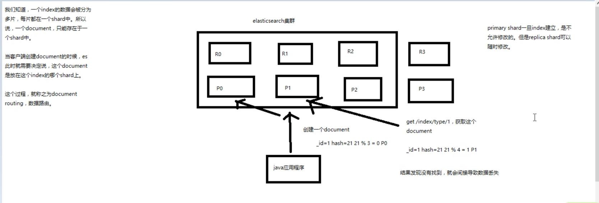
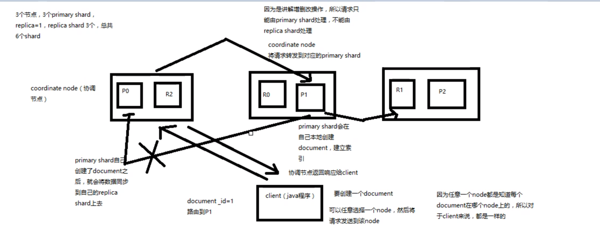

# Elasticsearch

## 目录

- [Elasticsearch核心知识入门篇](#Elasticsearch核心知识入门篇)
    - [Elasticsearch快速入门](#Elasticsearch快速入门)
      - [Elasticsearch功能适用场景特点](#Elasticsearch功能适用场景特点)
      - [Elasticsearch核心概念](#Elasticsearch核心概念) 
      - [Elasticsearch安装部署](#Elasticsearch安装部署)
      - [Elasticsearch文档的CRUD](#Elasticsearch文档的CRUD)
      - [Elasticsearch多种搜索方式](#Elasticsearch多种搜索方式) 
      - [Elasticsearch聚合搜索](#Elasticsearch聚合搜索)
    - [Elasticsearch分布式架构](#Elasticsearch分布式架构)
      - [Elasticsearch基础分布式架构](#Elasticsearch基础分布式架构)
          - [Elasticsearch对复杂分布式机制的透明隐藏特性](#Elasticsearch对复杂分布式机制的透明隐藏特性)
          - [Elasticsearch的垂直扩容与水平扩容](#Elasticsearch的垂直扩容与水平扩容)
          - [Elasticsearch增减节点时rebalance](#Elasticsearch增减节点时rebalance)
          - [Elasticsearch的master节点](#Elasticsearch的master节点)
          - [Elasticsearch节点平等的分布式架构](#Elasticsearch节点平等的分布式架构)
      - [index分片原理](#分片原理)
          - [shard&replica机制梳理](#Shard&replica机制梳理)
      - [Elasticsearch横向扩容原理](#Elasticsearch横向扩容原理)
          - [Elasticsearch分布式原理_横向扩容，如何超出扩容极限以及如何提升容错性](#Elasticsearch分布式原理_横向扩容，如何超出扩容极限以及如何提升容错性)
      - [Elasticsearch容错机制：master选举，replace容错，数据恢复](#Elasticsearch容错机制：master选举，replace容错，数据恢复)
    - [Elasticsearch分布式document](#Elasticsearch分布式document)
      - [_index元数据](#Index元数据)
      - [_type元数据](#Type元数据)
      - [_id元数据](#Id元数据)
      - [_source元数据](#Source元数据)
      - [document的全量替换](#Document的全量替换)
      - [_基于externa1lVersion进行乐观锁并发控制](#基于externa1lVersion进行乐观锁并发控制)
      - [partial update](#PartialUpdate)
      - [批量操作](#批量操作)
    - [Elasticsearch分布式系统](#Elasticsearch分布式系统)
      - [document数据路由原理](#Document数据路由原理)
      - [Document增删改内部原理](#Document增删改内部原理)
      - [写一致性原理以及quorum机制的深入解析](#写一致性原理以及quorum机制的深入解析)
      - [Document内部查询原理](#Document内部查询原理)
      - [BuilApi的奇特json格式与底层性能优化关系](#BuilApi的奇特json格式与底层性能优化关系)

#### 
- [Elasticsearch高手进阶篇](#Elasticsearch高手进阶篇)
    - [redis](#redis)
  
# Elasticsearch

## Elasticsearch核心知识入门篇

### Elasticsearch快速入门

#### Elasticsearch功能适用场景特点

1.Elasticsearch的功能、适用场景、以及特点介绍

    1.分布式搜索引擎和数据分析引擎
    2.全文检索、结构化检索、数据分析
    3.对海量数据进行近实时处理

2.Elasticsearch适用场景
  
    1.维基百科、全文检索、高亮、搜索推荐
    2.用户日志、社交网络数据、分析新闻文章公众反馈
    3.日志数据分析、logstash采集日志、复杂的数据分析
    4.分布式搜索引擎和数据分析引擎
    5.全文检索、结构化检索、数据分析
    6.对海量数据进行近实时处理

3.Elasticsearch特点介绍

    1.可以作为大型分布式集群技术，处理PB级数据服务大公司，也可以在单机上服务小公司
    2.全文检索、数据分析、分布式技术结合在一起。
    3.开箱即用、非常简单
    4.Elasticsearch提供了全文检索、同义词处理、相关度排序、复杂数据分析、海量数据近实时的功能

#### Elasticsearch核心概念

    1.Near Realtime(NRT)：近实时,意思是：从查询数据库到数据可以被es搜索到有一个延迟(大概1S);基于es执行搜索和分析可以达到秒级
    2.cluster:集群,包含多个节点,每个节点属于哪个 集群是通过一个配置(集群名称,默认是elasticsearch)来决定的。
    3.node：节点，几圈中的一个节点，节点也有名称（默认是随机分配的）,节点名称很重要(在运维管理进行操作的时候),默认节点会去加入一个名称为"elasticsearch"的集群中，如果直接启动一堆节点,那么他们会自动组成elasticsearch集群，当然一个节点可以组成elasticsearch集群
    4.document:文档,es中最小的数据单元,一个document可以是一条订单数据或者是一个商品数据，通常用JSON数据结构表示,每个index下type中都可以存储多个document,一个document里面有多个field，每个field就是一个数据字段
    5.index:索引，包含一堆相似的文档数据,比如订单索引，索引有一个名称。一个index包含多个document，一个index就代表一类类似的document.比如说建立一个product index，商品索引,里面可能就存放了所有的商品数据，所有的商品document.
    6.type:类型,每个索引都可以有一个活多个type，type是index中的一个逻辑数据分类,一个type下的document都有相同的field
    7.shard：单台机器无法存储大量数据,es可以将一个索引中的数据切分为多个shard，分布在多台服务器上存储.有了shard就可以横向扩展，存储更多数据,让搜索和分析等操作分布到多台机器上，执行速度快,提升吞吐量和性能.
    8.replica:粉盒一个服务器随机可能出现故障或者宕机.因此可以为每个shard创建多个replica副本,replica可以在shard故障时候提供备用，保证数据不丢失。多个replica哈可以提升搜索作用的吞吐量和性能。
    primary shard(建立索引时候一次设置,不能修改,默认5个),replica shard（随时修改数量,默认1个）,默认每个索引10个shard.5个primary shard。5个replica shard。最小高可用配置，是两台server.

#### Elasticsearch安装部署

Elasticsearch安装

    docker pull elasticsearch:7.6.2

    vim /etc/sysctl.conf #文件最后添加一行 vm.max_map_count=262144
    
    mkdir -p /data/elasticsearch/config
    mkdir -p /data/elasticsearch/data
    
    进入config目录下 创建 elasticsearch.yml文件 粘贴下面配置
    
    http.host: 0.0.0.0
    http.port : 9200
    transport.tcp.port : 9300
    http.cors.enabled : true
    http.cors.allow-origin : "*"
    network.bind_host: 0.0.0.0
    xpack.security.enabled: true
    xpack.security.audit.enabled: true
    
    #启动
    
    docker run -d --restart=always -p 9200:9200 -p 9300:9300 --name elasticsearch -e "discovery.type=single-node" -e "cluster.name=elasticsearch" -v /data/elasticsearch/config/elasticsearch.yml:/usr/share/elasticsearch/config/elasticsearch.yml -v /data/elasticsearch/data:/usr/share/elasticsearch/data -v /data/elasticsearch/plugins:/usr/share/elasticsearch/plugins elasticsearch:7.6.2

    #启动完毕后设置密码 参考文档: https://www.cnblogs.com/woshimrf/p/docker-es7.html
    #进入容器
    docker exec -it elasticsearch /bin/bash
    执行: ./bin/elasticsearch-setup-passwords auto
    输出以下信息:
    Changed password for user apm_system
    PASSWORD apm_system = l5CWYr67Q6CJUzpKyvZb
    
    Changed password for user kibana
    PASSWORD kibana = HOauyvrBjHKxwQ1R2Idt
    
    Changed password for user logstash_system
    PASSWORD logstash_system = sHvJEh4kxu0inCAlk8Uc
    
    Changed password for user beats_system
    PASSWORD beats_system = 8YmZ4TAAlaSzuVMgBSDi
    
    Changed password for user remote_monitoring_user
    PASSWORD remote_monitoring_user = X48M4DRRnWBTgG8y9dWb
    
    Changed password for user elastic
    PASSWORD elastic = e4R0G5bbwWTT7IuTdR63
    
    审核服务器:
    Changed password for user apm_system
    PASSWORD apm_system = E1OeyBsIoY1f4Hk8p3gM
    
    Changed password for user kibana
    PASSWORD kibana = 2qlVVaovTSguYNhw4YRf
    
    Changed password for user logstash_system
    PASSWORD logstash_system = m0Z9JdoGcPLLuLtjqrNv
    
    Changed password for user beats_system
    PASSWORD beats_system = LgNP0AhqfkEBKyg7E006
    
    Changed password for user remote_monitoring_user
    PASSWORD remote_monitoring_user = MpiGnxDhy36DtSviy7Bj
    
    Changed password for user elastic
    PASSWORD elastic = YWUVdA9MQPhUcFAt9JdH
    
    生产密码:
    Changed password for user apm_system
    PASSWORD apm_system = rx7WKzaqc1jZMLISiodA
    
    Changed password for user kibana
    PASSWORD kibana = lXGbcUu5wFH27XLeOUfL
    
    Changed password for user logstash_system
    PASSWORD logstash_system = 9S2Mg1vkUjeqQUdDmCik
    
    Changed password for user beats_system
    PASSWORD beats_system = k0pxVqpDQtJnK6z6sjok
    
    Changed password for user remote_monitoring_user
    PASSWORD remote_monitoring_user = gN9dIqHHHRMyVmzifIVU
    
    Changed password for user elastic
    PASSWORD elastic = n4rI5IOzxqC0Db1HJKzc

查看Elasticsearch是否启动成功

http://ip:port/?pretty

    {
    "name" : "66405ae2daed",    //Node名称
    "cluster_name" : "docker-cluster",  //集群名称  在Elasticsearch.yml 文件里修改
    "cluster_uuid" : "5_7wD3BtSKSuIYrBas5w0A",
    "version" : {
    "number" : "7.13.1",         //版本号
    "build_flavor" : "default",
    "build_type" : "docker",
    "build_hash" : "9a7758028e4ea59bcab41c12004603c5a7dd84a9",
    "build_date" : "2021-05-28T17:40:59.346932922Z",
    "build_snapshot" : false,
    "lucene_version" : "8.8.2",
    "minimum_wire_compatibility_version" : "6.8.0",
    "minimum_index_compatibility_version" : "6.0.0-beta1"
    },
    "tagline" : "You Know, for Search"
    }

查看Elasticsearch集群状态
GET ip:port/_cat/health?v

green：每个索引的primary shard和replica shard 都是activity
yellow：每个索引的primary shard 都是activity ，部分replica shard 不是activity状态，是不可用的状态
red：不是所有的primary shard都是activity，部分索引有数据丢失

kibana安装

    mkdir -p /data/kibana/config
    docker pull kibana:7.6.2
    
    vim /data/kibana/config/kibana.yml # 填入下面配置
    
    i18n.locale: 'zh-CN'
    server.host: '0.0.0.0'
    elasticsearch.hosts: ['http://172.18.14.12:9200','http://172.18.14.15:9200','http://172.18.14.10:9200']
    elasticsearch.username: 'elastic'
    elasticsearch.password: 'n4rI5IOzxqC0Db1HJKzc'
    xpack:
      apm.ui.enabled: false
      graph.enabled: false
      ml.enabled: false
      monitoring.enabled: false
      reporting.enabled: false
      security.enabled: false
      grokdebugger.enabled: false
      searchprofiler.enabled: false

    
    # 运行
    docker run -d -it --restart=always --privileged=true --name=kibana -p 15601:5601 -v /data/kibana/config/kibana.yml:/usr/share/kibana/config/kibana.yml kibana:7.6.2

#### Elasticsearch文档的CRUD

快速查看集群中有哪些索引
    
        GET /_cat/indecs?v

创建索引

       PUT /test?pretty

删除索引

    DELETE /test?pretty

**document CRUD** 

    新增document文档
        put /index/type/id
        {
            "key1":"value1",
            "key2":"value2",
        }
    更新document文档
    POST /index/type/id/_update
       "doc" {
            "key1":"value1",
            "key2":"value2",
    }
    
    删除document文档
    DELETE /index/type/id?pretty
 

#### Elasticsearch多种搜索方式

（1）、query string search（因为search都是http请求query string来附带的）

    语法：GET /index/type/_search
    
    例：GET /index/type/_search?q="search"&sort=filed:desc

    结果
        {
        "took" : 0, h耗费了几秒
        "timed_out" : false, 是否超时
        "_shards" : { // 请求了几个shard
        "total" : 3,
        "successful" : 3,
        "skipped" : 0,
        "failed" : 0
        },
        "hits" : {
        "total" : {  查询的数量
        "value" : 174,
        "relation" : "eq"
        },
        "max_score" : 1.0, 相关度匹配分数，越相关就越匹配，分数越高
        "hits" : [  匹配的document的相关数据
        ]

在生产环境很少用

（2）、query DSL（Domain Specified Language 特定领域的语言） 基于Http request body请求体，可以用json格式构建语法，可以构建各种复杂的语法
       
        例如：  
        {
            "query":{ //查询
            “match_all”:{ //
            },
            "filter" :{ // 过滤
                "range"{
                    "price" :{"gt",""}
                }
            }
        }
            "sort":[ 排序
            {
            "price":"desc"
            }
            ]
            "from":1, 查询游标
            "size":2 查询数量
            }
            "_source":["",""] :指定要查询出来的field
         }

match_all:全部查询
match:全文检索，将搜素词拆分为一个个词之后去倒排索引中进行匹配
match_phrase(短语搜索) :要求输入的搜索串，必须在指定字段文本中，完全一模一样的，才能算匹配
sort:排序
highlight:高亮
from:查询游标
size：查询数量
_source:指定要查询出来的field

#### Elasticsearch聚合搜索

    GET /index/type/_search
    {
        "size":0,         // 去掉返回值里的hits 具体的document
        "query"：""  // 查询条件之后在分组
        "aggs":{
            "group_by_tags":{       //聚合的别名
                //分组下的操作
                "terms":{
                    "field":"vaue" //根据field的分组
                    "order":{"group_by_tag1":desc/asc}  //按照内层聚合的结果降序排序
                },
                // 组内分组计算
                "aggs":{
                    "group_by_tag1":{
                      }
                    }
            }
        }
    }

为需要聚合的filed添加正排索引

    PUT /index/_mapping/type
    {
        "properties":{
            "field":{ //根据filed的设置
                "type":"string",
                "fielddata":"true",
            }
        }
        
    }

### Elasticsearch分布式架构

#### Elasticsearch基础分布式架构
##### Elasticsearch对复杂分布式机制的透明隐藏特性

    分片机制:我们将document插入到es集群中去，不用关心数据是怎么进行分片的，数据到哪个shard中
    cluster discovery：新加入的node自动发现集群，并且加入进去还接受了部分数据
    Shared 负载均衡:es会自动进行负载均衡（让每个node上具备差不多的shard数量），以保持每个节点均衡读写负载请求
    share副本:rep1ica shard是primary. shard的副本
    集群扩容:水平扩容
    请求路由:节点对等
    share重分配:集群rebalance

##### Elasticsearch的垂直扩容与水平扩容

    (1).垂直扩容：采购更强大的服务器。成本高，有瓶颈
    (2).水平扩容：增加服务器的数量

##### Elasticsearch增减节点时rebalance

    总有一些服务器负载重一些，承载的数据和请求会大一些，当增加或者减少节点时，数据分片会重新rebalance，实现shard的负载均衡（让每个节点的数据量差不多）

##### Elasticsearch的master节点
（主要管理es的元数据）

    (1)、创建或者删除索引
    (2)、增加或者删除节点

##### Elasticsearch节点平等的分布式架构

    (1)、节点对等，每个节点都能接受所有请求
    (2)、自动请求路由
    (3)、响应收集

#### 分片原理

##### Shard&replica机制梳理

    (1) index包含 多个shard，将多个shard分配到各个节点上去，每个shard存储一部分数据
    (2)每个shard都是一个最小工作单元， 承载部分数据，1ucene实例， 完整的建立索引和处理请求的能力
    (3)增减节点时，shard会自动在nodes中负载均衡
    (4) primary shard和replica shard; ，每个document肯定只存在于某一个primary      shard以及其对应的rep1ica shard中， 不可能存在于多个primary shard
    (5) rep1ica shard是primary. shard的副本， 负责容错，以及承担读请求负载
    (6).primary shard的数量在创建索引的时候就固定了，replica shard的数量可以随时修改
    (7).primary shard的默认数量是5，rep1ica默认是1:默认直10个shard; 5 primary shard, 5个replica, shard
    (8) primary shard不能和自己的replica shard放在同一个节点上(否则节点宕机，primary shard和副本都丢失，起不到容错的作用)，但是可以和其他primary shard的 ep1ica shard放在同一一个节点上

#### Elasticsearch横向扩容原理

###### Elasticsearch分布式原理_横向扩容，如何超出扩容极限以及如何提升容错性

    1、图解横向扩容过程，如何超出扩容极限，以及如何提升容错性
    (1) primary&rep1ica 自动负载均衡，6个shard， 3 primary，3 replica
    (2)每个node有更少的shard, I0/CPU/Memory资 源给每个shard分配更多，每个shard性能更好
    (3) 扩容的极限， 6个shard (3 primary, 3 replica) ，最多扩 容到6台机案，每个shard可以占用单 台服务器的所有资源，性能最好
    (4)超出扩容极限，动态修改rep1ica数量，9个shard (3primary， 6 rep1ica)，扩容到9台机器，比3台机器时，拥有3倍的读吞吐量
    (5) 3台机器下，9个shard (3 primary, 6 replica) ，资源更少，但是容错性更好，最多容纳2台机器宕机，6个shard只能容纳1台机器宕

#### Elasticsearch容错机制：master选举，replace容错，数据恢复

    (1).容错第-步: master选举，自动选举另外一个node成为新的master ,承担起master的责任来
    (2).容错第二步:新master ,将丢失掉的primary shard的某个replica shard提升为primary shard.此时cluster status会变为yellow ,因为primaryshard全都变成active了.但是,少了一个replica shard ,所以不是所有的replica shard都是active了.
    (3).容错第三步:重启故障的node ,new master ,会将缺失的副本都是copy-份到该node上去。而且该node会使用之前已有的shard数据，只是同步- -下宕机之后发生过的修改。cluster status变为green,因为primary shard和replica shard都齐全了

### Elasticsearch分布式document

#### Index元数据

    (1)代表一个document存放在哪个index中
    (2)类似的数据放在一一个素引，非类似的数据放不同索引
    (3) index中包含了很多类似的document
    (4)索引名称必须是小写的，不能用下划线开头，不能包含逗号

#### Type元数据

    (1)代表document属于index中的哪个类别(type)
    (2)一个索引通常会划分为多个type,谭辑上对index中有些许不同的几类数据进行分类
    (3) type名称可以是大写或者小写，但是同时不能用下划线开头，不能包含逗号

#### Id元数据

    (1)代表document的唯-标识， 与index和type一起， 可以唯-标识和定位一-个document
    (2)我们可以手动指定document的id,也可以不指定，由es自动为我们创建一-个id

根据应用情况来说，是否满足手动指定document id的前提:

    -般来说，是从某些其他的系统中，导入一些数据到es时，会采取这种方式，就是使用系统中已有数据的唯一标识，作为es中document的id。 举个例子，比如说，我们现在在开发
    - 一个电商网站，做搜索功能:或者是0A系统，做员工检索功能。这个时候，数据首先会在网站系统或者IT系统内部的数据库中，会先有一 份，此时就肯定会有- 一个数据库的primary
      key (自增长，UID,或者是业务编号)。如果将数据导入到es中，此时就比较适合采用数据在数据库中已有的primary key。
      如果说，我们是在做一个系统，这个系统主要的数据存储就是es- -种，也就是说，数据产生出来以后，可能就没有id, 直接就放es- -个存储，那么这个时候，可能就不太适合说手
      动指定document id的形式了，因为你也不知道i d应该是什么，此时可以采取下面要讲解的让es自动生成i d的方式。
      (2) put /index/ type/id
      (3.2)、自动生成document id
      (1) post ./index/ type.
      (2)自动生成的id,长度为20个字符，URL安全，base64编码， GUID, 分布式系统并行生成时不可能会发生冲突

#### Source元数据

    _source元数据:就是说，我们在创建一个document的时候， 使用的那个放在request body中的json串， 默认情况下，在get的时候，会原封不动的给我们返回回来。定制返回的结果，指定_source中，返回哪些field

#### Document的全量替换

(1)语法与创建文档是一样的。如果document id不存在，那么就是创建:如果document. ig已经存在，那么就是舍量替换操作,替换document的json串内容
(2) document是不可变的，如果要修改document的内容，第-种方式就是全量替换，直接对document重新建立索引，替换里面所有的内容。
PUT /index/type/id?
(3) es会将老的document标记为deleted,然后新增我们给定的一个document, 当我们创建越来越多的document的时候，es会 在适当的时机在后台自动删除标记为deleted的
document
2、document的强制创建
(1)创建文档与全量替换的语法是一样的， 有时我们只是想新建文档，不想替换文档，如果强制进行创建呢?
(2) PUT /index/ type/id?op__type=create, 
    PUT /index/type/id/_create
3、document的删除
(1) DELETE  index/type/id
(2)不会理解物理删除，只会将其标记为deleted，当数据越来越多的时候，在后台自动删除

1.Elasticsearch内部如何基于_version如何进行乐观锁并发控制

1.第一次创建一个document的时候，它的_version内部版本号就是1;
2.以后，每次对这个document执行修改或者删除操作，都会对这个_version版本号自动加1;哪怕是删除，也会对这条数据的版本号加1
3.多线程并发更新数据时,先获取document数据和最新版本号， 只有当你提供的version与es中的，version-模一样的时候，才可以进行修改，只要不一样，就报错或执行retry策略（retry_ on_ conf1ict）;
3.别的线程更新失败后，执行retry策略
retry策略
1、再次获取document数据和最新版本号
2、基于最新版本号再次去更新，如果成功那么就ok了
3、如果失败,重复1和2两个步骤,最多,重复几次呢?可以通过retry那个参数的值指定,比如5次

#### 基于externa1lVersion进行乐观锁并发控制

    es提供了一个feature, 就是说，你可以不用它提供的内部_version版本号来进行并发控制，可以基于你自己维护的一一个版本号来进行并发控制。
    举个列子，加入你的数据在mysq1
    里也有一份，然后你的应用系统本身就维护了-一个版本号，无论是什么自己生成的，程序控制的。
    这个时候，你进行乐观锁并发控制的时候，可能并不是想要用es内部的_version来进行控制，而是用你自己维护的那个version来进行控制。
    ?version=1
    ?version=1&version_type=externa1

    version_type=externa1,唯一-的区别在于， version, 只有当你提供的version与es中的，version-模一样的时候，才可以进行修改，只要不一样，就报错;

    当version_type=externa1的时候， 只有当你提供的versi on比es中的_versi on大的时候，才能完成修改
    es，_version=1?version=1， 才能更新成功
    es，_version=1?version> 1&version_type=externa1, 才能成功，比如说?versi on=2&version_type=externa1

#### PartialUpdate

全量替换语法：
    
    PUT /index/type/id,创建文档&替换文档，就是-样的语法

partial update语法：

    post /index/ type/id/_ update
    {
    '要修改的少数几个fie1d即可，不需要全量的数据”：""，
    "retry_ on_ conf1ict":"5"  //retry策略
    }

般对应到应用程序中，每次的执行流程基本是这样的（和全量替换的原理一样）:

    (1)应用程序发起一个get请求，获取到document， 展示到前台界面，供用户查看和修改
    (2)用户在前台界面修改数据，发送到后台
    (3)后台代码，会将用户修改的数据在内存中进行执行，然后封装好修改后的全量数据
    (4)然后发送PUT请求，到es中， 进行全量替换
    (5) es将老的document标记为de1eted，然后重新创建一个 新的document

看起来，好像就比较方便了，每次就传递少数几个发生修改的fie1d即可，不需要将全量的document数据发送过去

2、图解partial update实现原理以及其优点

    partial update, 看起来很方便的操作，实际内部的原理是什么样子的，然后它的优点是什么|
    
    其实es内部对partial update的实际执行,跟传统的全量替换方式，是几乎-样的

    1、内部先获取document
    2、将传过来的field更新到document的json中
    3、将老的document标记为deleted
    4、将修改后的新的document创建出来

partial update相较于全量替换的优点

    1、所有的查询、修改和写回操作,都发生在es中的一 个shard内部,避免了所有的网络数据传输的开销(减少2次网络请求) , 大大提升了性能
    2、减少了查询和修改中的时间间隔,可以有效减少并发冲突的情况

基于groovy脚本，如何执行partial update

    es， 其实是有个内置的脚本支持的， 可以基于groovy脚本实现各种各样的复杂操作
    基于groovy脚本，如何执行partia1 update.
    es scripting module, 我们会在高手进阶篇去讲解，这里就只是初步讲解一-下

partial update乐观锁并发控制原理

1.第一次创建一个document的时候，它的_version内部版本号就是1;
2.以后，每次对这个document执行修改或者删除操作，都会对这个_version版本号自动加1;哪怕是删除，也会对这条数据的版本号加1
3.多线程并发更新数据时,先获取document数据和最新版本号， 只有当你提供的version与es中的，version-模一样的时候，才可以进行修改，只要不一样，就报错或执行retry策略（retry_ on_ conf1ict）;
3.别的线程更新失败后，执行retry策略
retry策略
1、再次获取document数据和最新版本号
2、基于最新版本号再次去更新，如果成功那么就ok了
3、如果失败,重复1和2两个步骤,最多,重复几次呢?可以通过retry那个参数的值指定,比如5次

#### 批量操作

mget批量查询API(很重要，性能优化的一种方式)

    就是一条一条的查询，比如说要查询100条数据，那么就要发送100次网络请求，这个开销还是很大的
    如果进行批量查询的话，查询100条数据，就只要发送1次网络请求，网络请求的性能开销缩减100倍

语法一：查询不同一个index不同type的Document

    GET /index/_mget
        {
        "docs":[
            {
            "_index"："index"，
            "_type": "type",
            "_id":"id"
            },
            {
            "_index"："index"，
            "_type": "type",
            "_id":"id"
            }
    }
语法二：查询同一个index不同type的Document

    GET /index/_mget
    {
        "docs":[
            {
                "_type": "type",
                "_id":"id"
            },
            {
            "_type": "type",
            "_id":"id"
            }
    }

mget的重要性

可以说mget是很重要的，一 般来说，在进行查询的时候，如果一 次性要查询多条数据的话，那么一定要用batch批量操作的api
尽可能减少网络开销次数，可能可以将性能提升数倍，其至数十倍，非常非常之重要

bulk批量增删改

1、bulk语法

    POST /_bulk 或则POST index/type/_bulk
    delete": {” index":" test_ index,，” type" :“ test_ type'“?”J
    create" :index" :” test_ index，”_ type' :” test_ type"，”_ id" :“ 12”} }test_ fie1d": " test12”}
    index": {_index":" test_ index' '，”_type" : "test_ _type” }}，test_ field" :auto-generate id test
    index" :_index" :” test_ index”_type”: "test_ type"， ”id":“2”}}'test_ fie1d”:" replaced test2”
    update" : {”_ index :“ test_ index'，“type”: "test_ _type”，”id": "1”， ”retry_ on_ conf1ict" :3} }
    {“doc" : {"test_ fie1d2” : "bulk test1"} }

每一-个操作要两个json串， 语法如下:

    'action": { 'metadata"}}"data"}
    举例，比如你现在要创建一 个文档，放bulk里面，看起来会是这样子的:

    {" index": {"_ _index": "test_ index"，”type"，"test_ type"， " id":“1"}}
    {" test_ fie1d1":“ test1"，"test_ fie1d2": "test2"}
一个操作的语法不能换行，不同操作的语法要换行

有哪些类型的操作可以执行呢?

    (1) delete: 删除一个文档
    (2) create: PUT /index/type/id/ create， 强制创建
    (3) index: 普通的put操作，可以是创建文档，也可以是全量替换文档
    ( 4) update: 执行的partial update操作

bulk size最佳大小
    
    bulk, reguest会加载到内存里， 如果太大的话，性能反而会下降，因此需要反复尝试一 个最佳的bulk size。 - -般从1000 5000条数据开始，尝试逐渐增加。另外，如果看大小的话
    最好是在5^ 15MB之间。

document 总结 

    到目前为止，你觉得你在学什么东西，给大家个真观的感觉，好像已经知道了es是分布式的， 包括一些基本的原理，然后化了不少时间在学习document本身相关的操作，增删改
    查。一句话点出来，给大家归纳总结一 下，其实我们应该思考一 下，es的一个最最核心的功能，已经被我们相对完整的讲完了。
    Blastigsearch件电智
    来以
    其实起到的第一个最核心的功能。就是、个分布式的文档数据存储系统。ES是 分布式的。文档数据存储系统。文档据，存储系统。
    文档数据: es可以存储和操作json文档类型的数据， 而且这也是es的核心数据结构。
    存储系统: es可以对json文档类型的数据进行存储，查询，创建，更新，删除，等等操作。其实已经起到了一个什么样的效果呢?其实ES满足了这些功能，就可以说已经是一个
    NoSQL的存储系统了。
    围绕着document在操作，其实就是把es当成了一个NoSQL存储引擎，一个 可以存储文档类型数据的存储系统，在操作里面的document。
    s可以作为一个分布式的文档存储系统，所以说，我们的应用系统，是不是就可以基于这个概念，去进行相关的应用程序的开发了。
    什么类型的应用程序呢?
    I (①)数据量较大: es的分布式本质，可以帮助你快速进行护
    有的
    承载大量数据
    (2)
    教据精构家适备著随时可能会奔化计雪且教据替格之间的美系常基森出 如果聚们用传统数摄居奇那号不是很玩，因为要面临太量的表
    (3)
    对数据的
    作较为简单，比
    就是一些间
    改查，用我们之前讲解的那些document操作就可以搞定
    (4) NoSQL数据库，适用的也是类似于，上面的这种场景
    举个例子，比如说像一些网站系统，或者是普通的电商系统，博客系统，面向对象概念比较复杂，但是作为终端网站来说，没什么太复杂的功能，就是一些简单的CRUD操作， 而且
    数据量可能还比较大。这个时候选用ES这种NoSQL型的数据存储，比传统的复杂的功能务必强大的支持SOL的关系型数据库，更加合适一些。无论是性能，还是
    春吐量，可能都会更|
    好。

### Elasticsearch分布式系统

#### Document数据路由原理
document路由到shard是什么意思？

我们知道一个index数据会被分为多片，每片都在一个shard中
所以一个document，只能存放在一个shard中（primary shard）

后面primary shard 会同步到replica shard上

当客户端创建document的时候，此时需要决定，这个document
要放在这个index哪个shard上。

(2)路由算法: shard = hash(routing) % number_of_primary_shards举个例子，一个index有3个primary shard, PO, P1, P2

    每次增册改查一 个document的时候， 都会带过来一 个routing number,
    默认就是这个document的_id (可能是手动指定，也可能是自动生成)routing =. id, 假设. id=1
    
    会将这个routing值， 传入一个hash函数中，产出- -个routing值的hash值， hash(routing) = 21

    然后将hash函数产出的值对这个index的primary shard的数量求余数，21%3= 0就决定了，这个document就放在P0上。

决定一个document在哪个shard上， 最重要的一一个值就是routing值，默认是id,也可以手动指定，相同的routing值，

每次过来，从hash函数中， 产出的hash值-定是相同的无论hash值是几，无论是什么数字，对number_ _of. primary. shards求余数，结果-定是在0 *number_of_primary_shards-1之间这个范围内的。0,1, 2。

(3)_ id or custom routing value默认的routing就是id.

    也可以在发送请求的时候，手动指定一 个routing value, 比如说put /index/type/id?routing =useid
    
    手动指定routing value是很有用的， 可以保证说，某- -类document- -定被路由到一-个shard上去， 那么在后续进行应用级别的负载均衡，以及提升批量读取的性能的时候，是很有

(4) primary shard数量不可变的谜底（路由算法只和primary. shards的数量有关）

    因为shard = hash(routing) % number_of_primary_shards决定了document 在哪个shard上，
    如果改变，导致数据不在之前的shard上，导致查询的时候，无法找到，就会间接导致数据丢失。
    private shard 一旦index建立，是不允许修改的，replica shard 是可以改变的

#### Document增删改内部原理

    (1)客户端选择一-个node发送请求过去，，这个node就 是coordinating. node (协调节点)
    
    (2) coordinating, node,对document进行路 由，,将请求转发给对应的node (有primary shard)
    (3)实际的node.上的pri mary shard处理请求，然后将数据同步到replica node
    (4) coordinating node, 如果发现primary node和所有replica node都搞定之后，就返回响应结果给客户端

#### 写一致性原理以及quorum机制的深入解析

#### Document内部查询原理

#### BuilApi的奇特json格式与底层性能优化关系