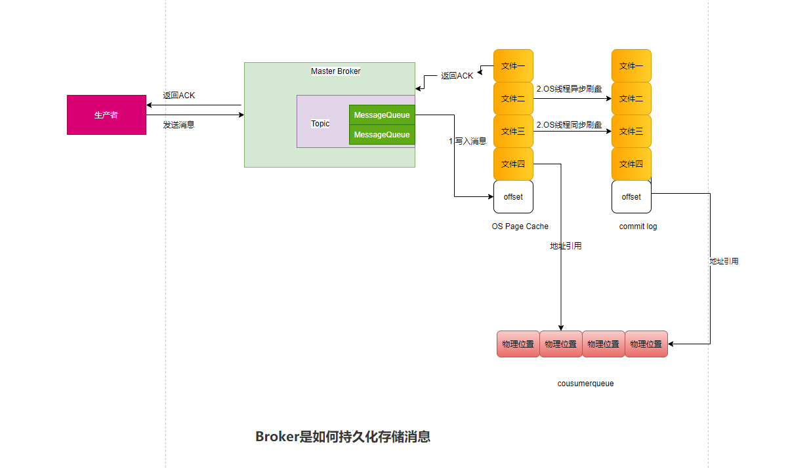

# 消息中间件

## 目录

- [放大100倍压力，找出你系统的技术挑战](#放大100倍压力，找出你系统的技术挑战)
- [消息中间件](#消息中间件)
    - [消息中间件作用](#消息中间件作用)
    - [Kafka、RabbitMQ 以及 RocketMQ对比](#Kafka、RabbitMQ以及RocketMQ对比)
- [RocketMQ](#RocketMQ)
    - [RocketMQ架构原理](#RocketMQ架构原理)
        - [NameServer](#NameServer)
        - [Broker主从架构](#Broker主从架构)
        - [RocketMQ的核心数据模型](#RocketMQ的核心数据模型) 
        - [RocketMQ的集群部署](#RocketMQ的集群部署)
          - [小规模RocketMQ的集群部署](#小规模RocketMQ的集群部署)
          - [RocketMQ的集群可视化监控](#RocketMQ的集群可视化监控)
          - [RocketMQ生产参数调整](#RocketMQ生产参数调整)
          - [RocketMQ的集群压测](#RocketMQ的集群压测)
          - [RocketMQ生产集群的规划](#RocketMQ生产集群的规划)
        - [RocketMQ生产者发送消息模式](#RocketMQ生产者发送消息模式)
        - [RocketMQ的消费模式](#RocketMQ的消费模式)
        - [RocketMQ的消费模式](#RocketMQ的消费模式)
  - [RocketMQ底层原理](#RocketMQ底层原理)
        - [生产者往Broker集群发送消息的底层逻辑](#生产者往Broker集群发送消息的底层逻辑)
        - [Broker接受消息后如何在存储到磁盘上的](#Broker接受消息后如何在存储到磁盘上的)
        - [基于Dledger技术部署Broker高可用集群，到底如何进行数据同步](#基于Dledger技术部署Broker高可用集群，到底如何进行数据同步)
        - [消费者到底是基于什么策略选择Master或Slave拉取数据](#消费者到底是基于什么策略选择Master或Slave拉取数据)
        - [消费者是如何从Broker拉取消息进行处理以及ACK的？如果消费者故障会如何处理](#消费者是如何从Broker拉取消息进行处理以及ACK的？如果消费者故障会如何处理)
        - [RocketMQ 是如何基于Netty扩展出高性能网络通信架构的？](#RocketMQ是如何基于Netty扩展出高性能网络通信架构的)
        - [基于mmap内存映射实现磁盘文件的高性能读写](#基于mmap内存映射实现磁盘文件的高性能读写)
        - [事务消息机制的底层实现原理](#事务消息机制的底层实现原理) 
        - [Broker保证消息零丢失方案](#Broker保证消息零丢失方案)
        - [Consumer消息零丢失方案](#Consumer消息零丢失方案)
        - [MQ消息幂等性](#MQ消息幂等性)
        - [MQ死信队列](#MQ死信队列)
        - [MQ消息乱序](#MQ消息乱序)
        - [MQ过滤机制](#MQ过滤机制)
        - [MQ延迟消息机制](#MQ延迟消息机制)
        - [MQ消息积压](#MQ消息积压)
        - [金融级系统针对RocketMQ集群崩溃设计高可用方案](#金融级系统针对RocketMQ集群崩溃设计高可用方案)
        - [MQ消息限流](#MQ消息限流)
  - [RocketMQ源码](#RocketMQ源码)

- [RabbitMQ](#RabbitMQ)

# 消息中间件

## 放大100倍压力，找出你系统的技术挑战

思考一：系统的核心链路，有哪些步骤，各个步骤的性能如何，是否有改进空间？
    
        下单--预约--核销---退款
         其余的流程可以走MQ异步处理
思考二：系统中是否有类似后台线程定时补偿的逻辑
    
    订单长时间未支付，要关闭，
    预约单长时间无人确认接单，自动分单，
    秒杀活动/优惠券设置时间后要自动开始，到点后要自动结束

思考三：系统中有哪些和第三方系统的耦合？

        耦合微信支付，短信，推送等
          
        考虑MQ解耦

思考四：核心链路中是否存在哪些关键步骤可能会失败的情况？万一失败了该怎么办？

     例如退款失败后怎么办

思考五：平时是否有其他系统需要获取你们的数据的情况？他们是如何获取数据的？

    是直接跑SQL从你们的数据库里查询？或者是调用你们的接口来获取数据？
    是否有这种情况？如果有，对你们有什么影响吗？
  
    可以基于mysql的binlog 日志将数据发送给MQ，别的部门从MQ中消费消息

思考六：你们的系统是否存在流量洪峰的情况，有时候突然之间访问量增大好几倍，是否对你们的系统产生无法承受的压力？
        
## 消息中间件

### 消息中间件作用

解耦
异步
消峰

### Kafka、RabbitMQ以及RocketMQ对比

（1）、Kafka的优势与劣势

   kafka 性能很高，基本发消息给kafka都是毫秒级的性能，可用性也很高，kafka支持集群部署的，其中部分宕机是可以继续运行的

   但是kafka比较为人诟病的一点，似乎是丢数据方能的问题，因为kafka收到消息后会写入一个磁盘缓冲区里，并没有落地到物理磁盘上，
    
   所以要是机器本身故障，可能会导致磁盘缓冲区数据丢失。
   
   而且kafka另外一个比较大的缺点，就是功能非常单一，主要支持发送消息给他，然后从里面消费消息，其他的就没有什么额外的高级功能了
   
   因此，综上所述，基本行业里的标准，是把kafka在用户行为日志的采集和传输上的，比如大数据团队要收集app上用于的一些行为日志，这种日志就是
   
   kafka收集传输的。

（2）、RabbitMQ的优势与劣势

   RabbitMQ的优势是可以保证数据不丢失，也可以保证高可用性，即集群部署的时候。部分机器宕机可以继续运行，然后支持部分高级功能
   比如说：死信队列，消息重试之类的

   但是他有个缺点最为人诟病的，就是RabbitMQ吞吐量比较低，一般就是每秒几万级别的，所以遇到特别高特别高的并发的情况下，支撑起来是有点困难的

   还有一个是它进行集群扩展的时候(就是加机器部署)，还是比较麻烦的

（2）、RocketMQ的优势与劣势

   RocketMQ吞吐量也同样很高，单机可以达到10wQPS以上，而且可以保证高可用，性能很高，而且支持配置，保证数据绝对不丢失，可以部署
   大规模集群，而且支持各种高级性能，比如说：延迟消息，事务消息，消息回溯，死信队列，消息积压等等
   
   
## RocketMQ

### RocketMQ架构原理

RocketMQ 这个技术一共包含了四个核心部分

    1.第一块就是他的NameServer，这个东西很重要，他要负责管理集群里所有Broker的信息，让使用MQ的系统能感知到集群里有哪些Broke。
    2.第二块就是Broke集群的本身信息，必须在多台机器上部署这么一个集群，而且还得用主从架构实现数据多副本和高可用。
    3.第三块就是消息生产者
    4.第四块就是消息的消费者

#### NameServer

NameServer的设计是采用Peer-to-Peer的模式来做的，可以集群化部署，但是里面任何一台机器都是独立运行的，跟其他机器没有任何通信。

要部署RocketMQ，就得先部署NameServer，NameServer支持集群化部署，做到高可用。任何一台机器宕机，NameServer可以继续对外提供服务。

每个Broker启动时都得向所有的NameServer进行注册，也就是说，每个NameServer都有一份集群中所有的Broker信息。

RocketMQ中的生产者和消费者自己主动区NameServer拉取Broker信息的

Broker和NameServer之间通过心跳机制（采用的是TCP长连接），Broker会每隔30s给所有的NameServer发送心跳，告诉NameServer自己还活着。

每次NameServer收到Broker心跳，就可以更新一下它的最近一次心跳时间。

然后NameServer 会每隔10s运行一个任务，区检查各个Broker的最近一次心跳，如果某个Broker超过120s都没发送心跳，那么就认为这个Broker已经挂掉。

生产者和消费者会重新获取NameServer最新的路由信息，并缓存在本地

#### Broker主从架构

为了保证RocketMQ的数据不丢失而且具备一定的高可用性，所以一般将Broker，部署成Master-Slave模式的，也就时一个Master Broker  对应一个Slave Broker

RocketMQ的Master-Slave模式采取的是（Pull模式）Slave Broker不停的发送请求到Master Broker 去拉取消息

**写入数据**的时候，肯定是选择**Master Broker** 去写入的

**读取数据**的时候，**有可能是Master Broker获取，有可能是Slave Broker 获取**，一切根据当时的情况来定。

如果Slave Broker 挂掉了，那么读写的压力都集中在Master Broker上。

如果Master Broker 挂掉了，在RocketMQ4.5版本之前，Slave Broker无法自定切换为Master Broker,会导致服务不可用。

RocketMQ 4.5之后的版本，RocketMQ支持一种新的机制，叫Dledger，可实现RocketMQ高可用自动切换的效果。

(备注:redis 的Master-Slaver 是基于哨兵模式，异曲同工）

#### RocketMQ的核心数据模型

MQ的核心数据模型 Topic

Topic其实就是一个（逻辑上）数据集合的意思，不同的数据，你的放到不同的Topic里面。

每个Topic分布式存储在Master Broker上，Slave Broker或同步Master Broker 数据。

生产者跟NameServer建立一个TCP长连接，然后定时的从他那里拉取最新的路由信息，包含集群中有哪些Broker，哪些Topic，每个Topic存储在哪些Broker 上

然后生产者找到自己要投递的Topic分布在哪些Broker上，根据负载均衡算法，选择出一台Broker出来，然后跟这个Broker页建立一个TCP长连接，然后通过长连接向Broker发送消息即可。

这里要注意的是生产者一定是投递消息到Master Broker的，然后通过Master Broker会同步数据到他的Slave Broker上

实现一份数据多个副本，保证Master Broker故障之后，数据不丢失，而且可以把Slave Broker切换为Master Broker提供服务。

消费者页生产者类似，他们也会从NameServer建立长连接，然后拉取路由消息，找到自己消息的Topic在哪几台Broker上，就可以跟Broker建立长连接，从里面拉取消息了。

这里唯一要注意的就是消费者系统可能会从Master Broker拉取消息，也可以从Slave Broker拉取消息，都有可能，一切看具体情况。

#### RocketMQ的集群部署

##### 小规模RocketMQ的集群部署

##### RocketMQ的集群可视化监控

##### RocketMQ生产参数调整

##### RocketMQ的集群压测

##### RocketMQ生产集群的规划

### RocketMQ生产者发送消息模式

    同步发送：生产者发送消息出去之后，登台MQ返回通知，程序在接着向下执行
    异步发送：生产者发送消息出去，无需登台MQ返回，直接向下执行，待MQ响应之后，callBack函数，
            如果发送成功，则调用onSuccess函数
            如果发送失败，则调用onException函数
    单向发送：生产者发送消息出去之后，代码向下执行，不关注MQ是否返回结果，无论消息发送成功或者发送失败都不管你的事。

### RocketMQ的消费模式

Push消费模式：就是Broker主动把消息发送给你的消费者
Pull消费模式：就是消费者主动发送请求到Broker去拉取消息

## RocketMQ底层原理

### 生产者往Broker集群发送消息的底层逻辑

topic数据分片机制：

    Message Queue 将一个Topic的数据拆分成了很多个数据分片，然后再每个Broker机器上存储一些Message Queue

生产者写入数据的过程：

Broker故障时：

Master Broker故障时，此时正在等待其他Slave Broker自动热切换为Master Broker，但是在这个过程中，这一组Broker是没有Master Broker可以写入的。

通常建议大家打开 Product 中开启一个开关，就是sendLatencyFaultEnable

一旦打开这个开关，那么他就会有一个自动容错机制，比如某次发现一个Broker无法访问，则自动回避访问这个Broker一段时间，过段时间再去访问他。

### Broker接受消息后如何在存储到磁盘上的

    Broker 数据存储实际才是MQ最核心的环节，他决定了生产者消息写入的吞吐量，决定了消息不能丢失，决定了消费者获取消息的吞吐量，这些都是由他决定的。

    首先，当生产者的消息发送到Broker上的时候，他会把这个消息写入到磁盘上的日志文件，叫做commitLog，直接顺序写入这个文件，（先进入OS Cache Page ，再刷入磁盘）
    这个CommitLog是很多个磁盘文件，每个文件限定差不多1GB
    Broker收到消息之后就直接追加写入这个文件的末尾，如果一个CommitLog写满了1GB，就会重新创建一个CommitLog
    
    在Broker中，对Topic下的每个MessageQueue都会有一系列的ConsumeQueue文件
   
    格式大致为 $HOME/store/consumeQueue/{topic}/{queueId}/{consumeQueueFileName}
    topic：就是指逻辑上的那个Topic
    queueId：值某个那个Topic下的某个MessageQueue
    consumeQueueFileName：MessageQueue对应的consumeQueue文件名称

    当你的Broker收到消息写入到CommitLog之后，其实他同时会将这条数据在CommitLog中的物理位置，也就是一个文件的偏移量（offset），写入到这条消息所属的
    MessageQueue对应的consumeQueue文件中去（offset其实的是CommitLog文件消息的地址引用）。
   
    实际上consumeQueue中存储的每条数据不止消息在CommitLog中的offset偏移量，还包含了消息的长度，以及tag，hashCode，一条数据是20个字节，每个consumeQueue保存30W条数据
    大概每个文件是5.72M

    所以实际上Topic的每个MessageQueue都对应了Broker机器上的多个ConsumeQueue文件，这些文件保存了这个MessageQueue的所有消息在CommitLog文件中的物理位置，也就是offset偏移量。

为了提升CommitLog文件的写入性能

    先写OS操作系统的Page Cache 和顺序写两个机制来提升写入CommitLog文件的性能

同步刷盘和异步刷盘

    异步刷盘模式下，写入到OS Page Cache 缓存成功后，直接提交ACK给生产者，如果刷盘失败，会导致数据丢失，但是吞吐量很高

    同步刷盘模式下，写入到OS Page Cache 缓存成功后，必须强制把这台哦消息刷入到底层的物理磁盘，然后才返回ACK给生产者，此时你才知道消息写入成功，
    这个模式下，保证Master 数据不会丢失，但是吞吐量下降。
    返回ACK后，如果Master挂掉，数据没同步，切换到Slave时，也会出现数据丢失。

### 基于Dledger技术部署Broker高可用集群，到底如何进行数据同步

Dledger技术实际上首先他自己就有一个CommitLog机制，你把数据交给他，他会写CommitLog磁盘文件里去，这是他能干的第一件事情。

如果以及Dledger技术来实现Broker高可用架构，实际上就是用Dledger先替换掉原来的Broker，Dledger自己来来管理CommitLog

那么就是每个Broker上都有一个Dledger组件，

Dledger是基于Raft协议来进行Leader Broker选举的，会从中选举出一个Leader来

Raft协议投票原理：
    
        比如三台机器，第一轮投票开始，他们都把票投给自己，结果每个人得到的票数一样，第一轮选举失败

        接着每个人进入一个随机休眠，如果是第一个人休息三秒，第二个人休息5秒，四但个人休息4秒
    
        接着第一个人开始醒过来，继续把票投给自己，然后发送自己的选票给别人，下一个人醒来时，发现自己没有票
    
        会把票投给那个有票的人，接着第三个人醒来同理

        依靠这个休眠机制一般都能选出一个Leader

Dledger是基于Raft协议进行多副本同步

Raft协议多副本同步机制：

        首先Leader Broker上的Dledger收到一条数据之后，会标记uncommitted 状态
        然后他会通过自己的DledgerServer组件把这个uncommitted数据发送给Following Broker的Dledger
        接着Follower Broker的DledgerServer收到uncommitted消息之后，必须返回一个ack给Leader Broker的DledgerServer
        然后如果Leader Broker收到超过半数的Follower Broker返回的ack之后，会将消息标记为committed状态
        然后Leader Broker上的DledgerServer就会发送commited消息给Follower Broker机器的DledgerServer，让他们也把消息标记为committed状态
        
如果Leader Broker发生宕机了
    
如果Leader Broker 发生宕机了，剩下的两个Follower Broker会重新发起选举，他们还是会采用Raft协议的算法，去选举出来一个新的Leader Broker继续对外提供服务，
而且会对没有完成数据同步的进行一些恢复性操作，保证数据不会丢失。

### 消费者到底是基于什么策略选择Master或Slave拉取数据

集群模式：一个消费者组获取一条消息，只会交给组内的一台机器取处理，而不是每台机器都可以获取到这条消息的
广播模式：那么对于消费者组获取到一条消息，组内的每台机器都可以获取到这条消，但是相对而言，广播模式用的很少，常见基本都是使用集群消费模式
一个Topic的多个MessageQueue会均匀分摊给消费者组内的多个机器取消费，这里的一个原则就是，
一个MessageQueue只能被一个消费机器取消费，但是一个消费机器，可以负责多个MessageQueue的消息处理

Push模式和Pull模式
实际上这两个模式是一样的，都是消费者机器主动发送请求到Broker机器上取拉取一批消息下来。

Push消费模式本质底层也是基于这种消费者主动拉取的模式实现的，只不过他的名字叫Push而已，意思是Broker会尽可能的实时的把消息
交给消费者机器来处理，他的消息实时性会更好。
一般我们使用RocketMQ的时候，消费者模式通常都是基于Push模式来做的，因为Pull模式的代码写起来更加复杂和繁琐，
而且Push模式底层本身就是基于消息拉取来做的，只不过实时性更好。

push模式实现思路：当消费者发送请求到Broker取拉取消息的时候，如果有新消息可以消费那么立马就会返回一批消息到消费机器取处理。
处理完之后会接着立刻发送请求到Broker机器去拉取下一批消息。

所以消费机器再push模式下会处理完一批消息，立马发送请求去拉取下一批消息，消息处理的实时性非常好，看起来就跟Broker
一直不停的推送消息到消费者机器一样。

push模式下有一个请求挂起和长轮询的机制

当你的请求发送到Broker，结果他发现没有新的消息给你处理的时候，就会请求线程挂起，默认挂起15s，然后这个期间
他会有后台线程每隔一会儿就会检查一下是否有新的消息给你，另外如果再这个挂起过程中，如果有新的消息到达了就会主动唤起挂起的线程
，然后把消息返回给你。

其实消费消息的时候，本质就是根据你要的消费的MessageQueue以及开始消费的位置，去找对应的ConsumeQueue读取里面对应位置的消息
再commitLog中的物理offset偏移量，然后到CommitLog中更具offset读取消息数据返回给消费者机器。

ConsumeQueue 文件同样也是基于 os page cache 来进行优化的

也就是说，对于Broker机器磁盘上的大量的ConsumeQueue文件，再写入的时候也会优先进入os cache,

而且os 自己有一个优化机制，就是读取一个磁盘文件的时候，他就会把磁盘文件的一些数据缓存到os cache中。

CommitLog 是基于os cache + 磁盘一起读取的

当你去拉取消息的时候，可以轻松从os cache 里读取少量的consumeQueue文件里的offset，这个性能是极高的，
但是当你去committedLog文件里去读取完整消息的时候，会有两种可能

第一种可能：如果你读取的是那种刚刚写入commitLog的数据，那么大概率还停留再 os cache,
此时你可以顺利的直接从 os cache 中读取commitLog中的数据
第二种可能：你读取的是比较早之前写入的commitLog的数据，哪些数据很早就被刷入磁盘了，已经不在os cache 里了，
那么此时你读取就只能从磁盘文件里读取了

### 消费者是如何从Broker拉取消息进行处理以及ACK的？如果消费者故障会如何处理

当消费者处理完这批消息之后，消费者机器就会提交我们的目前一个消费进度到Broker上去，然后Broker就会存储我们的消费进度

下次这个消费者组只要再次拉取这个ConsumeQueue的消息，就可以从Broker记录的消费位置开始拉取，不用从头开始拉取了。

如果消费者族中机器宕机或扩展机器，这个时候其实会进入一个rebalance的环节，也就是说重新给各个消费者机器分配他们要处理的MessageQueue

### RocketMQ是如何基于Netty扩展出高性能网络通信架构的

首先作为Broker而言，他会有一个Reactor主线程，而且这个线程负责监听一个网络端口

假设我么有一个Producer他现在想跟Broker建立TCP长连接，此时Broker上的这个Reactor主线程，他会在端口上监听到这个Producer建立连接的请求

接着这个Reactor主线程就专门负责这个Producer按照TCP协议规定的一系列步骤和规范，建立好一个长连接

Producer里面会有一个SocketChannel，Broker里也会有一个SocketChannel，这两个SocketChannel就代表他们两建立好这个长连接

接着Producer会通过这个SocketChannel去发送消息给Broker。

Reactor线程池，默认是3个线程

Reactor主线程建立好每个连接SocketChannel，都会交给这个Reactor线程池里的其中一个线程去监听请求

基于Worker线程池完成一系列准备工作

线程池会转交请求给Worker线程池，进行一系列预处理 

Worker线程池默认有8个线程，此时Reactor线程收到的这个请求会交给Worker线程池中的一个线程进行处理，完成ssl加密，编码解码，连接空闲检查，网络连接管理诸如此类的事情。

预处理之后，请求转交给业务线程池

比如对于处理发送请求而言，就会把请求转发给SendMessage线程池。SendMessage是可以配置的配置的越高，处理消息的吞吐量越高

所以最终的效果就是：
- Reactor主线程在端口上监听Producer建立连接的请求，建立长连接
- Reactor线程池并发的监听多个请求是否到达
- Worker线程池求情并发的对多个请求进行预处理
- 业务线程池并发的对多个请求进行磁盘读写业务操作

这样一套网络通信架构，最终实现的效果就是可以高并发、高吞吐的对大量的网络连接发送过来的大量请求数据进行处理，保证Broker实现高吞吐

### 基于mmap内存映射实现磁盘文件的高性能读写

传统文件IO操作的多次数据拷贝问题

会先将磁盘文件拷贝到内核IO缓冲区，再将数据拷贝到用户进程的私有空间

为了读取磁盘文件发生了两次拷贝，对磁盘读写的性能是由影响的

RocketMQ 是利用mmap技术配合Page Cache技术进行文件读写优化的

首先RocketMQ底层对CommitLog、ConsumeQueue之类的磁盘文件的读写操作，基本上都是采用mmap的技术来实现的

基于JDK NIO包下的MappedByteBuffer的map()函数先将磁盘文件映射到内存里来

MappedByteBuffer的map()底层就是基于mmap技术实现的

mmap技术在进行文件映射的时候，一般由大小限制，在1.5GB-2GB间

所以RocketMQ才能让CommitLog单个文件在1GB，ConsumeQueue文件在5.72MB，不会太大

接下来就可以对这个已经映射到内存的磁盘文件进行读写操作，写的时候他会直接进入Page Cache中，

然后过一段时间之后，由OS线程异步刷入磁盘中

你加载的数据块的临近其他数据块也一起加载到Page Cache里去

Broker针对磁盘文件高性能读写机制的优化：
1.**内存预加载机制**：Broker会针对磁盘中各种CommitLog、ConsumeQueue文件预先分配好MappedFile，
也就是提前对一些可能接下来要读写的磁盘文件，提前使用MappedByteBuffer执行map()函数完成映射，这样
后续读写文件的时候，就可以直接执行了。
2.**文件预热**：在提前对一些文件完成映射之后，因为映射不会直接将数据加载到内存里来，那么后续在读取
尤其是CommitLog、ConsumeQueue的时候，其实有可能会频繁的从磁盘文件里加载数据到内存中去。

所以其实在执行完map()函数之后，会进行madvise()系统调用，就是提前尽可能多的把磁盘文件加载到内存里去。

通过上述优化，才真正实现了一个效果
就是写磁盘文件的时候都是进入Page Cache的，保证写入的高性能；同时尽可能的多的通过map+madvise
的映射后预热机制，把磁盘文件里的数据尽可能多的加载到Page Cache里来，后续对ConsumeQueue、CommitLog进行读取
的时候，才能尽可能的从内存中读取数据。

### 事务消息机制的底层实现原理

    1.生产者发送half消息，这条half消息会定位到这个Topic的一个MessageQueue，
    通过MessageQueue消息写入CommitLog文件，同时消息的offset会写入到MessageQueue对应的consumeQueue
    
    2.但是此时这个half消息并没有发送到消费端对应的ConsumeQueue中，而是自己内部的RMQ_SYS_TRANS_HALF_TOPIC,
    对于事务消息下的half消息，RocketMQ是写入内部Topic的ConsumeQueue，而不是指定消费端ConsumeQueue
    此时别的系统无法在Topic对应的ConsumeQueue中查看到这套half消息，此时返回half响应给生产者。
    
    3.此时RocketMQ内部会有一个定时任务去扫描RMQ_SYS_TRANS_HALF_TOPIC中的half消息，如果此时你超过了一定时间
    还是half消息，此时会回调生产者系统的接口，让你判断这个half消息是rollback还是commit
    
    4.如果rollback，那么此时就需要对消息进行回滚。他的本质就是用一个OP操作来标记half消息的状态
    RocketMQ内部有一个OP_TOPIC，此时可以写入一条rollback OP记录在这个Topic里，标记某个half消息是rollback
    假设你一直没有执行rollback/commit，RocketMQ会对调生产者系统接口取判断half消息的状态，
    但是他最多就是回调15，如果15次之后，你都没有法告知他half消息的状态，此时就自动把消息标记为rollback
    
    5.如果订单系统提交了commit操作，此时RocketMQ就会在OP_TOPIC里写入一条记录，标记half消息已经是commit状态了。
    接着就需要把放在RMQ_SYS_TRANS_HALF_TOPIC中的half消息吸入人到消费端 Topic 的ConsumeQueue里去，然后下游系统就可以看到这条消息消费了

解决发送消息零丢失的方案:一定要使用事务消息方案

### Broker保证消息零丢失方案

解决方案总结：
        
        1.把Broker刷盘策略调整为同步刷盘，那么绝对不会因为机器宕机而丢失数据 
        2.采用主从架构的Broker集群，那么一条消息写入成功，就意味着多个Broker机器都写入了
        此时任何一台机器的磁盘故障，数据也不会丢失

### Consumer消息零丢失方案

在默认的Consumer消费模式下，必须是你处理完一批消息了，才会返回CONSUME_SUCCESS这个标识消息都处理结束了，去提交offset到Broker去。

在这种情况下，正常来说是不会丢失消息的，即使你一个Customer宕机了，他会把没处理完的消息交给其他Customer去处理

但是我们要警惕一点，就是我们在代码中不能对消息进行异步处理

对全链路消息丢失方案的总结：

发送消息到MQ的零丢失：
1.同步发送消息+反复多次重试
2.事务消息机制

MQ收到消息之后的零丢失：
同步刷盘策略+主从架构同步机制

消费消息的零丢失：

采用RocketMQ的消费者，天然就可以保证你处理完消息之后，才会提交消息的offset到Broker，
记住千万别采用多线程异步处理消息的方式即可

消息零丢失，会导致性能下降，MQ的吞吐量下降

一般我们建议，对于金钱、交易以及核心数据相关的系统和核心链路，可以使用消息零丢失方案

### MQ消息幂等性

 一般来说，对于MQ的重读消息问题而言，我们往MQ里面重复发送一样的消息其实是可以接受的，因为MQ里由多条重复消息，
 他不会对核心链路造成影响，但是我们关键要保证的，是你从MQ里获取消息进行处理，必须保证消息不能重复处理。
 
这样的话，要保证消息的幂等性，我们优先推荐的其实还是业务判断法，直接根据你的数据存储中的记录来判断这个消息是否处理过
如果处理过了，那就别在处理了。因为我们要知道，基于redis的消息发送状态的方案，在一些极端情况下还是没法完全保证幂等性。

### MQ死信队列

对于消息处理异常的，可以返回RECONSUME_LATER状态

所以实际上，如果我们因为数据库宕机等问题，导致这批消息处理异常的，此时没法处理这批消息，我们就返回一个RECONSUME_LATER状态

他的意思就是，我现在没法完成这批消息的处理，麻烦你稍后过段时间再次给我这批消息我重试一下！

RocketMQ会有一个针对你这个CustomerGroup的重试队列，如果你返回了RECONSUME_LATER状态，他会把你的这批消息放到你的这个消费者组的重试队列中去。

然后过一段时间之后，重试队列的消息再次给我们，我们再次进行处理，默认最多重试16次，每次重试的时间间隔是不一样的，配置如下所示：
messageDelayLevel:1s 5s 10s 30s 1m 2m 3m 4m 5m 6m 7m 8m 9m 10m 20m 30m 1h 2h

如果联系16次还是无法处理消息

这个时候消息会进入死信队列，后面针对私信队列中的消息进行单独处理就可以了。

### MQ消息乱序

在使用MQ的时候，出现消息乱序是是非常正常的一个问题，因为我们原本有顺序的消息，
完全有可能会分到不同的MessageQueue中去，然后不同机器上部署的Customer可能会用混乱的顺序从
不同的MessageQueue里获取消息然后处理。

所以要解决消息乱序的问题其实非常简单：

让同一个业务数据进入到同一个MessageQueue里去
Customer有序的处理一个订单的binlog，

对于有序消息的方案中，如果你遇到消息处理失败的场景，就必须返回SUSPEND_CURRENT_QUEUE_A_MOMENT这个状态
意思是先等一会儿，一会儿再继续处理这批消息，而不能把他放到重试队列中去，然后直接处理下一批。

### MQ过滤机制

RocketMQ支持比较丰富的数据过滤语法

1.数值比较，比如: > ,>= ,< ,<= ,BETWEEN ,= ;
2.字符比较，比如： = ，<>,IN;
3.IS NULL或者IS NOT NULL;
4.逻辑符号 AND ,OR , NOT ;
5.数值，1f127853
6.字符，比如'abc'必须用单引号包裹起来
7.NULL,特殊的常量
8.布尔值 TRUE或者FALSE

### MQ延迟消息机制

这种方式很不好，导致一个订单要扫描很多遍才发现他超过了30min未支付

因此针对这种场景，MQ里的延迟消息就会出场了，而且在实际项目中，MQ的延迟消息使用往往是很多的。

所谓延迟消息，意思就是说，我们订单系统在创建一个订单之后，可以发送一条消息到MQ里去，
我们指定这条消息是延迟消息，比如要等待30分钟之后，才能被订单扫描服务给消费到。

这种方式就比你用后台线程扫描订单的方式要好多了，一个是对每个订单你只会在他创建的30分钟查询他一次，
不会反复扫描多次。

另外就是如果你的订单数量很多，你完全可以让订单扫描的服务多部署几台机器，
然后对于MQ中的Topic可以多指定一个MessageQueue，这样每个订单扫描服务的机器作为一个Customer都会处理
一部分订单查询的任务。

MQ的延迟消息是非常常用并且非常有用的功能。

其实发送延迟消息的核心，就是设置消息的delayTimeLevel，也就是延迟级别

RocketMQ默认支持的延迟级别如下：1s,5s,10s,1m,2m,3m,4m,5m,6m,7m,8m,9m,10m,20m,1h,2h

如果设置为3，意思是延迟10s,你发送出去的消息，会过10s被消费者获取到

其实Consumer是支持设置从哪里开始消费消息的，常见有两种，一种是从Topic的第一条数据开始消费（CONSUMER_FROM_LAST_OFFSET），
另一种是从最后一次消费过的消息之后开始消费（CONSUMER_FROM_FIRST_OFFSET）

一般来说，我们都会选择（CONSUMER_FROM_LAST_OFFSET），这样你刚才就从topic的第一条消息开始消费，但是每次重启，你都是从上一次消费到的位置
继续往后进行消费的。

### MQ消息积压

高峰期消息积压，消费者无法尽快处理

增加消费者加大消费的吞吐量

### 金融级系统针对RocketMQ集群崩溃设计高可用方案

对于跟钱相关的问题，针对这种场景，我们通常会在发送MQ那个系统中设计高可用降级方案，这个降级的思路是,
在你需要发送MQ的地方进行try catch 捕获，如果发现发送消息到MQ有异常，此时就进行重试。

如果发现连续重试超过一定次数还是失败，说明MQ集群彻底崩溃了，此时你必须把消息写入本地储存或者NoSQL存储中去，但是一定要保证消息写入的顺序。

只要在这个方案下，即使MQ集群彻底崩溃了，你系统的消息也不会丢失，对于跟金钱相关的系统，广告系统来说，这个高可用的设计方案还是非常有必要的

### MQ消息限流

 一般会根据MQ压测的结果来，通过压测看看MQ最多能抗下多少QPS，然后最好限流

一般来说，限流算法可以采用令牌桶算法：也就是说每秒发放多少个令牌，然后只允许多少个请求通过

## RocketMQ源码

RabbitMQ与AMQP协议详解

. 消息队列的历史
了解一件事情的来龙去脉，将不会对它感到神秘。让我们来看看消息队列（Message Queue）这项技术的发展历史。

Message Queue的需求由来已久，80年代最早在金融交易中，高盛等公司采用Teknekron公司的产品，当时的Message queuing软件叫做：the information bus（TIB）。 TIB被电信和通讯公司采用，路透社收购了Teknekron公司。之后，IBM开发了MQSeries，微软开发了Microsoft Message Queue（MSMQ）。这些商业MQ供应商的问题是厂商锁定，价格高昂。2001年，Java Message queuing试图解决锁定和交互性的问题，但对应用来说反而更加麻烦了。

于是2004年，摩根大通和iMatrix开始着手Advanced Message Queuing Protocol （AMQP）开放标准的开发。2006年，AMQP规范发布。2007年，Rabbit技术公司基于AMQP标准开发的RabbitMQ 1.0 发布。

目前RabbitMQ的最新版本为3.5.7，基于AMQP 0-9-1。
RabbitMQ采用Erlang语言开发。Erlang语言由Ericson设计，专门为开发concurrent和distribution系统的一种语言，在电信领域使用广泛。OTP（Open Telecom Platform）作为Erlang语言的一部分，包含了很多基于Erlang开发的中间件／库／工具，如mnesia／SASL，极大方便了Erlang应用的开发。OTP就类似于Python语言中众多的module，用户借助这些module可以很方便的开发应用。

2. AMQP messaging 中的基本概念

Broker: 接收和分发消息的应用，RabbitMQ Server就是Message Broker。
Virtual host: 出于多租户和安全因素设计的，把AMQP的基本组件划分到一个虚拟的分组中，类似于网络中的namespace概念。当多个不同的用户使用同一个RabbitMQ server提供的服务时，可以划分出多个vhost，每个用户在自己的vhost创建exchange／queue等。
Connection: publisher／consumer和broker之间的TCP连接。断开连接的操作只会在client端进行，Broker不会断开连接，除非出现网络故障或broker服务出现问题。
Channel: 如果每一次访问RabbitMQ都建立一个Connection，在消息量大的时候建立TCP Connection的开销将是巨大的，效率也较低。Channel是在connection内部建立的逻辑连接，如果应用程序支持多线程，通常每个thread创建单独的channel进行通讯，AMQP method包含了channel id帮助客户端和message broker识别channel，所以channel之间是完全隔离的。Channel作为轻量级的Connection极大减少了操作系统建立TCP connection的开销。
Exchange: message到达broker的第一站，根据分发规则，匹配查询表中的routing key，分发消息到queue中去。常用的类型有：direct (point-to-point), topic (publish-subscribe) and fanout (multicast)。
Queue: 消息最终被送到这里等待consumer取走。一个message可以被同时拷贝到多个queue中。
Binding: exchange和queue之间的虚拟连接，binding中可以包含routing key。Binding信息被保存到exchange中的查询表中，用于message的分发依据。

3. 典型的“生产／消费”消息模型
   生产者发送消息到broker server（RabbitMQ）。在Broker内部，用户创建Exchange／Queue，通过Binding规则将两者联系在一起。Exchange分发消息，根据类型／binding的不同分发策略有区别。消息最后来到Queue中，等待消费者取走。

4. Exchange类型
   Exchange有多种类型，最常用的是Direct／Fanout／Topic三种类型。

Direct （point 2 point 点对点模式）
Message中的“routing key”如果和Binding中的“binding key”一致， Direct exchange则将message发到对应的queue中。

Fanout （多播模式）
每个发到Fanout类型Exchange的message都会分到所有绑定的queue上去。

Topic （发布-订阅模式）
根据routing key，及通配规则，Topic exchange将分发到目标queue中。

Routing key中可以包含两种通配符，类似于正则表达式：

“#”通配任何零个或多个word
“*”通配任何单个word
这里也推荐给想要了解RabbitMQ的同学一个网站，http://tryrabbitmq.com ，它提供在线RabbitMQ 模拟器，可以帮助理解Exchange／queue／binding概念。

至此，我们对于消息队列的发展，RabbitMQ的产生，以及AMQP协议中的重要概念做了一个完整的介绍。