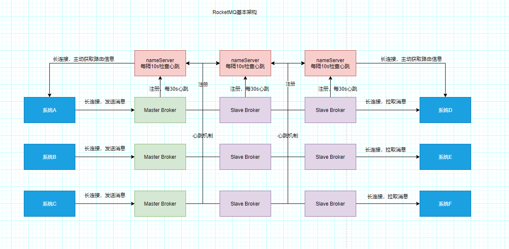

# 消息中间件

## 目录

- [放大100倍压力，找出你系统的技术挑战](#放大100倍压力，找出你系统的技术挑战)
- [消息中间件](#消息中间件)
    - [消息中间件作用](#消息中间件作用)
    - [Kafka、RabbitMQ 以及 RocketMQ对比](#Kafka、RabbitMQ以及RocketMQ对比)
- [MQ的架构原理](#MQ的架构原理)
    - [RocketMQ架构原理](#RocketMQ架构原理)
        - [NameServer](#NameServer)
        - [Broker主从架构](#Broker主从架构)
    - [Kafka架构原理](#Kafka架构原理)
    - [RabbitMQ架构原理](#RabbitMQ架构原理)

# 消息中间件

## 放大100倍压力，找出你系统的技术挑战

思考一：系统的核心链路，有哪些步骤，各个步骤的性能如何，是否有改进空间？
    
        下单--预约--核销---退款

思考二：系统中是否有类似后台线程定时补偿的逻辑
    
    订单长时间未支付，要关闭，
    预约单长时间无人确认接单，自动分单，
    秒杀活动/优惠券设置时间后要自动开始，到点后要自动结束

思考三：系统中有哪些和第三方系统的耦合？

        耦合微信支付，短信，推送等

思考四：核心链路中是否存在哪些关键步骤可能会失败的情况？万一失败了该怎么办？

     例如退款失败后怎么办

思考五：平时是否有其他系统需要获取你们的数据的情况？他们是如何获取数据的？

    是直接跑SQL从你们的数据库里查询？或者是调用你们的接口来获取数据？
    是否有这种情况？如果有，对你们有什么影响吗？

思考六：你们的系统是否存在流量洪峰的情况，有时候突然之间访问量增大好几倍，是否对你们的系统产生无法承受的压力？
        
## 消息中间件

### 消息中间件作用

解耦
异步
消峰

### Kafka、RabbitMQ以及RocketMQ对比

（1）、Kafka的优势与劣势

   kafka 性能很高，基本发消息给kafka都是毫秒级的性能，可用性也很高，kafka支持集群部署的，其中部分宕机是可以继续运行的

   但是kafka比较为人诟病的一点，似乎是丢数据方能的问题，因为kafka收到消息后会写入一个磁盘缓冲区里，并没有落地到物理磁盘上，
    
   所以要是机器本身故障，可能会导致磁盘缓冲区数据丢失。
   
   而且kafka另外一个比较大的缺点，就是功能非常单一，主要支持发送消息给他，然后从里面消费消息，其他的就没有什么额外的高级功能了
   
   因此，综上所述，基本行业里的标准，是把kafka在用户行为日志的采集和传输上的，比如大数据团队要收集app上用于的一些行为日志，这种日志就是
   
   kafka收集传输的。

（2）、RabbitMQ的优势与劣势

   RabbitMQ的优势是可以保证数据不丢失，也可以保证高可用性，即集群部署的时候。部分机器宕机可以继续运行，然后支持部分高级功能
   比如说：死信队列，消息重试之类的

   但是他有个缺点最为人诟病的，就是RabbitMQ吞吐量比较低，一般就是每秒几万级别的，所以遇到特别高特别高的并发的情况下，支撑起来是有点困难的

   还有一个是它进行集群扩展的时候(就是加机器部署)，还是比较麻烦的

（2）、RocketMQ的优势与劣势

   RocketMQ吞吐量也同样很高，单机可以达到10wQPS以上，而且可以保证高可用，性能很高，而且支持配置，保证数据绝对不丢失，可以部署
   大规模集群，而且支持各种高级性能，比如说：延迟消息，事务消息，消息回溯，死信队列，消息积压等等
   
   
## MQ的架构原理

### RocketMQ架构原理

RocketMQ 这个技术一共包含了四个核心部分

    1.第一块就是他的NameServer，这个东西很重要，他要负责管理集群里所有Broker的信息，让使用MQ的系统能感知到集群里有哪些Broke。
    2.第二块就是Broke集群的本身信息，必须在多台机器上部署这么一个集群，而且还得用主从架构实现数据多副本和高可用。
    3.第三块就是消息生产者
    4.第四块就是消息的消费者

#### NameServer

要部署RocketMQ，就得先部署NameServer，NameServer支持集群化部署，做到高可用。任何一台机器宕机，NameServer可以继续对外提供服务。

每个Broker启动时都得向所有的NameServer进行注册，也就是说，每个NameServer都有一份集群中所有的Broker信息。

RocketMQ中的生产者和消费者自己主动区NameServer拉取Broker信息的

Broker和NameServer之间通过心跳机制，Broker会每隔30s给所有的NameServer发送心跳，告诉NameServer自己还活着。

每次NameServer收到Broker心跳，就可以更新一下它的最近一次心跳时间。

然后NameServer 会每隔10s运行一个任务，区检查各个Broker的最近一次心跳，如果某个Broker超过120s都没发送心跳，那么就认为这个Broker已经挂掉。

生产者和消费者会重新获取NameServer最新的路由信息，并缓存在本地

#### Broker主从架构

为了保证RocketMQ的数据不丢失而且具备一定的高可用性，所以一般将Broker，部署成Master-Slave模式的，也就时一个Master Broker  对应一个Slave Broker

RocketMQ的Master-Slave模式采取的是（Pull模式）Slave Broker不停的发送请求到Master Broker 去拉取消息

写入数据的时候，肯定是选择Master Broker 去写入的

读取数据的时候，有可能是Master Broker获取，有可能是Slave Broker 获取，一切根据当时的情况来定。

如果Slave Broker 挂掉了，那么读写的压力都集中在Master Broker上。

如果Master Broker 挂掉了，在RocketMQ4.5版本之前，Slave Broker无法自定切换为Master Broker,会导致服务不可用。

RocketMQ 4.5之后的版本，RocketMQ支持一种新的机制，叫Dledger，可实现RocketMQ高可用自动切换的效果。

(备注:redis 的Master-Slaver 是基于哨兵模式，异曲同工）

