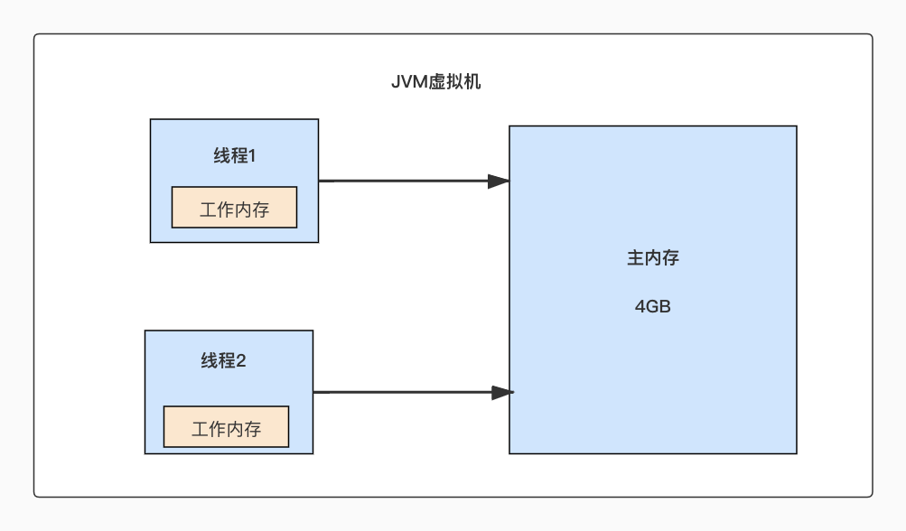
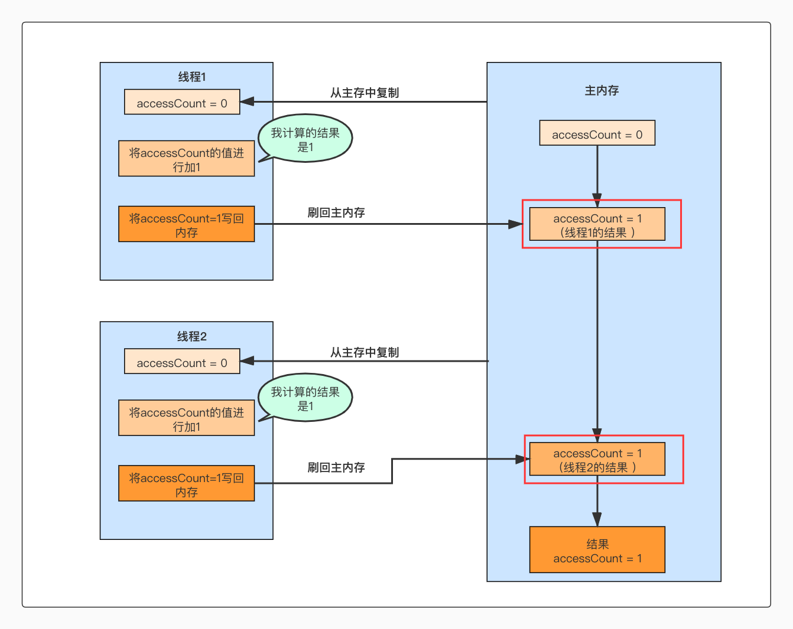
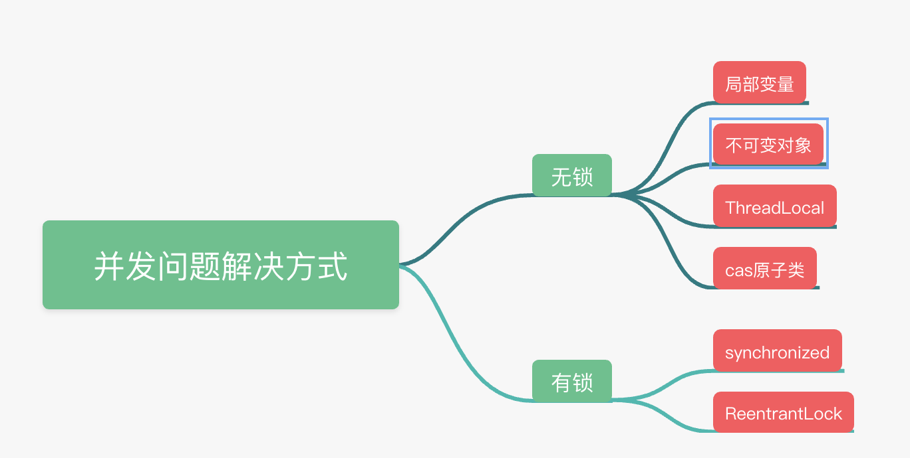
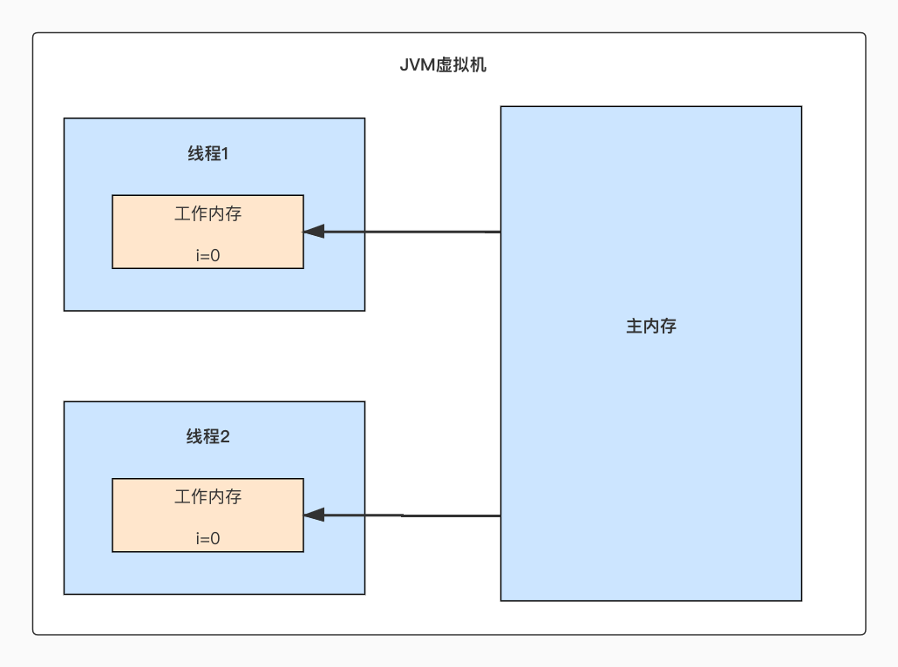
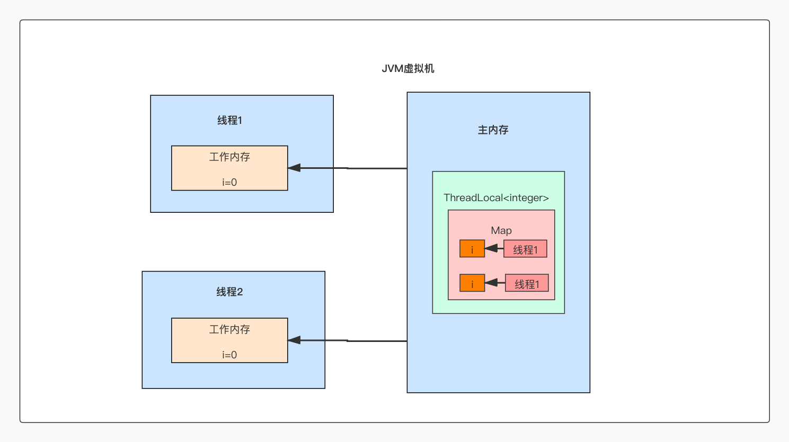
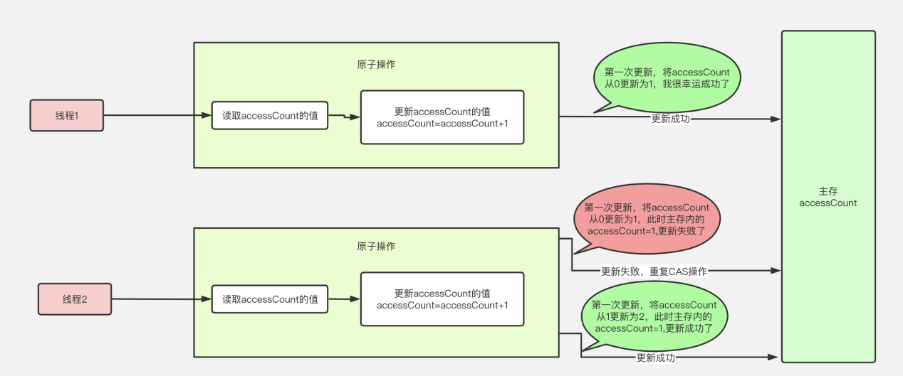
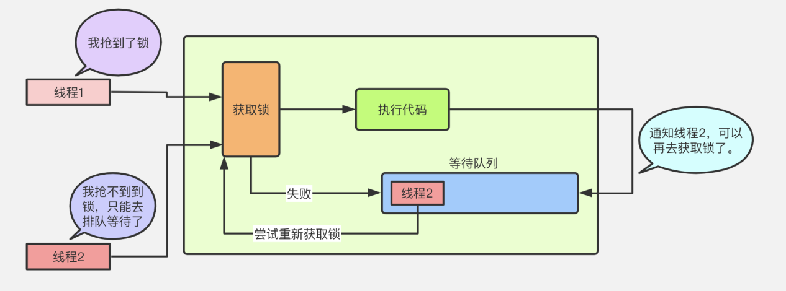

# java并发编程

##  目录
- [java并发编程](#java并发编程)


# java并发编程

## 问题：多线程读写同一共享变量是否存在并发问题？

    java内存模型



    JVM启动之后，操作系统会为JVM进程分配一定的内存空间，这部分内存空间就称为“主内存”
    
    另外java程序的所有工作都是由线程来完成的，而每个线程都会有一小块内存，称为“工作线程”，
    java中的线程在执行的过程中，会下你将数据从主内存中复制到线程的工作内存中，然后在执行计算。
    执行计算之后，在把计算的结果刷回到主内存。


多线程并发线程安全的问题



accessCount++这个代码，需要分为3个步骤 
1.从主内存中读取accessCount的值
2.将accessCount的值进行加1
3.将accessCount的值写回主内存中

如果要保证线程安全，就就需要保证多个操作的原子性

原子性：即一个操作或者多个操作，要么全部执行并且执行的过程中不被任何因素打断，要么都不执行。

## 解决并发问题的方法

常见并发问题的解决方法：



局部变量：



每个线程都只在自己的工作内存操作各自变量的“1”，不同线程之间的“1”，根本没有任何交集，所以也就不存在的并发问题了。

不可变对象：

    所谓的不可变对象是指已经创建，就对外的状态不会改变的对象，如果一个对象的状态是亘古不变的，那么自然就不存在并发问题了。
    因为对象是不可变的，所以无论多少个线程，对它做什么操作，他都是不变的


ThreadLocal：
 

   
    ThreadLocal本质上也是在每个线程都要自己的一个副本，每个线程的副本是互不影响的，没有任何关系。

    一个命名为“i”的ThreadLocal类，它会在每个线程都有一个Integer的对象，虽然每个线程都会从主内存中
    把Integer对象拷贝到工作线程中，但是线程1和线程2拷贝过来的对象并不是同一个对象，其中每个对象只会被其中
    一个线程操作，这种场景不是所谓的“共享变量”，就不存在并发问题了。

cas原子类：

    CAS机制当中使用了3个基本操作数：内存地址V，旧的预期值A，要修改的新值B，只有当内存地址V所对应的值和旧的预期值A相等的时候
    才会将内存地址V对应的值更新为新的值B。

    Atomic 都是采用的CAS思想，是基于乐观锁的，它的并发性能比较高，多个线程同时执行的时候，并且保证不会出现线程安全的问题。

     CAS操作对数据进行比较并置换，如果操作失败会进入while循环，直到操作成功，其中compareAndSwapInt是一个navite方法，
    底层是通过c++来实现的，可以保证整个操作时原子性的，从而避免并发问题。

    

```java

    private AtomicInteger counter = new AtomicInteger(0);

    public void atomicAdd(){
        counter.incrementAndGet();   
    }

```


Synchronized和ReentrantLock加锁:

    synchronized和reentrantLock都是采用的悲观锁策略，因为他们的实现非常的类似，只不过一种通过是语言方面来实现的（synchronized），
    另一种时通过编程方式来实现的（reentrantLock）

```java
import java.util.concurrent.locks.ReentrantLock;

public class Counter {

    private int i = 0;

    private ReentrantLock lock = new ReentrantLock();

    /**
     * 通过ReentrantLock方式加锁
     */

    public void lockMethod() {
        lock.lock();
        try {
            add();
        }finally {
            lock.unlock();
        }
    }

    /**
     * 通过synchronized方式加锁
     */
    public synchronized void lockMethod2(){
        add();
    }
    
    public void add(){
        i++;
    }
}


```

     在i++这个操作上，主要分为3个步骤：
     1.读取i的值
     2.将i的值加1 
     3.将i的值写回到主内存中
      这三个操作都是通过加锁可以保证原子性的，要么三个操作都成功，要么三个操作都不成功，所以可以解决线程安全的问题

