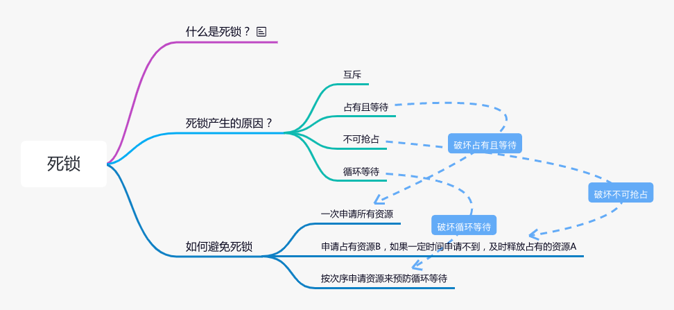

# java并发编程

##  目录
- [java并发编程](#java并发编程)


# java并发编程

## 问题：多线程读写同一共享变量是否存在并发问题？

    java内存模型


    JVM启动之后，操作系统会为JVM进程分配一定的内存空间，这部分内存空间就称为“主内存”
    
    另外java程序的所有工作都是由线程来完成的，而每个线程都会有一小块内存，称为“工作线程”，
    java中的线程在执行的过程中，会下你将数据从主内存中复制到线程的工作内存中，然后在执行计算。
    执行计算之后，在把计算的结果刷回到主内存。


多线程并发线程安全的问题


accessCount++这个代码，需要分为3个步骤 
1.从主内存中读取accessCount的值
2.将accessCount的值进行加1
3.将accessCount的值写回主内存中

如果要保证线程安全，就就需要保证多个操作的原子性

原子性：即一个操作或者多个操作，要么全部执行并且执行的过程中不被任何因素打断，要么都不执行。

## 解决并发问题的方法

常见并发问题的解决方法：


局部变量：


每个线程都只在自己的工作内存操作各自变量的“1”，不同线程之间的“1”，根本没有任何交集，所以也就不存在的并发问题了。

不可变对象：

    所谓的不可变对象是指已经创建，就对外的状态不会改变的对象，如果一个对象的状态是亘古不变的，那么自然就不存在并发问题了。
    因为对象是不可变的，所以无论多少个线程，对它做什么操作，他都是不变的


ThreadLocal：
 

   
    ThreadLocal本质上也是在每个线程都要自己的一个副本，每个线程的副本是互不影响的，没有任何关系。

    一个命名为“i”的ThreadLocal类，它会在每个线程都有一个Integer的对象，虽然每个线程都会从主内存中
    把Integer对象拷贝到工作线程中，但是线程1和线程2拷贝过来的对象并不是同一个对象，其中每个对象只会被其中
    一个线程操作，这种场景不是所谓的“共享变量”，就不存在并发问题了。

cas原子类：

    CAS机制当中使用了3个基本操作数：内存地址V，旧的预期值A，要修改的新值B，只有当内存地址V所对应的值和旧的预期值A相等的时候
    才会将内存地址V对应的值更新为新的值B。

    Atomic 都是采用的CAS思想，是基于乐观锁的，它的并发性能比较高，多个线程同时执行的时候，并且保证不会出现线程安全的问题。

     CAS操作对数据进行比较并置换，如果操作失败会进入while循环，直到操作成功，其中compareAndSwapInt是一个navite方法，
    底层是通过c++来实现的，可以保证整个操作时原子性的，从而避免并发问题。

    

```java

    private AtomicInteger counter = new AtomicInteger(0);

    public void atomicAdd(){
        counter.incrementAndGet();   
    }

```


Synchronized和ReentrantLock加锁:

    synchronized和reentrantLock都是采用的悲观锁策略，因为他们的实现非常的类似，只不过一种通过是语言方面来实现的（synchronized），
    另一种时通过编程方式来实现的（reentrantLock）

```java
import java.util.concurrent.locks.ReentrantLock;

public class Counter {

    private int i = 0;

    private ReentrantLock lock = new ReentrantLock();

    /**
     * 通过ReentrantLock方式加锁
     */

    public void lockMethod() {
        lock.lock();
        try {
            add();
        }finally {
            lock.unlock();
        }
    }

    /**
     * 通过synchronized方式加锁
     */
    public synchronized void lockMethod2(){
        add();
    }
    
    public void add(){
        i++;
    }
}


```

     在i++这个操作上，主要分为3个步骤：
     1.读取i的值
     2.将i的值加1 
     3.将i的值写回到主内存中
      这三个操作都是通过加锁可以保证原子性的，要么三个操作都成功，要么三个操作都不成功，所以可以解决线程安全的问题


     首先两个线程都会去争抢同一个锁，假设线程1获取到了锁，线程2 获取不到锁，就会进入等待队列，等待线程1，执行完代码逻辑之后，才回去通知线程2.
     这时线程2会重新尝试获取锁，假设线程2获取锁成功，线程2才开始执行代码。

## 如何将一个类改造成不可变类

    1.使用final关键字修饰所有成员变量，避免其被修改，也可以保证多线程环境下被final关键字修饰的变量所引用的对象初始化安全，
    即final修饰的字段在其他线程可见时，必须是初始化完成的。
    
    2.使用private修饰所有成员变量，可以防止子类以及其他地方通过引用直接修改变量值。
    
    3.禁止提供修改北部状态的公开接口
    
    4.禁止不可变类被外部继承，防止子类改变其定义方法的行为。
    
    5.如果类存在数组和集合，在提供给外部访问之前需要做防御性复制。

```java
   Collections.unmodifiableList(new ArrayList(data));
```


## 等效不可变对象CopyOnWriteArrayList适用场景分析

写时复制的最终目的时为了读多写少的场景，通过写时复制的机制，让大量的读请求在无需加锁牺牲性能的情况下保证多线程并发读写的情况下线程安全。


    两个线程并发读取CopyOnWriteArrayList的情况，其中线程1需要通过iterator()方法读取数据，
    其中集合中的元素为元素1、元素2，但是这个时候线程2需要往集合中添加一个元素：元素3，这个时候
    线程2的操作时直接基于集合当前的数据进行复制一份到新的数组，最后将array变量指向新的一个数组。
    
    这里注意思考这样一个场景：假设线程1在遍历元素的时候，读取到了元素1，但是还没有读取到元素2的时候
    线程2添加了元素3，这个时候线程1是无法读取到元素3的。这是因为线程1和线程2操作的数组不是同一个数组。
    这也是CopyOnWriteArrayList的一个特点：弱一致性。
    意思就是说线程1看到的是某一个时刻的一份数据快照，无法保证能读到最细你的数据。

CopyOnWriteArrayList使用场景：
    
    总的来说，CopyOnWriteArrayList适用于读多写少的场景，

## 线程在执行过程中的状态是如何流转的？


线程各个状态的说明：

NEW(初始化状态)
    
    实现Runable接口和继承Thread可以得到一个线程类。new一个实例出来，线程就进入了初始化状态。

RUNNABLE（就绪，运行中状态）

    ready就绪
    1.就绪状态只是说你自个儿运行，调度程序并没有挑选到你，你就永远是就绪状态。
    2.调用现成的start()方法，此线程进入就绪状态。
    3.当前线程sleep方法结束，其他线程join()结束，等待用户输入完毕，某个线程拿到对象锁，这些线程也将
    进入就绪状态。
    4.当前线程时间片用完了，调用当前线程的yield()方法，当前线程进入就绪状态。
    5.锁池里的线程拿到对象锁后，进入就绪状态。

RUNNING （运行中状态）

    线程调度程序从可运行池中选择一个线程作为当前线程时线程所处的状态。这也是线程进入运行状态的唯一一种方式。

BLOCKED（阻塞状态）
    
    阻塞状态是线程阻塞进入synchronized关键字修饰方法或者代码块（获取锁）之前的状态。
    
WAITING（等待状态）

    调用sleep或者wait方法后线程处于WAITING状态，等待被唤醒。

TIMED_WAITING（等待超时状态）

    调用sleep或者wait方法后线程处理TIMED_WAITING状态，等待被唤醒，或者时间超时唤醒。

TERMINATED（终止状态）

    1.当线程的run()方法完成时，或者主线程main()方法完成时，我们就认为它终止了。这个线程对象也许时活的，但是
    他已经不是一个单独执行的线程，线程一旦终止，就不能复生。
    2.在一个终止的线程线程上调用star()方式，会抛出iIIegelThreadStateException异常

线程状态之间的切换

1.NEW到RUNNABLE状态


2.RUNNABLE到BLOCKED状态转换


3.RUNNABLE到WAITING状态转换


    有三种场景会触发线程RUNNABLE向WAITING转换
    1.获得synchronized隐式锁的线程，调用Object.wait()方法。
    2.另一种，调用线程同步Thread.join()方法。
    3.最后一种，调用LockSupport.part()方法。java并发包中的锁，都是基于LockSupport对象实现的。
    调用LockSupport.park()方法，当前线程会阻塞，线程状态会从RUNNABLE状态转换到WAITING。
    调用LockSupport.uppark(Thread thread)方法，可唤醒目表线程，目表线程的状态会从WAITING状态
    转换到RUNNABLE。

4.RUNNABLE与TIMED_WAITING的状态转换


有5种场景会触发RUNNABLE向TIMED_WAITING转换

1.调用带超时参数的Thread.sleep(long millis)方法。
2.获取synchronized隐式锁的线程，调用带参数的Objects.wait(long timeout)方法;
3.调用带超时参数的Thread.join(long millis)方法;
4.调用带超时参数的LockSupport.parkNanos(Object blocker,long deadline)方法;
5.调用带超时参数的LockSupport.parkUntil(long deadline);

    这里你会发现TIMED_WAITING和WAITING状态的区别仅仅是触发条件多了超时参数。

5.RUNNABLE到TERMINATED状态


## 死锁



## 基于Guarded Suspension模式，优化百万交易系统

一、 Guarded Suspension模式简介
guarded在这里是“保护”的意思；suspension在这里是“暂时挂起”的意思。所以，Guarded Suspension模式又称为“保护性暂挂模式”；


创建GuardedQueue类

```java
public class GuardedQueue {
    private final Queue<Integer> sourceList;

    public GuardedQueue() {
        this.sourceList = new LinkedBlockingQueue<>();
    }
    
    public synchronized Integer get() {
        while (sourceList.isEmpty()) {
            try {
                wait();    // <--- 如果队列为null，等待            
            } catch (InterruptedException e) {
                e.printStackTrace();
            }
        }
        return sourceList.peek();
    }
    
    public synchronized void put(Integer e) {
        sourceList.add(e);
        notifyAll();  //<--- 通知，继续执行    }
}
```

测试一下

```java
public class App {
    public static void main(String[] args) {
        GuardedQueue guardedQueue = new GuardedQueue();
        ExecutorService executorService = Executors.newFixedThreadPool(3);
        executorService.execute(() -> {
                    guardedQueue.get();
                }
        );
        Thread.sleep(2000);
        executorService.execute(() -> {
                    guardedQueue.put(20);
                }
        );
        executorService.shutdown();
        executorService.awaitTermination(30, TimeUnit.SECONDS);
    }
}
```

四、总结与拓展
Guarded Suspension模式的“等待-通知”机制是一种非常普遍的线程间协作的方式。我们在平时工作中经常看到有同学使用“轮询while(true)”的方式来等待某个状态，其实都可以用这个“等待-通知”机制来优化。


另外，有同学可能会问为什么不用notify() 来实现通知机制呢？

Notify()和notifyAll()这两者是有区别的，notify() 是会随机地通知等待队列中的任意一个线程，而 notifyAll() 会通知等待队列中的所有线程。


觉得 notify() 会更好一些的同学可能认为即便通知所有线程，也只有一个线程能够进入临界区。但是实际上使用 notify() 也很有风险，因为随机通知等待的线程，可能会导致某些线程永远不会被通知到。

所以除非经过深思熟虑，否则尽量使用 notifyAll()