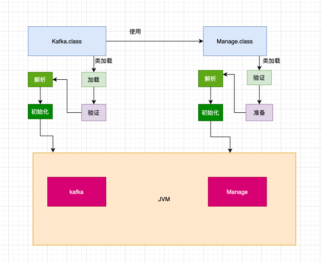
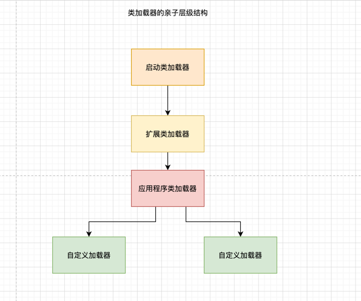
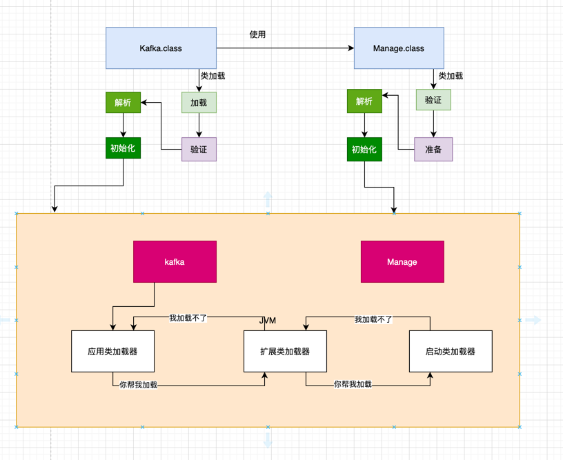
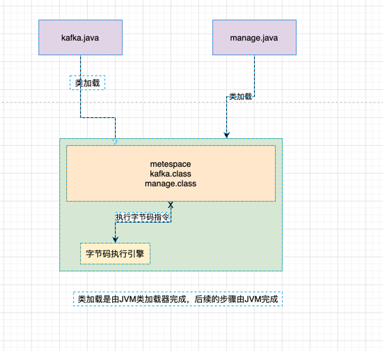
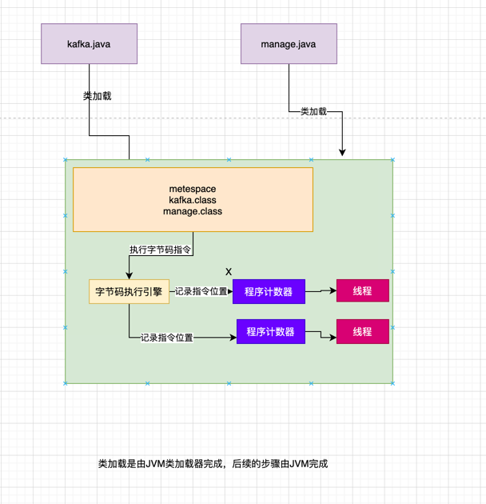
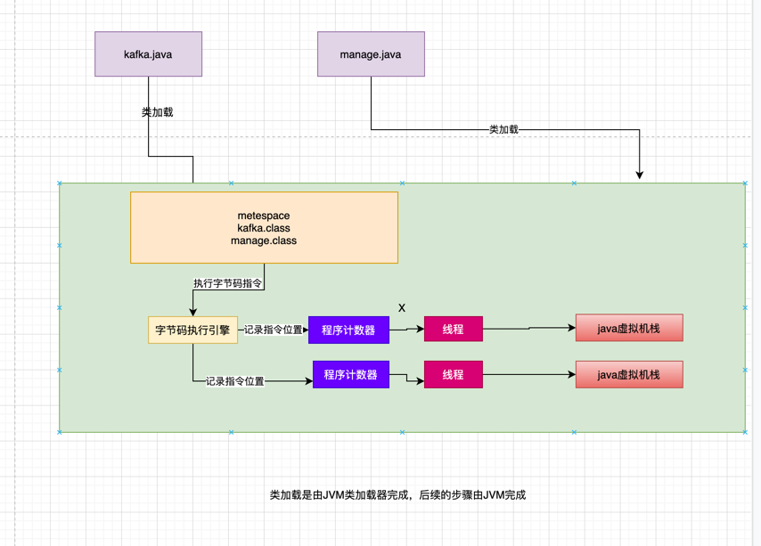
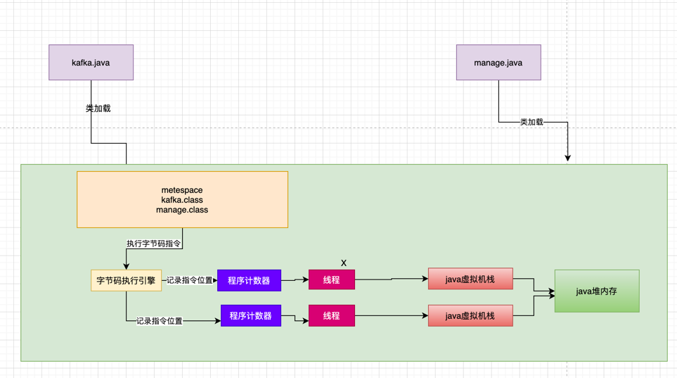
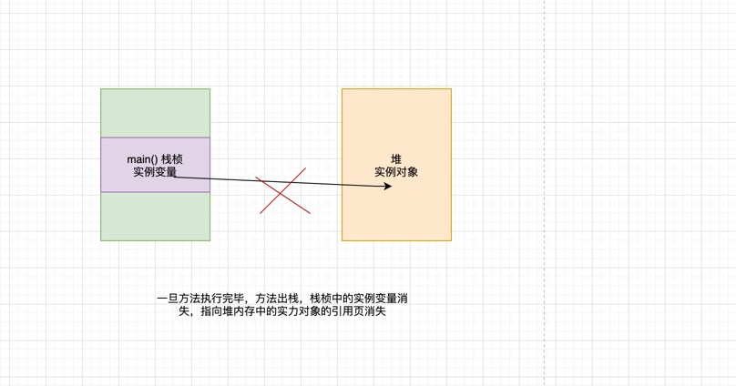
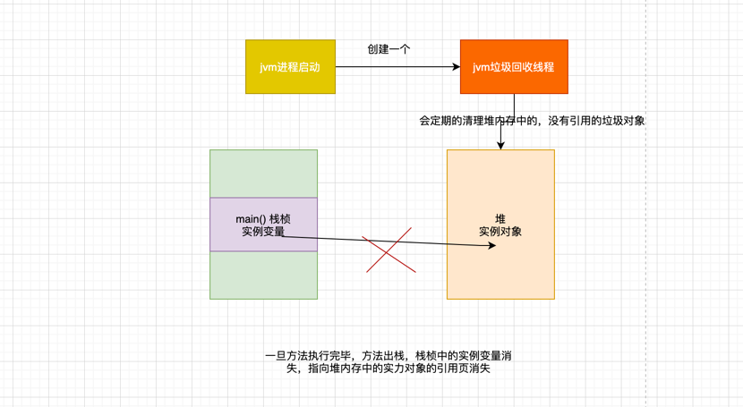
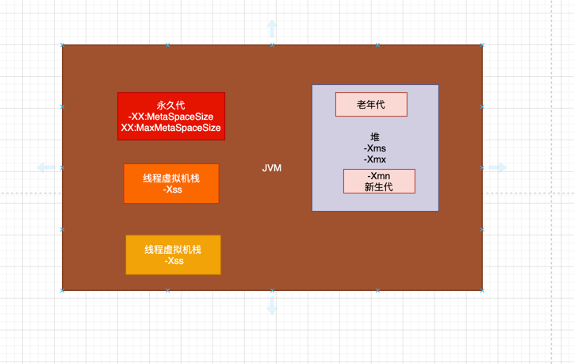

# JVM从0到实战
## 目录

- [jvm运行原理](#JVM运行原理)
    - [jvm核心运行流程](#jvm核心运行流程)
    - [JVM类加载机制](#JVM类加载机制)
    - [JVM中内存区域](#JVM中内存区域)
- [JVM垃圾回收机制](#JVM垃圾回收机制)
    - [JVM的垃圾回收机制是用来干嘛的？为什么要垃圾回收？](#JVM的垃圾回收机制是用来干嘛的？为什么要垃圾回收？)
    - [JVM分代模型](#JVM分代模型)
## 大纲
## JVM运行原理
### jvm核心运行流程
    

        
    JVM要运行这些字节码文件，首先得把这些.class文件加载进来
    此时会采用类加载器将这些字节码文件加载搭配JVM，供后续的代码运行使用
    最后一步，JVM会基于自己的**字节码执行引擎**，来执行加载到内存里我们写好的那些类了。
    
下一步讨论
### JVM类加载机制

一个类从加载到使用一般经历一下几个过程




**加载**--**验证**--**准备**--**解析**--**初始化**--**使用**--**卸载**

加载阶段：
       代码在使用这个类的时候，.class 文件会加载进内存

验证阶段：
       根据java虚拟机规范，来验证你加载进来的.class 文件的内容是否符合规范

准备阶段：
      给类遍历分配内存空间，来一个默认的初始值

解析阶段：
      把符号引用替换为直接引用

初始化：
     new Object() 初始化一个对象，在准备阶段知识只是分配了内存空间，给了默认值，真正的赋值是在初始化阶段完成的
     此外这里有个非常重要的规则，就是初始化一个类的时候，发现它的父类还没有初始化，那么必须先初始化它的父类。
    

### 类加载器和双亲委派机制

     从加载到初始化实际上是有类加载器来完成的

 **java中有哪些类加载器呢？简单来说有下面几种**

    - 启动类加载器
        Bootstrap classLoader ，它主要是负债加载我们机器安装的java目录下的核心类的
        相信大家都知道，如果你要在机器上运用一个自己写好的Java系统，无论是Windows笔记本，还是linux服务器，是不是都得装一下JDK，
        那么你在安装目录下就有一个**lib**文件
        所以一旦你的JVM启动，那么首先就会依托启动类加载器，去加载你的JAVA 安装目录下的**lib**目录

    - 扩展类加载器
        Extension ClassLoader，这个类加载器也是类似的，就是在你JAVA安装目录下，有个**lib\ext**目录，
        这里有一些类，就是需要使用这个类加载器来加载的，支撑你的系统的运行。
        那么你的JVM一旦启动，是不是也得从java安装目录下，加载这个**lib\ext**目录中的类
 
    - 应用类加载器
        Application ClassLoader，这类加载器就去加载**classpath**环境变量所指定的路径中的类加载器
        其实大致就理解为去加载你写好的Java代码吧，这类加载器主要负责加载你写好的那些类到内存里。

    - 自定义类加载器
        除了上面那几种情况外，还可以自定义类加载器，去根据你的需求加载你的类。

jvm的类加载器是有亲子层级机构的，就是启动类加载器子啊最上层，拓展类加载器在第二层，第三层是应用程序类加载器，最下面一层是自定义加载器



基于这个亲子层级关系，就有一个**双亲委派机制**

双亲委派机制：先由父类加载，不行的话在由儿子来加载。




首先类加载器由JVM提供，类加载器逻辑的第一个阶段解释加载阶段，后面的由JVM完成。


### JVM中内存区域
  - 元空间
    
    jvm在运行我们写好的代码，他必须使用多块内存空间的，不同的内存空间用来存放不同的数据，然后配合我们写的代码流程才能让我们系统运行起来。
    我们现在知道了JVM会加载类到内存里供后续运行使用，所以JVM里必须有一块内存空间，用来存放我们写的那些类。
    方法区是在JDK1.8以前版本里，代表JVM的一块区域。
    
    主要是存放.class文件中加载进来的类，还会有一些类似常亮池的东西放在这个区域里。
    但是JDK1.8之后，这块区域的名字变了，叫"metespace" ，可以认为"元数据空间"的意思，主要还是存放我们写的各种类的相关信息。
    '.calss' 后缀的字节码文件里，存放的就是你写出来的代码编译好的字节码了，对应着各种字节码指令。
    
 
 - 程序计数器
   
    现在当JVM加载类信息到内存之后，实际上就是使用自己的字节码执行引擎，去执行我们写的代码编译出来的代码指令
    
    
    
    那么在执行字节码的时候，就需要一块特殊的指令区域:**程序计数器**
    
    这个程序计数器就是来记录，当前**字节码指令执行位置的**
    
    **每个线程都有一个自己的程序指令器**



 - java虚拟机栈

    java代码在执行的时候一定是一个线程来执行某个方法中的代码，
    但是在方法里，我们会定义一些方法内的局部变量，
    因此，JVM必须有一块区域来保存方法内的**局部变量**等数据，这个区域就是**java虚拟机栈**
    
    **每个线程都有自己的java虚拟机栈，**
    
    如果一个线程执行一个方法，**就会对这个方法调用创建一个栈帧**
    
    栈帧里就会有这个方法的局部变量表，操作数栈，动态链表，方法出口等
    
    在执行方法的时候会创建栈桢，压入到java虚拟机栈中，当方法执行完成时们，就会把对应方法的栈桢，从java虚拟机中出栈
    


- java堆内存
    主要存放我们创建的对象
  
核心内存区域的全流程串讲

```java
    class kafka{
    public static void main(String[] args){
        Magage manage = new Magage();
    }
    public class Manage{
        int i ;
        public int excute(){
            i ++;
            return i;
        }
    }
}
```

首先你的JVM进程会启动，加载你的Kafka类到内存⾥。

然后有⼀个main线程，开始执⾏你的Kafka中的main()⽅法。


main线程是关联了⼀个程序计数器的，那么他执⾏到哪⼀⾏指令，就会记录在这⾥
⼤家结合上图中的程序计数器来理解⼀下。


其次，就是main线程在执⾏main()⽅法的时候，会在main线程关联的Java虚拟机栈⾥，压⼊⼀个main()⽅法的栈帧。


接着会发现需要创建⼀个ReplicaManager类的实例对象，此时会加载ReplicaManager类到内存⾥来。


然后会创建⼀个ReplicaManager的对象实例分配在Java堆内存⾥，并且在main()⽅法的栈帧⾥的局部变量表引⼊⼀个
“replicaManager”变量，让他引⽤ReplicaManager对象在Java堆内存中的地址。


## JVM垃圾回收机制

### JVM的垃圾回收机制是用来干嘛的？为什么要垃圾回收？

一旦方法执行完毕，压入栈桢中的方法就会出栈，栈桢里的局部变量也就没有了
也就是说没有一个变量指向java堆内存中的实例变量了


核心的知识点来了，java堆内存中的实例对象已经没有人引用它了。这个对象实际上已经没用了

内存资源是有限的。

我们在java堆内存里创建的对象都是占用内存资源的，而且内存资源有限。


对于不用的对象，我们应该怎么处理呢？

答案呼之欲出：**JVM垃圾回收机制**

JVM本身就有垃圾回收机制的，它是一个**后台自动运行的线程。**

你只要启动一个JVM进程，他就会自动携带一个垃圾回收的后台线程。


这个线程会在后台不断检测jvm堆内存中的各个实力对象。

那些不在被人引用的实例对象，即jvm中的**垃圾**，就会定期的被后台垃圾回收线程清理掉



思考题：加载到方法区的内会被回收吗，什么时候回收？为什么？
1. 该类的实例对象不存在时
2. 该类的classLoader 不在被使用时
3. 该类的class对象不再被使用时

### JVM分代模型

java将堆内存划分为新生代代  老年代

咱们平时创建出来的对象，一般情况就是两种
1. 一种是短期存活的对象，分配在堆内存后，迅速被垃圾回收
2. 一种是长期存活的对象，需要一直活在堆内存里，供程序后续使用

对象什么情况下进入年新生代什么情况下进入老年代

 **大部分对象都优先在新生代分配内存**
```java
        
   public KafKa{
    public static Manage manage = new Manage();
            
}

```
  类manage的静态变量的对象 new manage() 会长期存活在堆内存中
  哪怕是这样，你开始创建 new manage() 对象的时候，他也是分配到新生代里
    
 JVM 有一条规定
 如果一个对象在新生代中，在15次垃圾回收之后，还没有被回收掉，说明它已经15岁了
 这是对象的年龄，每次垃圾回收，如果对象没有被回收掉，那么它的年龄就会—加1
 达到一定的年龄限制后，会被认为是长期存活的对象。

 然后会被转移到Java 堆内存中的老年代。


 **思考题**
  老年代会进行垃圾回收吗？
  答案是肯定的，只要是不被引用的对象就会被回收。

**跟JVM内存相关的介个核心参数图解**
在JVM内存分配中，几个核心参数比较重要
1. -Xms java堆内存的大小
2. -Xmx java堆内存的最大大小
3. -Xmn java堆内存中新生代大小，扣除新生代剩下的就是老年代的内存了
4. -XX:PermSize 永久代大小 java1.8之后替换为 -XX:MetaSpaceSize 
5. -XX:MaxPermSize 永久代的最大大小 java1.8之后替换为  -XX:MaxMetaSpaceSize
6. -Xss:每个线程的栈内存大小




