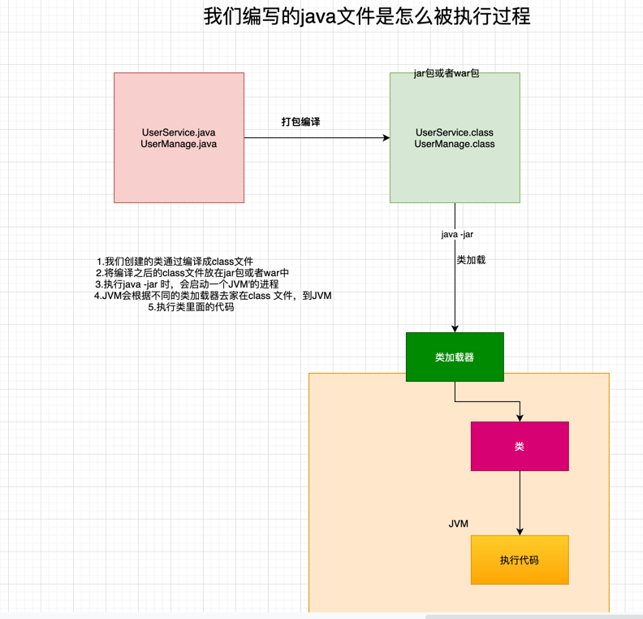

# JVM从0到实战
## 目录

- [jvm运行原理](#JVM运行原理)
    - [jvm核心运行流程](#jvm核心运行流程)
    - [JVM类加载机制](#JVM类加载机制)
    - [JVM中内存区域](#JVM中内存区域)
- [JVM垃圾回收机制](#JVM垃圾回收机制)
    - [JVM的垃圾回收机制是用来干嘛的？为什么要垃圾回收？](#JVM的垃圾回收机制是用来干嘛的？为什么要垃圾回收？)
    - [JVM分代模型](#JVM分代模型)
    - [JVM垃圾回收算法](#JVM垃圾回收算法)
- [JVM垃圾回收器](#JVM垃圾回收器)
## 大纲
## JVM运行原理
### jvm核心运行流程
    

        
    JVM要运行这些字节码文件，首先得把这些.class文件加载进来
    此时会采用类加载器将这些字节码文件加载搭配JVM，供后续的代码运行使用
    最后一步，JVM会基于自己的**字节码执行引擎**，来执行加载到内存里我们写好的那些类了。
    
下一步讨论
### JVM类加载机制

一个类从加载到使用一般经历一下几个过程


**加载**--**验证**--**准备**--**解析**--**初始化**--**使用**--**卸载**

加载阶段：
       代码在使用这个类的时候，.class 文件会加载进内存

验证阶段：
       根据java虚拟机规范，来验证你加载进来的.class 文件的内容是否符合规范

准备阶段：
      给类遍历分配内存空间，来一个默认的初始值

解析阶段：
      把符号引用替换为直接引用

初始化：
     new Object() 初始化一个对象，在准备阶段知识只是分配了内存空间，给了默认值，真正的赋值是在初始化阶段完成的
     此外这里有个非常重要的规则，就是初始化一个类的时候，发现它的父类还没有初始化，那么必须先初始化它的父类。
    

### 类加载器和双亲委派机制

     从加载到初始化实际上是有类加载器来完成的

 **java中有哪些类加载器呢？简单来说有下面几种**

    - 启动类加载器
        Bootstrap classLoader ，它主要是负债加载我们机器安装的java目录下的核心类的
        相信大家都知道，如果你要在机器上运用一个自己写好的Java系统，无论是Windows笔记本，还是linux服务器，是不是都得装一下JDK，
        那么你在安装目录下就有一个**lib**文件
        所以一旦你的JVM启动，那么首先就会依托启动类加载器，去加载你的JAVA 安装目录下的**lib**目录

    - 扩展类加载器
        Extension ClassLoader，这个类加载器也是类似的，就是在你JAVA安装目录下，有个**lib\ext**目录，
        这里有一些类，就是需要使用这个类加载器来加载的，支撑你的系统的运行。
        那么你的JVM一旦启动，是不是也得从java安装目录下，加载这个**lib\ext**目录中的类
 
    - 应用类加载器
        Application ClassLoader，这类加载器就去加载**classpath**环境变量所指定的路径中的类加载器
        其实大致就理解为去加载你写好的Java代码吧，这类加载器主要负责加载你写好的那些类到内存里。

    - 自定义类加载器
        除了上面那几种情况外，还可以自定义类加载器，去根据你的需求加载你的类。

jvm的类加载器是有亲子层级机构的，就是启动类加载器子啊最上层，拓展类加载器在第二层，第三层是应用程序类加载器，最下面一层是自定义加载器


基于这个亲子层级关系，就有一个**双亲委派机制**

双亲委派机制：先由父类加载，不行的话在由儿子来加载。


首先类加载器由JVM提供，类加载器逻辑的第一个阶段解释加载阶段，后面的由JVM完成。


### JVM中内存区域
  - 元空间
    
    jvm在运行我们写好的代码，他必须使用多块内存空间的，不同的内存空间用来存放不同的数据，然后配合我们写的代码流程才能让我们系统运行起来。
    我们现在知道了JVM会加载类到内存里供后续运行使用，所以JVM里必须有一块内存空间，用来存放我们写的那些类。
    方法区是在JDK1.8以前版本里，代表JVM的一块区域。
    
    主要是存放.class文件中加载进来的类，还会有一些类似常亮池的东西放在这个区域里。
    但是JDK1.8之后，这块区域的名字变了，叫"metespace" ，可以认为"元数据空间"的意思，主要还是存放我们写的各种类的相关信息。
    '.calss' 后缀的字节码文件里，存放的就是你写出来的代码编译好的字节码了，对应着各种字节码指令。
    
 
 - 程序计数器
   
    现在当JVM加载类信息到内存之后，实际上就是使用自己的字节码执行引擎，去执行我们写的代码编译出来的代码指令
    
    
    
    那么在执行字节码的时候，就需要一块特殊的指令区域:**程序计数器**
    
    这个程序计数器就是来记录，当前**字节码指令执行位置的**
    
    **每个线程都有一个自己的程序指令器**


 - java虚拟机栈

    java代码在执行的时候一定是一个线程来执行某个方法中的代码，
    但是在方法里，我们会定义一些方法内的局部变量，
    因此，JVM必须有一块区域来保存方法内的**局部变量**等数据，这个区域就是**java虚拟机栈**
    
    **每个线程都有自己的java虚拟机栈，**
    
    如果一个线程执行一个方法，**就会对这个方法调用创建一个栈帧**
    
    栈帧里就会有这个方法的局部变量表，操作数栈，动态链表，方法出口等
    
    在执行方法的时候会创建栈桢，压入到java虚拟机栈中，当方法执行完成时们，就会把对应方法的栈桢，从java虚拟机中出栈
    


- java堆内存
    主要存放我们创建的对象
  
核心内存区域的全流程串讲

```java
    class kafka{
    public static void main(String[] args){
        Magage manage = new Magage();
    }
    public class Manage{
        int i ;
        public int excute(){
            i ++;
            return i;
        }
    }
}
```

首先你的JVM进程会启动，加载你的Kafka类到内存⾥。

然后有⼀个main线程，开始执⾏你的Kafka中的main()⽅法。


main线程是关联了⼀个程序计数器的，那么他执⾏到哪⼀⾏指令，就会记录在这⾥
⼤家结合上图中的程序计数器来理解⼀下。


其次，就是main线程在执⾏main()⽅法的时候，会在main线程关联的Java虚拟机栈⾥，压⼊⼀个main()⽅法的栈帧。


接着会发现需要创建⼀个ReplicaManager类的实例对象，此时会加载ReplicaManager类到内存⾥来。


然后会创建⼀个ReplicaManager的对象实例分配在Java堆内存⾥，并且在main()⽅法的栈帧⾥的局部变量表引⼊⼀个
“replicaManager”变量，让他引⽤ReplicaManager对象在Java堆内存中的地址。


## JVM垃圾回收机制

### JVM的垃圾回收机制是用来干嘛的？为什么要垃圾回收？

一旦方法执行完毕，压入栈桢中的方法就会出栈，栈桢里的局部变量也就没有了
也就是说没有一个变量指向java堆内存中的实例变量了


核心的知识点来了，java堆内存中的实例对象已经没有人引用它了。这个对象实际上已经没用了

内存资源是有限的。

我们在java堆内存里创建的对象都是占用内存资源的，而且内存资源有限。


对于不用的对象，我们应该怎么处理呢？

答案呼之欲出：**JVM垃圾回收机制**

JVM本身就有垃圾回收机制的，它是一个**后台自动运行的线程。**

你只要启动一个JVM进程，他就会自动携带一个垃圾回收的后台线程。


这个线程会在后台不断检测jvm堆内存中的各个实力对象。

那些不在被人引用的实例对象，即jvm中的**垃圾**，就会定期的被后台垃圾回收线程清理掉


思考题：加载到方法区的内会被回收吗，什么时候回收？为什么？
1. 该类的实例对象不存在时
2. 该类的classLoader 不在被使用时
3. 该类的class对象不再被使用时

### JVM分代模型

java将堆内存划分为新生代代  老年代

咱们平时创建出来的对象，一般情况就是两种
1. 一种是短期存活的对象，分配在堆内存后，迅速被垃圾回收
2. 一种是长期存活的对象，需要一直活在堆内存里，供程序后续使用

对象什么情况下进入年新生代什么情况下进入老年代

 **大部分对象都优先在新生代分配内存**
```java
        
   public KafKa{
    public static Manage manage = new Manage();
            
}

```
  类manage的静态变量的对象 new manage() 会长期存活在堆内存中
  哪怕是这样，你开始创建 new manage() 对象的时候，他也是分配到新生代里
    
 JVM 有一条规定
 如果一个对象在新生代中，在15次垃圾回收之后，还没有被回收掉，说明它已经15岁了
 这是对象的年龄，每次垃圾回收，如果对象没有被回收掉，那么它的年龄就会—加1
 达到一定的年龄限制后，会被认为是长期存活的对象。

 然后会被转移到Java 堆内存中的老年代。


 **思考题**
  老年代会进行垃圾回收吗？
  答案是肯定的，只要是不被引用的对象就会被回收。

**跟JVM内存相关的介个核心参数图解**
在JVM内存分配中，几个核心参数比较重要

        1. -Xms java堆内存的大小
        2. -Xmx java堆内存的最大大小
        3. -Xmn java堆内存中新生代大小，扣除新生代剩下的就是老年代的内存了
        4. -XX:PermSize 永久代大小 java1.8之后替换为 -XX:MetaSpaceSize 
        5. -XX:MaxPermSize 永久代的最大大小 java1.8之后替换为  -XX:MaxMetaSpaceSize
        6. -Xss:每个线程的栈内存大小


**如何启动JVM参数**


**如何设置堆内存大小**

    根据对象创建的速度和对象的大小（每个属性的占用的字节数） 去估算

**如何设置永久代大小** 

    一般设置个几百兆

**如何设置栈内存大小**

     默认512kb -1M


 **什么时候会触发垃圾回收**

    **新生代快满的时候就会触发垃圾回收，这就是新生代核心的垃圾回收触发时机**

 **被哪些变量引用的对象是不能被回收的**

      新生代快满时，进行垃圾回收的时候，到底哪些对能能够被回收，哪些对象不能被回收
      JVM运用了**可达性分析算法**，来判断哪些对象是可以被回收的，哪些对象是不能被回收的。
      这个算法的意思就是，**每个对象都分析一下，有谁在引用它，然后一层层向上判断，看看是否又一个GCROOT**
      一句话总结：**就是只要你的对象被方法的局部变量或者类的静态变量引用，就不会回收它**
 
 **java中对象的不同引用类型**
   
    关于引用与垃圾回收的关系，就是java里，有不同的引用类型
    强引用，软引用，弱引用，虚引用
    强引用：一个变量引用一个对象，只要是强引用的对象，垃圾回收机制都不会去回收它
    软引用：对象里面包裹着的那个对象，正常情况下，垃圾回收机制是不会回收软引用的对象的，但是发现内存还是不够存放新的对象时，
           内存都快溢出了，这是会把软引用的对象给回收掉，哪怕它被变量引用者，但是因为它是软引用还是要被回收掉
    弱引用：很好理解，就是没有引用，如果发生垃圾回收，就会把这个垃圾回收掉
    虚引用：

 **finalize()方法的作用**

### JVM垃圾回收算法

1. 复制算法（新生代的垃圾回收算法）
        
        所谓的复制算法就是把新生代分为两块，使用其中一块，待那块区域快满的时候，把存活的对象放到另一块区域
        保证没有内存碎片，接着一次性回收，原来那块内存区域的垃圾对象，再次空出来一块内存区域。
        **两块内存区域都这么重复循环使用着**

 **复制算法的缺点**
    如果分配了1G的新生代内存，那么只有512M可以使用，有一半的内存是浪费的
    至始至终只有一半的内存可以用，对内存的使用效率太低了。

**复制算法的优化**Eden和Survivor
真正的复制算法会做如下优化
    把新生代的内存分成3块，
    一个Eden区两个Survivor区，Eden占80%的内存空间，每一个Survivor各占10%

    
    1.刚开始对象分配在eden区，如果eden的内存快满了就会触发垃圾回收。
    2.此时就会把eden区存活的对象一次性转移到一块空的survivor区，接着eden区被清空
    3.接着再分配对象到eden区，这时eden区和一块survivor是有对象的，其中survivor区存放的是上一次minor GC 存活下来的对象 
    4.如果下次eden区满，再次触发minorGC，就会把Eden区和放着上一次minorGC存活对的survivor区内的存活对象转移到另一块survivor区

因为之前分析了每次垃圾回收，存活下来的对象1%，这样的设计就用100M的空间来存放每次垃圾回收之后存活下来的对象
始终保存一块survivor区是空着的
最大的好处就是只有10% 的空间是空闲的。90%的内存都用上了。
无论是垃圾回收的性能，还是内存碎片的控制，都非常好

**对象如何进入老年代**

1.15岁规则

    默认设置下，当对象的年龄达到15岁的时候，也就是躲过15次GC的时候，他就会转移到老年代里去。
    这个具体是多少岁进入老年代，可以通过JVM参数 **-XX:MAXTenuringThreshold**来设置，默认是15岁

2.动态对象年龄判断:这个规则也会让新生代对象进入老年代
    
    规则逻辑：年龄1+年龄2+年龄3+...+年龄N，对象的总和超过了Survivor区的50%，
    此时就会把年龄n以上的对象都放在老年代。

3.大对象直接进入老年代

    有一个JVM参数，就是 -XX:PretenureSizeThreshold可以把它的值设置为字节数，比如 1048576，就是1M。
    它的意思就是，如果你要创建一个大于这个大小的对象，比如一个超大的数组，或者别的啥东西，就直接把这个对象放到老年代里去，压根不会经过新生代
    之所以这么做，就是要避免新生代里出现那种大对象，然后屡次躲过GC，还得把它在两个survivor来回复制多次才能进入老年代，这么大的一个对象在内存中来回复制不是很耗时吗

**Minor GC 后的对象太多无法存入Survivor区怎么办**

这个时候必须要把这些对象发在老年代区中


**老年代空间分配担保规则**
 如果新生代有大量对象存活，确实是自己的Survivor区放不下了，必须转移到老年代中区？、，
 那么老年代的空间也不够存放这些对象，那怎么办
        
    首先在执行任何一次minorGC之前，JVM会先检查一下老年代可用的可用空间内存。
    为啥要检查呢？如果所有的对象都存活下来，那不是新生代的全部对象都要进入老年代？
   
    如果老年代的内存大小大于新生代的所有对象，此时就可以放心大胆的对新生代发起一起minorGC了，即使minorGC之后，所有的对象都存活下来了，Survivor区放不下，也可以转移到老年代去。
    但是假如执行MinorGC之前，发现老年代的可用内存已经小于新生代的全部对象大小了，就会看一个 **-XX:HandlePromotionFailure**的参数是否设置了
        如果有这个参数的设置，就是看看老年代的内存大小，是否大于之前每一次MonirGC之后进入老年代的对象平均大小，就会执行MinorGC
            此时执行minorGC 有三种情况
                1.第一种可能，minorGC 过后，剩余的存活对象的大小，是小于Survivor区的大小的，那么此时存活的对象进入Survivor区即可。
                2.第二种可能， minorGC过后，剩余存活对象的大小，是大于SUrvivor区域的大小，但是小于老年代可能的内存大小的，此时直接进入老年代即可。
                3.第三种可能，很不幸，minorGC过后，剩余存活对象的大小，是大于Survivor区域的大小，也大于老年代可用内存的大小，
                    此时老年代都存放不下这些存活的对象，就会发生**HandlePromotionFailure**的情况，这个时候就会触发一次FullGC
                   
        如果上诉判断失败了，或者**-XX:HandlePromotionFailure**参数没有设置，就会直接触发一次**Fully GC**,就是对老年代对象进行回收，尽量腾出一些内存来，然后执行 MinorGC

        如果 Full GC 过后，老年代没有足够的空间存放monir GC过后剩余的存活对象，那么此时就会导致所谓的oom，内存溢出了
    
 Full GC就是对老年代进行垃圾回收，同时也一般会对新生代进行垃圾回收。

2.标记整理算法(老年代的垃圾回收算法)
    
    老年代采用的算法是标记整理算法

标记存活的对象，把他们尽量的移动到一块，避免垃圾回收有过多的垃圾内存碎片，再一次性把垃圾对象回收掉
值得注意的是，老年代的垃圾回收算法，比新生代的垃圾回收算法慢十倍，如果系统频繁的出现老年代的垃圾回收fullGc，会导致系统性能严重影响甚至出现卡顿。


彻底理解了jvm运行原理就会知道，**所谓jvm优化，就是尽可能的让对象在新生代里分配和回收，尽量避免太多的对象频繁进入老年代，避免频繁对老年代进行垃圾回收，
同时给系统足够的内存大小，避免频繁的对新生代的对象进行垃圾回收。**

### JVM垃圾回收器
**JVM的痛点： stop the world**
因为在垃圾回收的时候，尽可能的让垃圾回收器专心致志的工作，不能让我们写的java系统继续创建对象，所以此时jvm后台会进入 stop the world 的状态
也就是说他会直接停止掉我们写的系统的所有工作线程，让我们的代码不在运行，然后让垃圾回收线程专心致志的做垃圾回收的工作。


接着一旦垃圾回收完毕，就可以恢复我们java系统工作线程运行了

**stop the world 造成的系统停顿**

    无论是新生代还是老年代，都尽量避免频率过高，也避免持续时间过长，避免影响系统正常运行，这是使用jvm运行过程中最需要优化的一个地方，也是最大的一个痛点。

**不同的垃圾回收器不同的影响**

新生代

    serial垃圾回收器:就是利用一个线程进行垃圾回收，然后此时停止工作线程，所以我们在服务程序中很少用这种
    
    parNew：平时常用的新生代垃圾回收器，它针对服务器都是多核cpu做了优化，它支持多线程垃圾回收，大幅度提升了回收的性能，缩短回收时间

老年代

            G1

**parNew**
**parNew大致原理图如下**


**如何为线上系统指定使用parNew垃圾收集器**

    在启动系统里使用参数 -XX:+UseParNewGC

**parNew垃圾回收器默认情况下的线程数量**

    默认给自己设置的垃圾回收线程的数量就是跟cpu的核数一致
    但是你一定要调节parNew垃圾回收器回收线程数量也是可以的，使用 **-XX:ParallelGCThread** 设置参数即可设置它的线程数量，但是建议一般不要随便动这个参数
