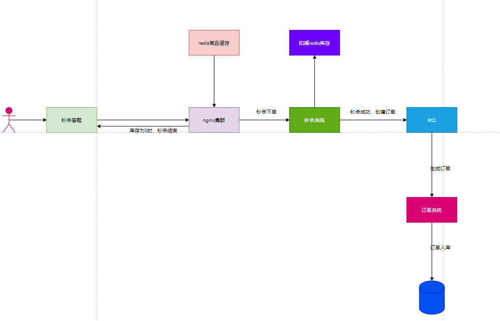

秒杀架构

对于一个秒杀系统而言，比较重要的有一下几点：

1.客户端设置秒杀答题，错开大量人下单的时间，阻止作弊器刷单。
2.独立出来一套秒杀系统，专门负责处理秒杀请求
3.优先基于redis进行高并发的库存减扣，一旦库存扣完则秒杀结束。
4.秒杀结束之后Nginx层过滤无效的请求，大幅度削减转发到后端的流量
5.瞬间生产大量的下单请求直接进入RocketMQ进行削峰，订单系统慢慢拉取消息完成下单操作。

对于瞬时高并发抢购商品的场景，首先要避免直接基于数据库进行高并发的库存扣减，那样会对数据库造成过大的压力。

因为数据库单机可能每秒只能抗几千的请求，但是基于redis进行高并发扣减库存，可以轻松抗几万的请求。

这是针对高并发的第一次优化，将瞬间高并发转发到redis，而不是Mysql，轻松抗下高并发。

一旦库存扣减为零，秒杀结束，因此实际上可能只是前面少量请求可以进入后台，后续99%的请求，都可以直接在Nginx层面被拦截，不会转发到后台系统造成压力。

接着生成大量的订单请求，不会直接交给订单系统去处理，否则也会对订单数据库系统造成过大压力

此时会直接写入MQ进行削峰，让MQ轻松抗下高并发压力，让订单系统慢慢消费和处理下单操作。

所以综上分析像秒杀这种瞬间超高并发的场景，我们架构优化的核心，就是独立出一套专门的系统专门处理，避免高并发请求落在Mysql上

因为Mysql天生不擅长高并发，我们需要通过Redis，Nginx，MQ这些天生轻松单机可以抗几万甚至十万并发的系统来优化架构。

